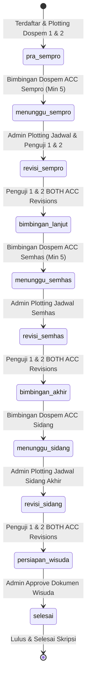

# SIMTA MASTER SYSTEM DOCUMENTATION & SPECIFICATIONS
## Central Codebase Memory, System Logic Flow, Fixed Bug Log, and Risk Audit
### Study Case: Program Studi Sistem Informasi - Institut Teknologi Batam

---

## 0. PROJECT OVERVIEW & FLOW SYSTEM

### 0.1 Apa itu SIMTA?
**SIMTA (Sistem Informasi Manajemen Tugas Akhir)** adalah platform berbasis web terintegrasi yang dirancang untuk mengoptimalkan, mendokumentasikan, dan memantau seluruh proses pengerjaan Tugas Akhir (Skripsi) mahasiswa di Institut Teknologi Batam. Sistem ini menggantikan media bimbingan konvensional yang terfragmentasi (seperti obrolan WhatsApp, email, atau lembar bimbingan fisik) menjadi satu sistem pencatatan terpusat yang aman dan terpantau oleh program studi (Admin).

---

### 0.2 Modul-Modul Utama Sistem
Sistem SIMTA dibagi menjadi 6 modul fungsional utama yang saling terhubung:
1.  **Modul Autentikasi (Authentication Module):** 
    Mengamankan sistem dengan hak akses berbasis peran (Role-Based Access Control / RBAC) menggunakan **JSON Web Token (JWT)** dan **Refresh Token** untuk sesi login berkelanjutan. Sistem membagi hak akses menjadi tiga aktor: **Mahasiswa**, **Dosen**, dan **Admin**.
2.  **Modul Dashboard:**
    Menampilkan visualisasi data yang disesuaikan per aktor. Mahasiswa melihat info dospem, progres Tugas Akhir, dan checklist syarat kelayakan sidang. Dosen melihat rangkuman jumlah beban bimbingan/uji aktif dan agenda jadwal sidang terdekat. Admin melihat grafik statistik kelulusan, jumlah akun aktif, dan rangkuman jadwal sidang.
3.  **Modul Bimbingan (Guidance Module - Core):**
    Fitur utama tempat mahasiswa mengajukan dokumen bimbingan (.pdf) secara berkala. Sistem melacak riwayat pengiriman menggunakan penomoran versi dinamis (`V1`, `V2`, `V3`, dst.) per dosen. Setiap pengajuan bimbingan memiliki ruang diskusi (*nested reply*) untuk dosen dan mahasiswa saling membalas umpan balik.
4.  **Modul Jadwal Sidang (Examination Module):**
    Pusat pengaturan pelaksanaan ujian (Seminar Proposal, Seminar Hasil, dan Sidang Akhir). Terintegrasi dengan plotting dosen penguji 1 & 2 secara otomatis dan membatasi bentrok jadwal berdasarkan ruangan ujian.
5.  **Modul Laporan Progress (Progress Report & Letter Generation):**
    Tampilan admin untuk memantau beban membimbing dosen, jumlah bimbingan mahasiswa, dan status ACC dosen. Jika mahasiswa dinyatakan "Cukup" (memenuhi batas bimbingan & disetujui), sistem dapat men-generate **Surat Persetujuan Sempro** dalam format `.docx` secara otomatis.
6.  **Modul Manajemen User (User Management):**
    Alat bantu admin untuk mengelola biodata pengguna, status keaktifan akun (soft-delete), serta memetakan (*plotting*) Dosen Pembimbing 1 & 2 ke mahasiswa.

---

### 0.3 Alur Bimbingan & Progres Akademik (Detailed Flow)
Progres pengerjaan Tugas Akhir mahasiswa diatur secara ketat melalui state machine di database dan validasi backend dengan alur rinci sebagai berikut:



```text
[Pra-Sempro] 
  │
  ├── 1. Mahasiswa mengajukan bimbingan bab 1-3 ke Dosen Pembimbing 1 & 2
  ├── 2. Bimbingan dilakukan berkala (versi dokumen V1, V2, dst bertambah)
  ├── 3. Setiap dosen memberikan status bimbingan (Revisi, Lanjut Bab, atau ACC)
  ├── 4. Syarat Sempro terpenuhi jika:
  │      - Jumlah bimbingan Dospem 1 >= batas minimal (default: 5)
  │      - Jumlah bimbingan Dospem 2 >= batas minimal (default: 5)
  │      - Kedua dospem telah memberikan status "ACC Sempro"
  └── 5. Progres mahasiswa otomatis naik ke status [Menunggu Sempro]
        │
        └── [Menunggu Sempro]
              │
              ├── 6. Admin membuat jadwal sidang (mengisi tanggal, jam, ruang, & Penguji 1 & 2)
              ├── 7. Detail penguji 1 & 2 otomatis tertulis ke dokumen profil mahasiswa
              └── 8. Ujian Proposal dilaksanakan, status naik ke [Revisi Sempro]
                    │
                    └── [Revisi Sempro]
                          │
                          ├── 9.  Akses bimbingan ke Dosen Pembimbing DIKUNCI oleh sistem
                          ├── 10. Mahasiswa masuk ke tab "Bimbingan Penguji" (aktif otomatis)
                          ├── 11. Mahasiswa mengirim draf revisi PDF ke Penguji 1 & Penguji 2
                          ├── 12. Penguji 1 & Penguji 2 memeriksa dan memberikan ACC revisi
                          └── 13. [Double ACC Penguji]: Jika kedua penguji telah memberi ACC:
                                    - Status mahasiswa naik ke [Bimbingan Lanjut]
                                    - Tab bimbingan Dosen Pembimbing terbuka kembali
                                    - Progres bab bimbingan otomatis diset ke BAB IV
```

### 0.4 Analisis & Aturan Bisnis Alur Akademik Terkini (Wisuda Flow)

Berikut adalah validasi analisis kesesuaian alur bimbingan yang telah disepakati:
1.  **Fase Pra-Sempro (Bimbingan Bab 1-3):**
    *   **Aktor:** Mahasiswa $\leftrightarrow$ Dosen Pembimbing (Dospem) 1 & 2.
    *   **Fokus:** Bimbingan Bab I, II, dan III.
    *   **Aturan Kelulusan:** Memerlukan batas minimal bimbingan (default: 5) dan ACC dari kedua dospem untuk maju ke ujian.
2.  **Setelah Ujian Sempro (Revisi Sempro):**
    *   **Aktor:** Mahasiswa $\leftrightarrow$ Dosen Penguji 1 & 2.
    *   **Fokus:** Penyempurnaan revisi Bab I-III berdasarkan catatan sidang.
    *   **Aturan Kelulusan:** Tidak ada batas minimal jumlah bimbingan. Begitu mendapat status ACC dari kedua penguji, mahasiswa otomatis kembali ke pembimbing.
3.  **Fase Pra-Semhas (Bimbingan Bab 4-6):**
    *   **Aktor:** Mahasiswa $\leftrightarrow$ Dospem 1 & 2.
    *   **Fokus:** Penyusunan Bab IV (Hasil & Pembahasan), Bab V (Implementasi/Kesimpulan), dan Bab VI (Saran/Penutup).
    *   **Kelonggaran Akses:** Bab I-III dapat diunggah kembali jika ada revisi tambahan dari dospem, namun sifatnya opsional.
4.  **Setelah Ujian Semhas (Revisi Semhas):**
    *   **Aktor:** Mahasiswa $\leftrightarrow$ Penguji 1 & 2.
    *   **Fokus:** Revisi Bab IV-VI (atau Bab I-VI jika menyeluruh).
    *   **Aturan Kelulusan:** Penguji 1 & 2 memberikan ACC untuk revisi. Begitu disetujui keduanya, mahasiswa kembali ke dospem.
5.  **Fase Pra-Sidang Akhir (Bimbingan Keseluruhan Bab 1-6):**
    *   **Aktor:** Mahasiswa $\leftrightarrow$ Dospem 1 & 2.
    *   **Fokus:** Konsolidasi seluruh Bab I-VI dan penyempurnaan akhir draf skripsi.
    *   **Aturan Kelulusan:** **TIDAK ADA BATAS MINIMAL BIMBINGAN** (cukup bimbingan dinamis sampai kedua dospem memberikan ACC kelayakan sidang).
6.  **Setelah Ujian Sidang Akhir (Revisi Sidang):**
    *   **Aktor:** Mahasiswa $\leftrightarrow$ Penguji 1 & 2.
    *   **Fokus:** Penyempurnaan naskah skripsi final berdasarkan catatan sidang akhir.
    *   **Aturan Kelulusan:** **TIDAK ADA BATAS MINIMAL BIMBINGAN**. Begitu mendapat ACC revisi dari kedua dosen penguji, status akademik mahasiswa otomatis berubah menjadi `'persiapan_wisuda'`.
7.  **Tahap Persiapan Wisuda (Modul Persiapan Wisuda):**
    *   **Kondisi Aktif:** Setelah mahasiswa lulus revisi sidang (status `statusMahasiswa === 'persiapan_wisuda'`).
    *   **Kebutuhan Fitur:** Mahasiswa wajib mengunggah berkas administrasi kelulusan dalam format **PDF**:
        1.  *File Skripsi Lengkap* (Bab I - VI + Lampiran)
        2.  *PPT Presentasi Skripsi*
        3.  *Halaman Pengesahan* (yang sudah ditandatangani)
        4.  *Form Logbook Bimbingan*
    *   **Pengguna Verifikator:** Admin program studi memeriksa dan memantau dokumen yang diunggah.
    *   **Transisi Akhir:** Setelah Admin menyetujui (**Approve**) seluruh dokumen wisuda tersebut, status akhir mahasiswa berubah menjadi `'selesai'` (lulus sepenuhnya dan siap wisuda).
8.  **Ketentuan Dosen Penguji Tetap (Lintas Ujian):**
    *   **Aturan:** Dosen Penguji 1 & 2 yang di-plot pertama kali oleh Admin pada saat **Seminar Proposal** bersifat **tetap** (locked/immutable) untuk tahapan ujian berikutnya (**Seminar Hasil** dan **Sidang Akhir**). Hal ini dilakukan untuk menjaga objektivitas dan konsistensi penilaian masukan revisi tugas akhir mahasiswa.

---

## 1. COMPREHENSIVE DIRECTORY STRUCTURE
```text
C:\Users\GIGABYTE\Documents\Skripsi\Program_Deploy
│
├── DEPLOYMENT_GUIDE.md               # Production deployment manual for Netlify and VPS
├── README.md                         # General developer readme file
├── BLACKBOX_TESTING.md               # Active blackbox test cases table (desktop/mobile)
├── BLACKBOX_ANALYSIS_SIMTA.md        # Deep audit analysis comparing blackbox cases to backend
│
├── tools                             # Scripts to compile and generate thesis assets
│   ├── generate-blackbox-docx.js    # Compiles markdown test files into Word format
│   └── generate-bab5-kating-style-docx.js # Compiles test reports to matching style
│
├── RANDOM-KEBUTUHANSKRIPSI           # Directory for diagrams, drafts, Kaprodi interview documents
│   ├── DraftSemhas_AndhikaLaksmana_2321053.docx # Main thesis manuscript
│   ├── extracted_semhas_text.txt    # Extracted plain text copy of thesis draft
│   ├── generate_drawio_diagrams.py  # Automation Python script for draw.io assets
│   └── extracted_images/            # Diagram assets extracted from docx
│
├── backend                           # RESTful Express Server API
│   ├── index.js                     # HTTP Server starter file
│   ├── app.js                       # Middleware setup (Cors, Helmet, BodyParser, health checkpoints)
│   ├── config
│   │   └── database.js              # Mongoose connection config with connection hooks
│   ├── middleware
│   │   ├── authMiddleware.js        # JWT verification, attaches req.user
│   │   ├── roleMiddleware.js        # RBAC enforcer
│   │   ├── errorMiddleware.js       # Express catch-all error handling
│   │   └── validationMiddleware.js  # express-validator payload sanitizers
│   ├── models
│   │   ├── User.js                  # User collections schema (roles, phases, plotting, bcrypt hooks)
│   │   ├── Bimbingan.js             # Guidance uploads, versions, statuses, categories
│   │   ├── Jadwal.js                # Sidang/Sempro schedules, dates, rooms, examiners list
│   │   ├── Reply.js                 # Log discussion replies
│   │   └── SystemSetting.js         # Requirements configuration schema
│   ├── controller
│   │   ├── authController.js        # Login logic, credentials check, JWT generation, populates
│   │   ├── userController.js        # Workload aggregation, CRUD, student-dosen mappings
│   │   ├── bimbinganController.js   # Locking logic, auto-promotion, PDF handler, Word document builder
│   │   └── jadwalController.js      # Scheduling, examiners assigning, sorting algorithm
│   └── scripts
│       ├── seedDosen.js             # Seeds lecturers only
│       ├── seedMahasiswa.js         # Seeds students only
│       ├── seedAllStudentsDummy.js  # Seeder for full batch of students with rooms mapped
│       ├── seedHalfStudentsDummy.js # Seeder for half batch of students
│       └── seedLargeDummyData.js    # Seeder for 60+ schedules with deterministic room mapping
│
└── frontend                          # React Client SPA
    ├── vite.config.ts                # Bundler configurations
    ├── tailwind.config.js            # Design token declarations
    ├── src
        ├── main.tsx                  # React DOM renderer entry
        ├── App.tsx                   # Central router & protected layout gates
        ├── index.css                 # Base stylesheet containing tailwind directives
        ├── config/                   # Configuration mappings
        ├── lib
        │   └── api.ts                # Axios wrapper with silent refresh interceptors
        ├── store
        │   ├── index.ts              # Redux main store
        │   └── slices
        │       └── authSlice.ts      # Authentication reducer & async thunks
        ├── components
        │   ├── ProtectedRoute.tsx    # Role validator for pages
        │   ├── Sidebar.tsx           # Collapsible layout navigation
        │   └── ui                    # Reusable shadcn base components
        └── pages
            ├── Login
            │   └── Login.tsx         # Responsive login form
            ├── Profile
            │   └── Profile.tsx       # Profile editor & password changer
            ├── Dashboard
            │   ├── Mahasiswa
            │   │   └── DashboardMhs.tsx # Guidance timelines & active plotting
            │   └── Dosen
            │       └── DashboardDosen.tsx # Workload overview, active students lists
            ├── Bimbingan
            │   ├── Mahasiswa
            │   │   └── BimbinganMahasiswa.tsx # Sub-navigation tabs, locks, uploads
            │   └── Dosen
            │       ├── ListMahasiswaBimbingan.tsx # Student table
            │       └── BimbinganDosen.tsx # Log viewer, drafts, reviews, comments
            ├── Dosen
            │   └── JadwalPenguji.tsx # Shows examiner schedule list (limit: 100)
            └── Admin
                ├── DashboardAdmin.tsx # Academic stats, charts, scheduler summaries
                ├── ManajemenUser.tsx  # User list, role filters
                ├── EditUser.tsx       # Detail editor (plotting, status updates)
                ├── KelolaBimbingan.tsx # Guidance history settings
                ├── KelolaJadwal.tsx   # Schedule creator, active/inactive lists (sorted)
                └── Laporan.tsx        # Combined progress table (no "Total")
```

---

## 2. DATABASE SCHEMAS & FIELD SPECIFICATIONS

### 2.1 User Schema (`User.js`)
*   `nim_nip`: `{ type: String, required: true, unique: true, trim: true }` (Unique identifier).
*   `password`: `{ type: String, required: true, select: false }` (Bcrypt hash).
*   `name`: `{ type: String, required: true, trim: true }`.
*   `email`: `{ type: String, required: true, unique: true, lowercase: true }`.
*   `role`: `{ type: String, enum: ['mahasiswa', 'dosen', 'admin'], required: true }`.
*   `status`: `{ type: String, enum: ['aktif', 'nonaktif'], default: 'aktif' }`.
*   `prodi` (Mahasiswa only): `{ type: String, default: null }`.
*   `semester` (Mahasiswa only): `{ type: Number, default: null }`.
*   `judulTA` (Mahasiswa only): `{ type: String, default: null }`.
*   `currentProgress`: `{ type: String, enum: ['BAB I', 'BAB II', 'BAB III', 'BAB IV', 'BAB V', 'Selesai'], default: 'BAB I' }`.
*   `statusMahasiswa`: `{ type: String, enum: ['pra_sempro', 'menunggu_sempro', 'revisi_sempro', 'bimbingan_lanjut', 'menunggu_semhas', 'revisi_semhas', 'bimbingan_akhir', 'menunggu_sidang', 'revisi_sidang', 'persiapan_wisuda', 'selesai'], default: 'pra_sempro' }`.
*   `dospem_1`, `dospem_2`, `penguji_1`, `penguji_2`: `{ type: Schema.Types.ObjectId, ref: 'User', default: null }`.
*   `avatar`: `{ type: String, default: null }`.
*   `whatsapp`: `{ type: String, default: null }`.

### 2.2 Bimbingan Schema (`Bimbingan.js`)
*   `mahasiswa`: `{ type: Schema.Types.ObjectId, ref: 'User', required: true }`.
*   `dosen`: `{ type: Schema.Types.ObjectId, ref: 'User', required: true }`.
*   `dosenType`: `{ type: String, enum: ['dospem_1', 'dospem_2', 'penguji_1', 'penguji_2'], required: true }`.
*   `kategoriBimbingan`: `{ type: String, enum: ['bimbingan_dospem', 'revisi_sempro', 'revisi_semhas', 'revisi_sidang'], default: 'bimbingan_dospem' }`.
*   `version`: `{ type: String, required: true, match: /^V\d+$/ }`.
*   `judul`: `{ type: String, required: true }`.
*   `catatan`: `{ type: String, default: null }`.
*   `fileName`: `{ type: String, required: true }` (Unique storage path filename).
*   `filePath`: `{ type: String, required: true }`.
*   `fileSize`: `{ type: String, required: true }`.
*   `fileOriginalName`: `{ type: String, default: null }`.
*   `status`: `{ type: String, enum: ['menunggu', 'revisi', 'acc', 'lanjut_bab', 'acc_sempro'], default: 'menunggu' }`.
*   `feedback`: `{ type: String, default: null }`.
*   `feedbackDate`: `{ type: Date, default: null }`.
*   `feedbackFile`: `{ type: String, default: null }`.

### 2.3 Jadwal Schema (`Jadwal.js`)
*   `mahasiswa`: `{ type: Schema.Types.ObjectId, ref: 'User', required: true }`.
*   `jenisJadwal`: `{ type: String, enum: ['sempro', 'semhas', 'sidang'], required: true }`.
*   `tanggal`: `{ type: Date, required: true }`.
*   `waktuMulai`: `{ type: String, required: true }` (e.g. `'09:00'`).
*   `waktuSelesai`: `{ type: String, required: true }` (e.g. `'11:00'`).
*   `ruangan`: `{ type: String, required: true }` (validated rooms: `A301-A315` and `B301-B309`).
*   `penguji`: `[{ type: Schema.Types.ObjectId, ref: 'User', required: true }]`.
*   `status`: `{ type: String, enum: ['dijadwalkan', 'selesai', 'batal'], default: 'dijadwalkan' }`.
*   `hasil`: `{ type: String, enum: ['lulus', 'lulus_revisi', 'tidak_lulus'], default: null }`.

### 2.4 Reply Schema (`Reply.js`)
*   `bimbingan`: `{ type: Schema.Types.ObjectId, ref: 'Bimbingan', required: true }`.
*   `sender`: `{ type: Schema.Types.ObjectId, ref: 'User', required: true }`.
*   `senderRole`: `{ type: String, enum: ['mahasiswa', 'dosen'], required: true }`.
*   `message`: `{ type: String, required: true, minlength: 1, maxlength: 2000 }`.

### 2.5 SystemSetting Schema (`SystemSetting.js`)
*   `key`: `{ type: String, required: true, unique: true }`.
*   `value`: `{ type: Schema.Types.Mixed, required: true }`.
*   `label`: `{ type: String, default: null }`.
*   `description`: `{ type: String, default: null }`.

---

## 3. KEY WORKFLOWS & CODE MECHANISMS (UNDER THE HOOD)

### 3.1 Student Guidance Restrictions
*   **Status Constraint:** Implemented inside `/backend/controller/bimbinganController.js` (`create` method).
    *   If student is in a revision phase (`revisi_sempro`, `revisi_semhas`, `revisi_sidang`), they can **only** submit logs where `dosenType` is `'penguji_1'` or `'penguji_2'`. The supervisor tabs are locked.
    *   If student is in a normal guidance phase (`pra_sempro`, `bimbingan_lanjut`, `bimbingan_akhir`), they can **only** submit logs to supervisors (`'dospem_1'`, `'dospem_2'`).
*   **Pending Locks:** A student cannot send a new log to a specific lecturer if the previous submission status is still `'menunggu'` (Awaiting feedback).

### 3.2 Examiner Revision & Auto-Promotion
*   Implemented inside `bimbinganController.js` $\rightarrow$ `giveFeedback` handler.
*   When an examiner gives an `'acc'` feedback:
    *   The system checks if the student's phase is a revision phase.
    *   If it is, the system searches for an `'acc'` entry from the *other* examiner.
    *   If both examiners (`penguji_1` and `penguji_2`) have issued an `'acc'` status to the student's submissions, the student's status automatically transitions:
        *   `'revisi_sempro'` $\rightarrow$ `'bimbingan_lanjut'`
        *   `'revisi_semhas'` $\rightarrow$ `'bimbingan_akhir'`
        *   `'revisi_sidang'` $\rightarrow$ `'selesai'`
    *   Upon promotion, supervisor guidance unlocks automatically.

### 3.3 Admin & Dosen Schedule Management
*   **Upcoming Limit:** Standard page loads use `limit: 100` (e.g., in `JadwalPenguji.tsx` and admin dashboards) to prevent the default pagination limits from truncating future exam schedules.
*   **Admin Schedule Prioritization:**
    *   Schedules are sorted on the client side: `"dijadwalkan"` (Active) items are grouped at the top and ordered *date ascending* (closest first).
    *   Completed or Canceled schedules (`"selesai"`, `"batal"`) are pushed to the bottom and ordered *date descending* (most recent first).

### 3.4 Auth & Population
*   `authController.js` $\rightarrow$ `login` and `getMe` automatically populate the student's supervisors (`dospem_1`, `dospem_2`) and examiners (`penguji_1`, `penguji_2`) with their respective names and contact information, ensuring the UI correctly displays lecturer names rather than hardcoded fallbacks.

---

## 4. BACKEND ROUTE REGISTRY & MIDDLEWARE LOGIC

### 4.1 Middlewares

#### 1. Auth Gate (`authMiddleware.js`)
1. Parses headers. Look for `Authorization` containing a string matching `Bearer (.*)`.
2. Verifies signature using `jwt.verify(token, process.env.ACCESS_TOKEN_SECRET)`.
3. If valid, queries user: `User.findById(decoded.id)`.
4. If user status is `'aktif'`, attaches it to `req.user` and calls `next()`. Otherwise, returns `403 Forbidden` ("Akun Anda tidak aktif").

#### 2. Role Gate (`roleMiddleware.js`)
1. Rejects request with `403 Forbidden` if role is not in the allowed list:
   ```javascript
   const roleMiddleware = (allowedRoles) => (req, res, next) => {
       if (!allowedRoles.includes(req.user.role)) {
           return res.status(403).json({ success: false, message: 'Akses ditolak.' });
       }
       next();
   };
   ```

#### 3. Validation Layer (`validationMiddleware.js`)
*   Uses `express-validator` chains to sanitize input parameters.
*   **Key Validation Rule (`createBimbinganValidation`)**:
    ```javascript
    body('dosenType')
        .notEmpty().withMessage('Jenis dosen wajib diisi')
        .isIn(['dospem_1', 'dospem_2', 'penguji_1', 'penguji_2'])
        .withMessage('Jenis dosen harus: dospem_1, dospem_2, penguji_1, atau penguji_2')
    ```

---

### 4.2 Route Endpoint Registry

| Method | Endpoint Path | Role Allowed | Controller Action | Description |
| :--- | :--- | :--- | :--- | :--- |
| **POST** | `/api/auth/login` | Public | `authController.login` | Autentikasi user, kembalikan access token & refresh token, populate dospem & penguji |
| **GET** | `/api/auth/me` | Logged In | `authController.getMe` | Ambil data profil lengkap user aktif dengan populate pembimbing/penguji |
| **POST** | `/api/auth/refresh` | Public | `authController.refreshToken` | Tukar refresh token yang valid dengan token akses baru |
| **POST** | `/api/bimbingan` | Mahasiswa | `bimbinganController.create` | Kirim bimbingan baru (unggah PDF, cek status locking, sequential pending locks) |
| **PUT** | `/api/bimbingan/:id/feedback`| Dosen | `bimbinganController.giveFeedback` | Dosen memberikan review & status (picu alur auto-promotion jika dospem/penguji ACC) |
| **POST** | `/api/bimbingan/:id/reply` | Mahasiswa, Dosen| `bimbinganController.addReply` | Kirim balasan komentar di riwayat log bimbingan |
| **GET** | `/api/bimbingan/admin/progress-report` | Admin | `bimbinganController.getProgressReport` | Ambil laporan bimbingan mahasiswa (beban dosen membimbing/menguji, progress bar dospem/penguji) |
| **GET** | `/api/bimbingan/generate-surat-sempro/:mahasiswaId` | Mahasiswa, Admin | `bimbinganController.generateSuratSempro` | Generate file Word `.docx` persetujuan sidang berdasarkan template |
| **POST** | `/api/jadwal` | Admin | `jadwalController.create` | Buat jadwal sidang (plot penguji 1 & 2 ke mahasiswa, update status ke menunggu_sempro) |
| **GET** | `/api/jadwal` | Mahasiswa, Dosen, Admin | `jadwalController.getAll` | Ambil jadwal sidang. Dosen penguji memuat dengan `limit: 100` agar tidak terpotong |
| **PUT** | `/api/users/:id/assign-dospem` | Admin | `userController.assignDospem` | Petakan pembimbing 1, pembimbing 2, penguji 1, penguji 2 (cegah dosen yang sama) |

---

## 5. FRONTEND STATE & COMPONENT FLOWS

### 5.1 Axios Client (`src/lib/api.ts`)
*   Equipped with request interceptors to append `Authorization: Bearer <accessToken>` headers.
*   Equipped with response interceptors to listen for `401 Unauthorized`. Upon interception, it stalls the request pipeline, initiates `/api/auth/refresh`, commits the new credentials to the Redux store, and resumes the original query.

### 5.2 BimbinganMahasiswa.tsx States & Views
*   **Tab System (`useState`)**:
    *   `activeCategory`: `'pembimbing' | 'penguji'`.
    *   `activeSubTab`: `'dospem1' | 'dospem2' | 'penguji1' | 'penguji2'`.
*   **Dynamic Variables**:
    *   `isRevisionPhase` is derived from:
        ```typescript
        const isRevisionPhase = ['revisi_sempro', 'revisi_semhas', 'revisi_sidang'].includes(user?.statusMahasiswa)
        ```
    *   If `isRevisionPhase` is true, the categories default to `'penguji'` and `'penguji1'`.
*   **Locked Tab Renderings**:
    *   If student clicks the **Bimbingan Pembimbing** tab when `isRevisionPhase` is true, the screen returns an alert informing them that their guidance is locked and they must submit revisions to the examiners first.
    *   If they click the **Bimbingan Penguji** tab when `isRevisionPhase` is false, it returns an alert that the examiner tab is locked until they complete their exam.

---

## 6. COMPLETED FIXED WORKSPACE BUGS

### 1. Examiner Upcoming Schedule Truncation Fix
*   **Symptom:** If a lecturer was assigned to more than 10 total schedules, their upcoming schedules were truncated and did not appear in their list.
*   **Fix:** Added `limit: 100` parameter to frontend queries in `JadwalPenguji.tsx` and admin dashboards, resolving backend pagination cut-offs.

### 2. Admin Schedule List Sorting Priority
*   **Symptom:** Completed schedules remained at the top of the admin schedule list, cluttering the view.
*   **Fix:** Added sorting logic in `KelolaJadwal.tsx` to group active schedules (`'dijadwalkan'`) at the top (date ascending) and finished/canceled schedules at the bottom (date descending).

### 3. Database Seeder Room Mapping
*   **Symptom:** Seeder scripts generated arbitrary room names (e.g. "Ruang Sidang 1 Utama") that failed frontend validations.
*   **Fix:** Replaced random generation with a deterministic hashing algorithm mapping rooms to valid rooms (`A301-A315` and `B301-B309`).

### 4. Examiner Guidance Submission Validation
*   **Symptom:** Students in the revision phase got a validation error ("Jenis dosen harus: dospem_1 atau dospem_2") when submitting documents to examiners.
*   **Fix:** Added `penguji_1` and `penguji_2` to the allowed `dosenType` array in backend validator `createBimbinganValidation`.

### 5. Examiner Profile Names Blank on Login
*   **Symptom:** The examiner buttons on the student page displayed the fallback string "Dosen Penguji 1/2" instead of the lecturer's name.
*   **Fix:** Updated the backend login controller to populate the student's `penguji_1` and `penguji_2` fields on login.

### 6. Bimbingan Safety Controls & Supervisor ACC Transitions
*   **Symptom:** Students meeting the bimbingan count and receiving approval from both supervisors remained in `'pra_sempro'`, `'bimbingan_lanjut'`, or `'bimbingan_akhir'` status unless manually transitioned by the Admin. Additionally, graduated students could still submit regular bimbingan, and progress chapter values (`currentProgress`) didn't update automatically during stage transitions.
*   **Fix:**
    *   **Auto-Transitions:** Added automated promotion checking in `giveFeedback` of `bimbinganController.js` when both supervisors have given `'acc_sempro'` status on their latest bimbingan.
    *   **Phase Date Thresholds:** Utilized completed exam schedule timestamps (`Jadwal` collection) to prevent past stage supervisor approvals from incorrectly triggering promotions in newer stages.
    *   **Automatic Progress Bab Update:** Integrated automatic updates to `currentProgress` (to `'BAB IV'`, `'BAB VI'`, or `'Selesai'`) during examiner double ACC promotions and direct exam passes.
    *   **Regular Bimbingan Lockdown:** Blocked regular bimbingan creations in the backend API and locked the student bimbingan tab UI with a premium congratulations card for graduated students.

### 7. Schedule Constant Reassignment TypeError Fix
*   **Symptom:** Creating a schedule for a student who already has preassigned examiners triggered a backend runtime `TypeError: Assignment to constant variable` when trying to enforce examiner immutability.
*   **Fix:** Changed destructuring assignment in `create` function of `jadwalController.js` from `const` to `let` for the `penguji` request body field.

### 8. Shared Schedule Filter & Dynamic Title Stages
*   **Symptom:** The shared schedule page `JadwalSidang.tsx` had a hardcoded title "Jadwal Sidang Proposal Tugas Akhir" and lacked an option to filter specifically for Seminar Hasil or Sidang Akhir.
*   **Fix:** Added `jenisJadwalFilter` state and backend query mapping, a Select dropdown for stage filtering, and a dynamic title component displaying the selected stage.

### 9. Three Exam Stages Option Integration in Admin Panel
*   **Symptom:** The admin schedule panel `KelolaJadwal.tsx` lacked selection and display styles for the second exam stage (Seminar Hasil / `sidang_semhas`).
*   **Fix:** Added Seminar Hasil to the create/edit Select options, mapped conflict checking, and integrated matching status badge styles.

---

## 7. RISK AUDIT & FUTURE VULNERABILITIES

### 7.1 Orphaned Reviews on Examiner Reassignment
*   **Scenario:** A student gets `acc` from `Penguji 1`. The admin then reassigns `Penguji 1` to a different lecturer. The old examiner's `acc` record remains in the database.
*   **Impact:** When the new examiner gives feedback, the backend search checks the student's *current* examiners. Since the new examiner has not given `acc` yet, the student is locked in the revision phase indefinitely.
*   **Fix:** Clean up or re-map old review records when reassigning examiners.

### 7.2 Concurrent Submissions (Lack of Button Debounce)
*   **Scenario:** A student double-clicks the "Kirim Bimbingan" button during network latency.
*   **Impact:** Sends multiple parallel requests. The first database call is still resolving, bypassing the `hasPending` check and saving duplicate bimbingan records.
*   **Fix:** Disable the submit button immediately on click and add a loading state in the React component.

### 7.3 Soft Deleted Users Included in Workloads
*   **Scenario:** Dosen workload is calculated by counting all mapped students.
*   **Impact:** Soft-deleted or inactive students (`status: 'nonaktif'`) are still counted, inflating lecturers' active workload statistics.
*   **Fix:** Add `{ status: 'aktif' }` to queries counting advisors' active students.

### 7.4 Invalid Phone Number Formats for WhatsApp Gateway
*   **Scenario:** A user changes their WhatsApp number in their profile to a format lacking a country code (e.g., `0812...` instead of `62812...`).
*   **Impact:** The Fonnte SMS/WhatsApp gateway fails to send notifications to that number.
*   **Fix:** Add regex validation in `validationMiddleware.js` to enforce country codes on phone number updates.

### 7.5 Immutable Plotted Examiners & Automated Scheduling Generation
*   **Scenario:** Once Dosen Penguji 1 and 2 are assigned to a student during the first exam (Seminar Proposal), they must remain the same for subsequent stages (Seminar Hasil and Sidang Akhir) to ensure evaluation consistency. Changing examiners later can lead to inconsistent feedback or stuck revisions.
*   **Recommendation:** Plotted examiners should be immutable after the first plotting. For subsequent stages (Seminar Hasil and Sidang Akhir), the system could directly generate the schedule and automatically assign the same plotted examiners instead of requiring manual input.

### 7.6 Exam Stages Clarification
*   The system formally operates across three consecutive exam stages:
    1. **Seminar Proposal** (represented in code/DB as `'sidang_proposal'`)
    2. **Seminar Hasil** (represented in code/DB as `'sidang_semhas'`)
    3. **Sidang Akhir** (represented in code/DB as `'sidang_skripsi'`)

---

## 8. PLANNING & TO-DO LIST (WISUDA MODULE IMPLEMENTATION)

Berikut adalah to-do list terperinci berdasarkan kesepakatan alur akademik dan modul Persiapan Wisuda terbaru:

### 8.1 Backend Task List
*   [x] **Update User Schema (`backend/models/User.js`):** Tambahkan field `dokumenWisuda` yang memuat `skripsiFull`, `pptSkripsi`, `halamanPengesahan`, `formBimbingan` (masing-masing memiliki nama file, path file, dan tanggal unggah), serta status verifikasi dan catatan admin.
*   [x] **Konfigurasi Multer Upload Wisuda (`backend/router/userRoutes.js`):** Setup penyimpanan file PDF khusus di folder `/uploads/wisuda/` dengan batas ukuran maksimal file (misal 20MB karena draf lengkap skripsi berukuran besar).
*   [x] **Buat API Endpoint Upload Berkas Wisuda (`POST /api/users/upload-wisuda`):** Implementasikan *multiple files upload* untuk 4 berkas wisuda bagi mahasiswa yang statusnya sudah `'selesai'`.
*   [x] **Buat API Endpoint Verifikasi Wisuda (`PUT /api/users/verifikasi-wisuda/:mahasiswaId`):** Sediakan endpoint bagi Admin untuk memperbarui status verifikasi berkas wisuda (`'disetujui'` / `'ditolak'`) dan menulis catatan evaluasi.
*   [x] **Verifikasi Syarat Sidang Akhir & Revisi:** Pastikan di controller backend tidak ada pengecekan batas minimal jumlah bimbingan untuk fase `bimbingan_akhir` (Pra Sidang Akhir) dan fase `revisi_sidang` (hanya bergantung pada status ACC dosen/penguji).

### 8.2 Frontend Task List
*   [x] **Buat Service Wisuda (`frontend/src/services/wisudaService.ts`):** Definisikan wrapper Axios untuk upload berkas wisuda dan aksi verifikasi berkas oleh admin.
*   [x] **Buat Komponen Modul Wisuda Mahasiswa (`frontend/src/pages/Dashboard/Mahasiswa/`):** Tampilkan kartu/modul khusus "Persiapan Wisuda" di dashboard mahasiswa hanya ketika `statusMahasiswa === 'selesai'`. Sediakan form unggah 4 berkas PDF beserta info status verifikasinya.
*   [x] **Buat Tampilan Verifikasi Wisuda Admin (`frontend/src/pages/Admin/`):** Sediakan sub-menu baru "Kelola Berkas Wisuda" bagi admin untuk memantau data unggahan wisuda, mengunduh file PDF, dan tombol aksi untuk Setujui/Tolak berkas mahasiswa.

---

## 9. CURRENT VERIFICATION ADDENDUM (2026-06-22)

Catatan ini ditambahkan tanpa menghapus bagian lama. Tujuannya meluruskan bagian dokumentasi yang sudah berubah di kode terbaru.

### 9.1 Flow Akademik yang Terverifikasi di Kode
*   Status mahasiswa yang aktif di schema `backend/models/User.js` adalah:
    `pra_sempro -> menunggu_sempro -> revisi_sempro -> bimbingan_lanjut -> menunggu_semhas -> revisi_semhas -> bimbingan_akhir -> menunggu_sidang -> revisi_sidang -> persiapan_wisuda -> selesai`.
*   Saat jadwal ujian ditandai `selesai` dengan `hasil === 'lulus_revisi'`, `backend/controller/jadwalController.js` mengubah status ke fase revisi:
    *   `sidang_proposal -> revisi_sempro`
    *   `sidang_semhas -> revisi_semhas`
    *   `sidang_skripsi -> revisi_sidang`
*   Saat jadwal ujian ditandai `selesai` dengan `hasil === 'lulus'`, mahasiswa langsung lompat tanpa revisi:
    *   `sidang_proposal -> bimbingan_lanjut` dan `currentProgress = 'BAB IV'`
    *   `sidang_semhas -> bimbingan_akhir` dan `currentProgress = 'BAB VI'`
    *   `sidang_skripsi -> persiapan_wisuda` dan `currentProgress = 'Selesai'`
*   Saat dua penguji memberi `acc` di fase revisi, `backend/controller/bimbinganController.js` mengubah status:
    *   `revisi_sempro -> bimbingan_lanjut`
    *   `revisi_semhas -> bimbingan_akhir`
    *   `revisi_sidang -> persiapan_wisuda`
*   Jadi transisi akhir yang benar adalah `revisi_sidang -> persiapan_wisuda`, bukan langsung `selesai`. Status `selesai` baru dicapai setelah admin menyetujui dokumen wisuda.

### 9.2 Istilah Jadwal yang Benar di Kode Terbaru
*   `backend/models/Jadwal.js` memakai `jenisJadwal`:
    *   `sidang_proposal`
    *   `sidang_semhas`
    *   `sidang_skripsi`
*   Status jadwal yang valid adalah:
    *   `dijadwalkan`
    *   `berlangsung`
    *   `selesai`
    *   `dibatalkan`
*   Karena itu bagian lama yang menyebut `jenisJadwal: sempro/semhas/sidang` atau status `batal` perlu dibaca sebagai catatan lama, bukan kontrak kode terbaru.

### 9.3 Modul Wisuda yang Terverifikasi
*   Upload wisuda berada di `POST /api/users/upload-wisuda`, hanya untuk role mahasiswa, dan hanya boleh jika `statusMahasiswa === 'persiapan_wisuda'`.
*   Verifikasi admin berada di `PUT /api/users/:id/verifikasi-wisuda`, hanya untuk role admin, juga hanya memproses mahasiswa dengan `statusMahasiswa === 'persiapan_wisuda'`.
*   Jika admin mengirim `statusVerifikasi === 'disetujui'`, backend mengubah `statusMahasiswa` menjadi `selesai` dan `currentProgress` menjadi `Selesai`.
*   File upload wisuda memakai field:
    *   `skripsiFull`
    *   `pptSkripsi`
    *   `halamanPengesahan`
    *   `formBimbingan`
*   Batas file wisuda di router saat ini 25MB per file PDF.

### 9.4 Catatan Inkonsistensi Minor di Dokumentasi Lama
*   Section task lama menyebut modul wisuda mahasiswa muncul ketika `statusMahasiswa === 'selesai'`; kode terbaru memperlihatkan flow yang lebih tepat: upload/verifikasi aktif di `persiapan_wisuda`, lalu baru menjadi `selesai` setelah disetujui admin.
*   Section `Examiner Revision & Auto-Promotion` lama menyebut `revisi_sidang -> selesai`; kode terbaru memakai `revisi_sidang -> persiapan_wisuda`.
*   Section `Jadwal Schema` lama perlu disesuaikan dengan enum terbaru `sidang_proposal/sidang_semhas/sidang_skripsi` dan `dibatalkan`.

---

## 10. DEVELOPMENT LOG (2026-06-22)

### 10.1 Kelola Bimbingan - Statistik Tahap Ujian Mahasiswa
*   Ditambahkan ringkasan status akademik di halaman admin `frontend/src/pages/Admin/KelolaBimbingan.tsx`.
*   Data dihitung dari daftar mahasiswa aktif yang dimuat melalui endpoint `/api/users` dengan parameter `role=mahasiswa`, `status=aktif`, dan `limit=1000`.
*   Kartu statistik baru:
    *   **Sudah Sempro:** mahasiswa dengan `statusMahasiswa` mulai dari `revisi_sempro` sampai `selesai`.
    *   **Sudah Semhas:** mahasiswa dengan `statusMahasiswa` mulai dari `revisi_semhas` sampai `selesai`.
    *   **Sudah Sidang Akhir:** mahasiswa dengan `statusMahasiswa` `revisi_sidang`, `persiapan_wisuda`, atau `selesai`.
*   Interpretasi "sudah" berarti mahasiswa sudah masuk fase setelah ujian tersebut dilaksanakan, termasuk mahasiswa yang lulus tanpa revisi dan langsung naik ke fase berikutnya.
*   Validasi:
    *   `npx.cmd eslint src/pages/Admin/KelolaBimbingan.tsx` berhasil tanpa error, hanya menyisakan warning lama `react-hooks/exhaustive-deps` pada dependency debug `useEffect`.
    *   `npm.cmd run build` belum berhasil karena error TypeScript di file lain yang sudah ada (`VerifikasiWisuda.tsx` dan `DashboardMhs.tsx`), terutama import tidak terpakai, prop `FeedbackAlert.variant`, tipe `dokumenWisuda`, serta import `Badge/Button/Clock` yang belum lengkap.

### 10.2 Koreksi Kelola Bimbingan - Limit dan Posisi Card
*   Koreksi setelah verifikasi UI: backend `paginationQuery` membatasi `limit` maksimal 500, sehingga fetch daftar mahasiswa di `KelolaBimbingan.tsx` diganti dari `limit=1000` menjadi `limit=500`.
*   Tiga kartu statistik akademik dipindahkan ke atas panel **Pilih Mahasiswa** sesuai kebutuhan tampilan admin.
*   Catatan: poin 10.1 masih mencatat implementasi awal. Kontrak aktif setelah koreksi ini adalah `/api/users?role=mahasiswa&status=aktif&limit=500`.
*   Validasi ulang: `npx.cmd eslint src/pages/Admin/KelolaBimbingan.tsx` berhasil tanpa error, masih menyisakan warning lama `react-hooks/exhaustive-deps`.

### 10.3 Kelola Bimbingan - List Mahasiswa dan Detail Pembimbing/Penguji
*   Halaman `frontend/src/pages/Admin/KelolaBimbingan.tsx` diubah dari pola dropdown pilih mahasiswa menjadi pola list/tabel seperti Manajemen User.
*   List mahasiswa langsung tampil dengan search, filter tahap, pilihan jumlah data per halaman, pagination, dan tombol **Detail**.
*   Status tahap di list dihitung dari `statusMahasiswa`:
    *   `pra_sempro` dan `menunggu_sempro` = **Belum Sempro**
    *   setelah Sempro tapi sebelum Semhas = **Sudah Sempro**
    *   setelah Semhas tapi sebelum Sidang Akhir = **Sudah Semhas**
    *   `revisi_sidang`, `persiapan_wisuda`, dan `selesai` = **Sudah Sidang Akhir**
*   Tombol **Detail** memakai logic lama: set mahasiswa terpilih, lalu memuat `getAdminBimbinganSummary`, `getBimbinganSettings`, setting syarat sidang, tab riwayat Dospem 1/2, dan clear riwayat untuk mahasiswa tersebut.
*   Backend `backend/controller/bimbinganController.js` pada endpoint `GET /api/bimbingan/admin/mahasiswa/:mahasiswaId` sekarang ikut populate dan mengirim `penguji_1` serta `penguji_2`.
*   Tipe `AdminBimbinganSummary` di `frontend/src/services/bimbinganService.ts` ditambah field `penguji_1` dan `penguji_2`.
*   Kartu detail mahasiswa di Kelola Bimbingan sekarang menampilkan Dospem 1, Dospem 2, Penguji 1, dan Penguji 2.
*   Validasi:
    *   `npx.cmd eslint src/pages/Admin/KelolaBimbingan.tsx src/services/bimbinganService.ts` berhasil tanpa error.
    *   `node --check backend/controller/bimbinganController.js` berhasil.
    *   `npm.cmd run build` masih gagal karena error TypeScript lama di `VerifikasiWisuda.tsx` dan `DashboardMhs.tsx`, terutama import tidak terpakai, prop `FeedbackAlert.variant`, tipe `dokumenWisuda`, dan import UI/icon yang belum lengkap.

### 10.4 Koreksi Tombol Detail Kelola Bimbingan
*   Tombol **Detail** di list `KelolaBimbingan.tsx` sebenarnya sudah memicu pemilihan mahasiswa, tetapi detail muncul di bawah tabel sehingga terasa seperti tidak bisa ditekan.
*   Ditambahkan `detailSectionRef` dan auto-scroll `scrollIntoView` setelah `summary` mahasiswa berhasil dimuat.
*   Tombol detail mahasiswa terpilih sekarang berubah label menjadi **Terbuka** agar state klik terlihat jelas.
*   Validasi: `npx.cmd eslint src/pages/Admin/KelolaBimbingan.tsx` berhasil tanpa error.

### 10.5 Kelola Jadwal - Filter Default Jadwal Aktif
*   Jadwal dengan status `selesai` tidak otomatis terhapus; data tetap disimpan sebagai riwayat dan bisa dihapus permanen hanya lewat aksi hard-delete.
*   Untuk mengurangi tampilan jadwal selesai yang menumpuk, `frontend/src/pages/Admin/KelolaJadwal.tsx` mengubah default `statusFilter` dari `all` menjadi `dijadwalkan`.
*   Label filter `dijadwalkan` diubah menjadi **Terjadwal Aktif** agar jelas bahwa tampilan awal fokus ke jadwal aktif.
*   Teks footer tabel menambahkan keterangan `jadwal aktif` saat filter default `dijadwalkan` sedang dipakai.
*   Validasi: `npx.cmd eslint src/pages/Admin/KelolaJadwal.tsx` masih gagal karena error lama `@typescript-eslint/no-explicit-any` di file yang sama, bukan dari perubahan filter ini.

### 10.6 Jadwal Sidang Global - Filter Jenis dan Status Saja
*   Halaman shared `frontend/src/pages/Jadwal/JadwalSidang.tsx` disederhanakan: filter tahun, gelombang, dan periode dihapus dari toolbar.
*   Filter yang tersisa: `jenisJadwalFilter` untuk jenis ujian dan `statusFilter` untuk status jadwal.
*   Status filter mendukung:
    *   `dijadwalkan` = Terjadwal
    *   `berlangsung` = Berlangsung
    *   `selesai` = Selesai
    *   `dibatalkan` = Dibatalkan
    *   `all` = Semua Status
*   Request `/api/jadwal` sekarang mengirim `status` hanya jika filter status bukan `all`; default halaman tetap `dijadwalkan`.
*   Tabel jadwal global ditambah kolom **Status** agar hasil filter status terlihat jelas.
*   Badge subjudul tabel tidak lagi menampilkan tahun/periode, tetapi menampilkan label status filter aktif.
*   Validasi: `npx.cmd eslint src/pages/Jadwal/JadwalSidang.tsx` berhasil tanpa error.

### 10.7 Jadwal Sidang Global - Filter Ruangan dan Dosen, Plus Ruang A401-A414
*   Halaman shared `frontend/src/pages/Jadwal/JadwalSidang.tsx` ditambah filter frontend untuk ruangan dan dosen penguji.
*   Filter ruangan dan dosen dihitung dari data jadwal yang sedang dimuat dari `/api/jadwal`; jika jenis/status berubah dan pilihan ruangan/dosen tidak tersedia lagi, filter otomatis kembali ke `all`.
*   Limit request jadwal global dinaikkan ke `500` agar opsi filter ruangan/dosen punya cakupan data lebih lengkap tanpa melewati batas validasi pagination backend.
*   Kartu total, mahasiswa, sesi waktu, ruangan, tabel, dan footer sekarang memakai data hasil filter ruangan/dosen.
*   `frontend/src/pages/Admin/KelolaJadwal.tsx` menambahkan opsi ruangan `A401` sampai `A414` ke daftar ruangan admin.
*   `backend/middleware/validationMiddleware.js` diselaraskan agar `createJadwalValidation` menerima `sidang_semhas`, selain `sidang_proposal` dan `sidang_skripsi`.
*   Validasi:
    *   `npx.cmd eslint src/pages/Jadwal/JadwalSidang.tsx` berhasil tanpa error.
    *   `node --check backend/middleware/validationMiddleware.js` berhasil.
    *   `npx.cmd eslint src/pages/Admin/KelolaJadwal.tsx` masih gagal karena error lama `@typescript-eslint/no-explicit-any` di file yang sama, bukan karena penambahan ruangan.

### 10.8 Fix Dashboard Mahasiswa - Modul Persiapan Wisuda Crash
*   Saat mahasiswa dengan status `persiapan_wisuda` atau `selesai` membuka dashboard, halaman sempat blank karena `DashboardMhs.tsx` memakai komponen `Button`, `Badge`, dan icon `Clock` tanpa import.
*   `frontend/src/pages/Dashboard/Mahasiswa/DashboardMhs.tsx` sekarang mengimpor `Button`, `Badge`, dan `Clock`.
*   Tipe `MahasiswaData` ditambah `dokumenWisuda?: DokumenWisuda` dari `frontend/src/services/authService.ts` agar akses dokumen wisuda terdefinisi.
*   Prop `FeedbackAlert` untuk pesan sukses upload wisuda diganti dari `variant="success"` menjadi `type="success"` sesuai kontrak komponen.
*   `catch` yang tidak memakai variabel dan `catch unknown` dirapikan agar lint bersih.
*   `frontend/src/pages/Admin/VerifikasiWisuda.tsx` juga dirapikan: import tidak terpakai dihapus, `FeedbackAlert variant` diganti ke `type`, `catch any` diganti `unknown`, dan `fetchStudents` dibuat `useCallback`.
*   Validasi:
    *   `npx.cmd eslint src/pages/Dashboard/Mahasiswa/DashboardMhs.tsx src/pages/Admin/VerifikasiWisuda.tsx` berhasil tanpa error.
    *   `npm.cmd run build` berhasil; hanya tersisa warning ukuran chunk besar dari Vite/Rolldown.

### 10.9 Pengajuan Softcopy Seminar dan Verifikasi Dokumen Mahasiswa
*   Ditambahkan modul backend `PengajuanSeminar` untuk menyimpan softcopy pengajuan Seminar Proposal dan Seminar Hasil.
*   Endpoint baru:
    *   `GET /api/pengajuan-seminar` untuk list pengajuan sesuai role.
    *   `POST /api/pengajuan-seminar/:jenisPengajuan/upload` untuk upload PDF mahasiswa.
    *   `PUT /api/pengajuan-seminar/:id/verifikasi` untuk verifikasi admin.
    *   `GET /api/pengajuan-seminar/download/:fileName` untuk download/preview file dengan token.
*   Alur aktif: **ACC Seminar sesuai fase mahasiswa -> Upload Softcopy -> Verifikasi Admin -> Buat Jadwal**.
*   Dashboard mahasiswa menampilkan kartu **Berkas Pengajuan Seminar Proposal** saat `statusMahasiswa = menunggu_sempro`, dan **Berkas Pengajuan Seminar Hasil** saat `statusMahasiswa = menunggu_semhas`.
*   Upload softcopy mahasiswa dibatasi PDF dan maksimal 25MB dari backend; UI juga menampilkan alert jika file bukan PDF.
*   Menu admin `/admin/wisuda` diganti secara UI menjadi **Verifikasi Dokumen Mahasiswa** dan dipisah tab:
    *   **Pengajuan Seminar** untuk verifikasi softcopy Seminar Proposal/Seminar Hasil.
    *   **Dokumen Wisuda** untuk verifikasi dokumen kelulusan/wisuda lama.
*   Backend `POST /api/jadwal` sekarang menolak pembuatan jadwal `sidang_proposal` dan `sidang_semhas` jika pengajuan seminar terkait belum `disetujui` admin.
*   Sidang akhir tidak dijadikan flow internal baru pada SIMTA; sesuai keputusan saat ini, sidang akhir berada di ranah akademik eksternal dan SIMTA hanya melanjutkan ke berkas wisuda setelah status mahasiswa masuk `persiapan_wisuda`.
*   Halaman detail bimbingan dosen menampilkan kartu read-only **Berkas Pengajuan Seminar** agar dosen dapat melihat softcopy yang diunggah mahasiswa.
*   Validasi:
    *   `node --check backend/models/PengajuanSeminar.js` berhasil.
    *   `node --check backend/controller/pengajuanSeminarController.js` berhasil.
    *   `node --check backend/router/pengajuanSeminarRoutes.js` berhasil.
    *   `node --check backend/controller/jadwalController.js` berhasil.
    *   `npm.cmd run build` di frontend berhasil; hanya tersisa warning ukuran chunk besar dari Vite/Rolldown.

### 10.10 Seed Data Uji Pengajuan Seminar
*   Ditambahkan script `backend/scripts/seedPengajuanSeminarFlowData.js` dan shortcut `npm run seed:pengajuan-seminar-flow`.
*   Script bersifat non-destruktif terhadap user/jadwal: tidak membuat mahasiswa/dosen baru, tidak menghapus data lama, dan hanya upsert data `PengajuanSeminar` serta file PDF dummy di `backend/uploads/pengajuan-seminar`.
*   Mode default hanya memilih mahasiswa existing dengan status `menunggu_sempro`/`menunggu_semhas`.
*   Mode `--prepare-statuses` dapat menaikkan mahasiswa existing yang valid dari:
    *   `pra_sempro` -> `menunggu_sempro`
    *   `bimbingan_lanjut` -> `menunggu_semhas`
*   Eksekusi berhasil dengan command:
    *   `npm.cmd run seed:pengajuan-seminar-flow -- --prepare-statuses`
*   Data uji yang dibuat:
    *   Adittya Danang Setiawan (`2221013`) -> Seminar Proposal `menunggu_verifikasi`.
    *   Charles (`2221015`) -> Seminar Proposal `disetujui`.
    *   Hudiya Aksan Hawary (`2221009`) -> Seminar Hasil `menunggu_verifikasi`.
    *   Intan Iqlima (`2221011`) -> Seminar Hasil `disetujui`.
*   Mahasiswa/dosen yang dipilih adalah data existing dan dospem yang terhubung juga user dosen existing aktif.

### 10.11 Koreksi Seed Pengajuan Seminar - Riwayat ACC Sidang
*   Script `backend/scripts/seedPengajuanSeminarFlowData.js` diperbaiki agar data dummy softcopy tidak berdiri sendiri.
*   Setiap mahasiswa seed pengajuan seminar sekarang dipastikan memiliki riwayat bimbingan dospem yang sesuai alur utama:
    *   Minimal 5 bimbingan pada `dospem_1`.
    *   Minimal 5 bimbingan pada `dospem_2`.
    *   Riwayat terbaru masing-masing dospem berstatus `acc_sempro` sebagai representasi **ACC Sidang / ACC Seminar**.
*   Untuk data seed Seminar Hasil, script juga memastikan ada riwayat jadwal `sidang_proposal` berstatus `selesai` sebagai bukti mahasiswa sudah melewati Seminar Proposal.
*   Eksekusi ulang berhasil dengan command:
    *   `npm.cmd run seed:pengajuan-seminar-flow -- --prepare-statuses`
*   Validasi DB setelah repair:
    *   Adittya Danang Setiawan (`2221013`): `menunggu_sempro`, Dospem 1 total 5 latest `acc_sempro`, Dospem 2 total 5 latest `acc_sempro`.
    *   Charles (`2221015`): `menunggu_sempro`, Dospem 1 total 5 latest `acc_sempro`, Dospem 2 total 5 latest `acc_sempro`.
    *   Hudiya Aksan Hawary (`2221009`): `menunggu_semhas`, Dospem 1 total 5 latest `acc_sempro`, Dospem 2 total 5 latest `acc_sempro`, jadwal Seminar Proposal `selesai/lulus`.
    *   Intan Iqlima (`2221011`): `menunggu_semhas`, Dospem 1 total 7 latest `acc_sempro`, Dospem 2 total 5 latest `acc_sempro`, jadwal Seminar Proposal `selesai/lulus_revisi`.
