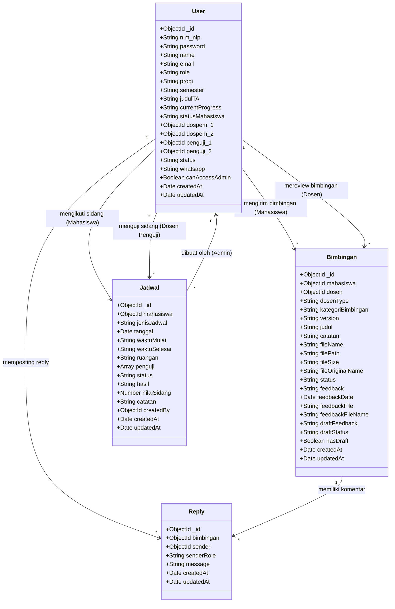

# Laporan Audit & Perbaikan Lengkap Seluruh Diagram Bab IV (Sistem Informasi Manajemen Tugas Akhir - SIMTA)

Laporan ini disusun setelah melakukan pembacaan dan analisis mendalam terhadap **penjelasan serta diagram-diagram yang terdapat dalam file draf Word Anda (`Draftbab4UDAHSETUP.docx`)** dan membandingkannya secara langsung baris-demi-baris dengan **kode program nyata (frontend React-TS, backend Node.js, database Mongoose/MongoDB)** pada repositori SIMTA.

---

## 1. KONSISTENSI AKTOR: PENGGABUNGAN DOSEN PEMBIMBING & PENGUJI

> [!IMPORTANT]
> **Masukan Dosen Anda:** Satukan **Dosen Pembimbing** dan **Dosen Penguji** menjadi satu aktor bernama **Dosen** saja, namun di dalam diagram tetap mencerminkan aktivitas pembimbingan maupun pengujian.

### Analisis Kode Reality vs Draf:
1.  **Di Database (Mongoose):** Di file `backend/models/User.js`, field `role` hanya memiliki enum: `['mahasiswa', 'dosen', 'admin']`. Tidak ada role terpisah bernama `penguji`.
2.  **Hubungan Dinamis:** Dosen yang sama dapat di-assign sebagai `dospem_1` atau `dospem_2` di data mahasiswa, sekaligus ditugaskan sebagai `penguji_1` atau `penguji_2` melalui jadwal sidang (`Jadwal.js`).
3.  **Di Diagram Draf Anda:** Aktor Dosen Penguji belum dimasukkan secara eksplisit dalam daftar aktor di Use Case diagram, melainkan hanya Dosen Pembimbing.

**Rekomendasi Perbaikan:**
*   Ganti nama aktor **Dosen Pembimbing** menjadi **Dosen** di seluruh diagram (Use Case, Activity, Sequence, dan Class Diagram).
*   Gunakan keterangan peran dinamis (misalnya: *Dosen Pembimbing* atau *Dosen Penguji*) pada alur proses spesifik.

---

## 2. AUDIT USE CASE DIAGRAM (GAMBAR 4.2)

Berikut adalah perbandingan gelembung *use case* yang ada di draf Anda dengan logika fungsionalitas nyata pada sistem:

### A. Temuan Mismatch & Hal yang Belum Ada:
1.  **Hapus Use Case "Pendaftaran Seminar Proposal" (Mahasiswa):**
    *   *Realita Kode:* Pada frontend dan backend SIMTA, **tidak ada fitur atau formulir bagi mahasiswa untuk mendaftar sempro**. 
    *   *Sistem Sebenarnya:* Status kelayakan mahasiswa dihitung otomatis oleh sistem (`GET /api/bimbingan/sempro-status/:mahasiswaId`). Setelah syarat minimal bimbingan terpenuhi (status `acc` atau `acc_sempro` dari dospem 1 & 2), Admin langsung menjadwalkan sidang di menu Kelola Jadwal.
2.  **Tambahkan Use Case "Unduh Surat Persetujuan Sempro (DOCX)" (Mahasiswa & Admin):**
    *   *Realita Kode:* Ada endpoint `/api/bimbingan/generate-surat-sempro/:mahasiswaId` di `bimbinganController.js` yang menghasilkan surat persetujuan maju sidang secara otomatis dalam format `.docx`. Fitur otomatisasi ini sangat baik untuk ditonjolkan namun belum ada di Use Case draf Anda.
3.  **Tambahkan Use Case "Mengunggah Dokumen Revisi ke Penguji" (Mahasiswa):**
    *   *Realita Kode:* Mahasiswa yang berada dalam fase revisi (`revisi_sempro/semhas/sidang`) dapat mengunggah draf revisi PDF yang ditujukan ke dosen penguji (`penguji_1` / `penguji_2`).
4.  **Tambahkan Use Case "Review & ACC Revisi Ujian" (Dosen sebagai Penguji):**
    *   *Realita Kode:* Dosen penguji dapat membuka draf revisi mahasiswa dan memberikan status `acc` yang akan mentransisikan status mahasiswa ke tahap bimbingan berikutnya atau `selesai`.
5.  **Tambahkan Use Case "Input Hasil & Nilai Sidang" (Admin):**
    *   *Realita Kode:* Admin menginput nilai (`nilaiSidang`) and keputusan sidang (`hasil` = `lulus` / `lulus_revisi` / `tidak_lulus`). Aksi ini otomatis merubah status akademik mahasiswa dan memetakan dosen penguji secara permanen.

### B. Kode Mermaid.js untuk Use Case Diagram Baru (Dosen Pembimbing & Penguji Bersatu):

Anda dapat langsung menyalin kode Mermaid berikut untuk divisualisasikan:

```mermaid
graph LR
  ActorAdmin["Admin (Koordinator)"]
  ActorMhs["Mahasiswa"]
  ActorDsn["Dosen<br/>(Pembimbing / Penguji)"]

  subgraph Batasan Sistem SIMTA
    UC_Login(((Login)))
    UC_Dash(((Melihat Dashboard)))
    UC_Users(((Kelola Data User)))
    UC_Plot(((Assign Dosen Pembimbing)))
    UC_Jadwal(((Kelola Jadwal Sidang)))
    UC_Hasil(((Input Hasil & Nilai Sidang)))
    UC_Upload(((Kirim PDF Bimbingan Dospem)))
    UC_History(((Lihat Riwayat & Feedback)))
    UC_Reply(((Diskusi / Reply Komentar)))
    UC_Surat(((Unduh Surat Persetujuan DOCX)))
    UC_Revisi(((Kirim PDF Revisi ke Penguji)))
    UC_ReviewDospem(((Review Bimbingan Dospem)))
    UC_ReviewPenguji(((Review Revisi Penguji)))
    UC_AccSempro(((ACC Kesiapan Sempro)))
    UC_AccRevisi(((ACC Kelulusan Revisi Ujian)))
    UC_ViewJadwal(((Lihat Jadwal Sidang)))
  end

  ActorAdmin --- UC_Login
  ActorAdmin --- UC_Dash
  ActorAdmin --- UC_Users
  ActorAdmin --- UC_Plot
  ActorAdmin --- UC_Jadwal
  ActorAdmin --- UC_Hasil
  ActorAdmin --- UC_ViewJadwal

  ActorMhs --- UC_Login
  ActorMhs --- UC_Dash
  ActorMhs --- UC_Upload
  ActorMhs --- UC_History
  ActorMhs --- UC_Reply
  ActorMhs --- UC_Surat
  ActorMhs --- UC_Revisi
  ActorMhs --- UC_ViewJadwal

  ActorDsn --- UC_Login
  ActorDsn --- UC_Dash
  ActorDsn --- UC_History
  ActorDsn --- UC_Reply
  ActorDsn --- UC_ReviewDospem
  ActorDsn --- UC_ReviewPenguji
  ActorDsn --- UC_AccSempro
  ActorDsn --- UC_AccRevisi
  ActorDsn --- UC_ViewJadwal
```

---

## 3. AUDIT 8 ACTIVITY DIAGRAM (GAMBAR 4.3 - 4.10)

Berikut adalah daftar hal-hal penting (*Business Rules*) di kode program yang **belum digambarkan** pada alur Activity Diagram Anda:

### Gambar 4.3: Activity Diagram Login User
*   **Belum Ada di Draf:** Validasi status aktif akun.
*   **Koreksi Alur:** Setelah sistem memverifikasi NIP/NIM dan kata sandi di database, sistem harus memeriksa field `status` pada model User. Jika status akun adalah `nonaktif`, login dibatalkan dan sistem memunculkan pesan kesalahan.

### Gambar 4.4: Activity Diagram Pengelolaan Data Pengguna (Admin)
*   **Belum Ada di Draf:** Metode penghapusan dan enkripsi kata sandi.
*   **Koreksi Alur:** Saat Admin menambahkan user baru, sistem secara otomatis melakukan enkripsi password menggunakan bcrypt (`User.js` pre-save hook). Selain itu, Admin memiliki pilihan hapus dinonaktifkan (*soft delete* dengan mengubah status menjadi `nonaktif`) atau hapus permanen (*hard delete* melalui `/api/users/:id/permanent`).

### Gambar 4.5: Activity Diagram Penentuan Dosen Pembimbing (Admin)
*   **Belum Ada di Draf:** Validasi duplikasi dosen pembimbing.
*   **Koreksi Alur:** Sistem menerapkan aturan ketat: **Dosen Pembimbing 1 tidak boleh sama dengan Dosen Pembimbing 2**. Jika Admin memilih dosen yang sama, sistem harus menampilkan validasi kesalahan dan menolak penyimpanan.

### Gambar 4.6: Activity Diagram Pengelolaan Jadwal Sidang (Admin)
*   **Belum Ada di Draf:** 
    1.  Validasi ketersediaan ruangan (mencegah bentrok jadwal di hari/jam yang sama).
    2.  Validasi bahwa Dosen Penguji tidak boleh merangkap sebagai Dosen Pembimbing mahasiswa tersebut.
    3.  Pemuatan otomatis ID Dosen Penguji ke dalam field `penguji_1` dan `penguji_2` pada record mahasiswa saat jadwal disimpan dengan status selesai.
*   **Koreksi Alur:** Masukkan percabangan keputusan (*decision nodes*) untuk memvalidasi bentrok ruang dan peran dosen.

### Gambar 4.7: Activity Diagram Pengajuan Bimbingan Mahasiswa
*   **Belum Ada di Draf:**
    1.  *Concurrency Check (Pencegahan Antrean):* Mahasiswa dilarang keras mengunggah bimbingan baru ke dosen yang sama jika pengajuan sebelumnya masih berstatus `menunggu` review. Tombol kirim akan di-disable.
    2.  *Pengecekan Status Alur Sidang:* Sistem mengecek `statusMahasiswa`. Jika berada dalam status revisi (`revisi_sempro/semhas/sidang`), pengajuan bimbingan ke dospem dikunci dan mahasiswa diarahkan untuk mengirim dokumen ke Dosen Penguji.
*   **Koreksi Alur:** Tambahkan dua pengecekan kondisi ini sebelum proses pemilihan file PDF.

### Gambar 4.8: Activity Diagram Dosen Review Bimbingan
*   **Belum Ada di Draf:**
    1.  *Validasi ACC Sempro:* Ketika dosen memilih status `acc_sempro`, sistem memeriksa jumlah sesi bimbingan mahasiswa dengan dospem terkait. Jika total bimbingan kurang dari 5 kali, pemberian ACC ditolak.
    2.  *Otomatisasi Progres (Lanjut Bab):* Jika dosen menyetujui status `lanjut_bab`, sistem secara otomatis memperbarui `currentProgress` mahasiswa di database (misalnya mengubah dari "BAB I" ke "BAB II").
*   **Koreksi Alur:** Tambahkan keputusan perhitungan bimbingan (hitung data bimbingan di database) dan pembaruan field progress.

### Gambar 4.9: Activity Diagram Diskusi Bimbingan (Reply Komentar)
*   **Belum Ada di Draf:** Otorisasi akses thread diskusi.
*   **Koreksi Alur:** Sebelum menyimpan balasan komentar, sistem harus memastikan bahwa pengirim balasan adalah pemilik dokumen bimbingan (Mahasiswa yang bersangkutan) atau dosen yang dituju. Pihak luar tidak diperkenankan mengakses/mengirim komentar.

### Gambar 4.10: Activity Diagram Lihat Jadwal Sidang
*   **Belum Ada di Draf:** Filter data berdasarkan hak akses/role.
*   **Koreksi Alur:** Aktor Mahasiswa hanya bisa melihat jadwal sidangnya sendiri. Aktor Dosen hanya bisa melihat jadwal sidang dimana ia ditunjuk sebagai penguji. Admin dapat melihat seluruh daftar jadwal sidang.

---

## 4. AUDIT 8 SEQUENCE DIAGRAM (GAMBAR 4.11 - 4.18)

Sequence diagram Anda harus disesuaikan agar penamaan objek (*Lifeline*) merefleksikan arsitektur MVC / REST API yang sebenarnya pada kode SIMTA:

*   **Boundary/View (Frontend):** `LoginView`, `DashboardView`, `BimbinganView`, `JadwalView`, `KelolaUserView`.
*   **Controller (Backend API):** `authController.js`, `userController.js`, `bimbinganController.js`, `jadwalController.js`.
*   **Entity/Model (Database):** `User` (Koleksi `users`), `Bimbingan` (Koleksi `bimbingans`), `Jadwal` (Koleksi `jadwals`), `Reply` (Koleksi `replies`).

### Detil Gaps per Sequence Diagram:
1.  **Sequence Autentikasi Login (Gambar 4.11):**
    *   *Pesan yang Kurang:* Controller memanggil model `User` untuk memvalidasi `status == "aktif"`. Jika false, return 401 Unauthorized.
2.  **Sequence Plotting Dospem (Gambar 4.13):**
    *   *Pesan yang Kurang:* Controller memvalidasi `dospem_1 !== dospem_2` sebelum melakukan `findByIdAndUpdate` ke model `User`.
3.  **Sequence Kelola Jadwal (Gambar 4.14):**
    *   *Pesan yang Kurang:* Controller memanggil `Jadwal.isSlotAvailable` untuk memverifikasi ruangan. Setelah jadwal sukses dibuat, controller memanggil `User.findByIdAndUpdate` untuk mensinkronisasi field `penguji_1` dan `penguji_2` ke record Mahasiswa.
4.  **Sequence Upload Bimbingan (Gambar 4.15):**
    *   *Pesan yang Kurang:* Controller memanggil `Bimbingan.hasPendingBimbingan(mahasiswaId, dosenType)` untuk memeriksa antrean aktif. Serta mengambil nomor versi terakhir menggunakan `Bimbingan.getNextVersion`.
5.  **Sequence Dosen Review (Gambar 4.16):**
    *   *Pesan yang Kurang:* Jika status = `acc_sempro`, controller menghitung bimbingan lewat `Bimbingan.countDocuments`. Jika status = `lanjut_bab`, controller meng-update progres mahasiswa di database.
6.  **Sequence Diskusi Reply (Gambar 4.17):**
    *   *Pesan yang Kurang:* Validasi otorisasi pengirim pesan (`sender` harus merupakan bagian dari relasi dokumen bimbingan tersebut).

---

## 5. AUDIT CLASS DIAGRAM (GAMBAR 4.19)

> [!WARNING]
> Class diagram pada draf Anda belum mencakup field-field krusial yang digunakan sistem untuk mengontrol status akademik, dosen penguji, dan pelacakan draf. Jika dibiarkan, class diagram ini tidak akan cocok dengan skema database nyata.

### Atribut Class yang Kurang:
*   **Class `User`:**
    *   `statusMahasiswa: String` (Enum alur sidang: `pra_sempro`, `menunggu_sempro`, `revisi_sempro`, `bimbingan_lanjut`, dst).
    *   `penguji_1: ObjectId` (Referensi ke Dosen Penguji 1).
    *   `penguji_2: ObjectId` (Referensi ke Dosen Penguji 2).
    *   `canAccessAdmin: Boolean` (Penentu akses dashboard admin).
*   **Class `Bimbingan`:**
    *   `kategoriBimbingan: String` (Enum pembeda: `bimbingan_dospem`, `revisi_sempro`, `revisi_semhas`, `revisi_sidang`).
    *   `dosenType: String` (Enum: `dospem_1`, `dospem_2`, `penguji_1`, `penguji_2`).
    *   `fileOriginalName: String` (Nama asli file PDF yang diunggah).
    *   `fileSize: String` (Ukuran file).
    *   `feedbackFile: String` & `feedbackFileName: String` (Lampiran PDF feedback dosen).
    *   `hasDraft: Boolean` (Penentu apakah dosen sedang menyimpan draf review).
*   **Class `Jadwal`:**
    *   `hasil: String` (Enum hasil: `lulus`, `lulus_revisi`, `tidak_lulus`).
    *   `nilaiSidang: Number` (Nilai ujian).
    *   `createdBy: ObjectId` (Referensi ke Admin pembuat jadwal).

### Kode Mermaid.js untuk Class Diagram (MongoDB/Mongoose Schema):

---

## 6. AUDIT SPESIFIKASI DATABASE (TABEL 4.5 - 4.8)

Pada subbab spesifikasi basis data di draf Anda, tambahkan baris field-field baru berikut agar spesifikasinya sinkron dengan Class Diagram dan Schema Mongoose:

1.  **Tabel 4.5 (Spesifikasi Koleksi Users):**
    *   Tambahkan field `statusMahasiswa` (Tipe: String, Keterangan: Menyimpan status tahapan sidang & revisi mahasiswa).
    *   Tambahkan field `penguji_1` (Tipe: ObjectId, Keterangan: ID referensi dosen penguji 1 yang ditentukan dari jadwal).
    *   Tambahkan field `penguji_2` (Tipe: ObjectId, Keterangan: ID referensi dosen penguji 2 yang ditentukan dari jadwal).
    *   Tambahkan field `canAccessAdmin` (Tipe: Boolean, Keterangan: Menandakan hak akses ke modul admin).
2.  **Tabel 4.6 (Spesifikasi Koleksi Bimbingan):**
    *   Tambahkan field `kategoriBimbingan` (Tipe: String, Keterangan: Menyimpan kategori dokumen: bimbingan_dospem, revisi_sempro, revisi_semhas, atau revisi_sidang).
    *   Tambahkan field `dosenType` (Tipe: String, Keterangan: Menyimpan tipe dosen: dospem_1, dospem_2, penguji_1, atau penguji_2).
    *   Tambahkan field `fileOriginalName` (Tipe: String, Keterangan: Nama asli berkas PDF yang diunggah).
    *   Tambahkan field `fileSize` (Tipe: String, Keterangan: Ukuran berkas PDF yang diunggah).
3.  **Tabel 4.8 (Spesifikasi Koleksi Jadwal):**
    *   Tambahkan field `hasil` (Tipe: String, Keterangan: Keputusan kelulusan sidang: lulus, lulus_revisi, atau tidak_lulus).
    *   Tambahkan field `nilaiSidang` (Tipe: Number, Keterangan: Skor nilai ujian sidang mahasiswa).
    *   Tambahkan field `createdBy` (Tipe: ObjectId, Keterangan: ID referensi ke Admin yang menjadwalkan).

---

## 7. REKOMENDASI PERBAIKAN FLOWCHART (GAMBAR 4.29 - 4.31)

### A. Penghentian Penggunaan Istilah WhatsApp Gateway:
Di beberapa bagian penjelasan draf Anda masih menyebutkan "WhatsApp Gateway / API Fonnte". Karena sistem yang diusulkan **difokuskan hanya menggunakan Notifikasi Email (Nodemailer)**, maka:
*   Ubah keterangan pada Flowchart Dosen Review (Gambar 4.30) dari "Kirim Notifikasi WhatsApp" menjadi **"Kirim Notifikasi Email"**.
*   Ubah penjelasan teks di bawah flowchart agar tidak menyebutkan pengiriman pesan WhatsApp secara otomatis, melainkan diganti dengan pengiriman email berisi link feedback dokumen.

### B. Penambahan Alur Validasi Ujian pada Flowchart Admin (Gambar 4.31):
*   Pada menu penjadwalan sidang, tambahkan langkah pengecekan konflik ruang dan bentrok peran dosen (Dospem tidak boleh menjadi Penguji) sebelum jadwal berhasil disimpan.

---

## Ringkasan Tindakan Perbaikan Anda:
1.  **Ganti Dosen Pembimbing $\rightarrow$ Dosen** pada Use Case, Activity, Sequence, dan Class Diagram.
2.  **Gunakan Kode Mermaid** di atas untuk menggambar ulang Use Case Diagram dan Class Diagram agar presisi dengan repositori.
3.  **Perbarui 4 Tabel Spesifikasi DB** di file Word Anda dengan menambahkan kolom-kolom status akademik (`statusMahasiswa`), kategori bimbingan (`kategoriBimbingan`), dan nilai ujian (`nilaiSidang`, `hasil`).
4.  **Sesuaikan narasi email** di subbab notifikasi dan hapus rujukan WhatsApp Gateway.
