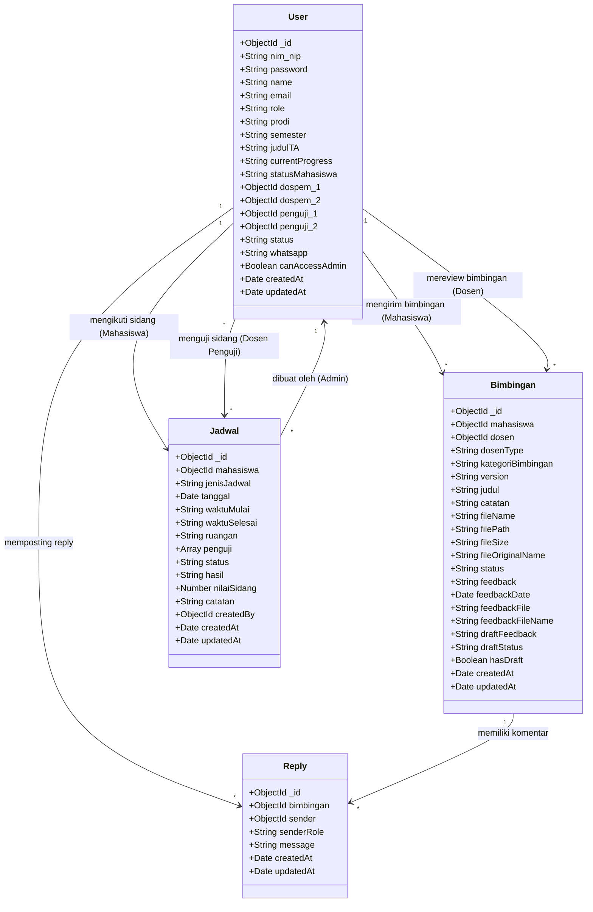
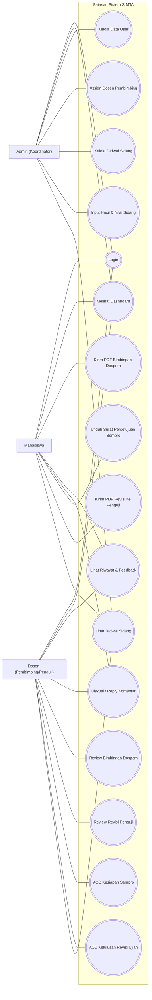
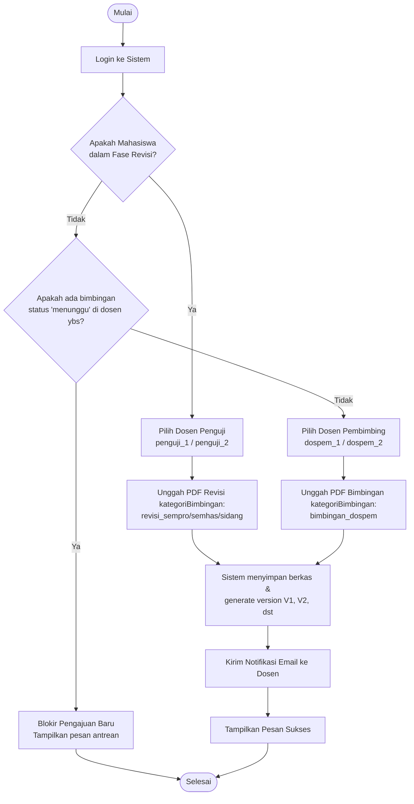
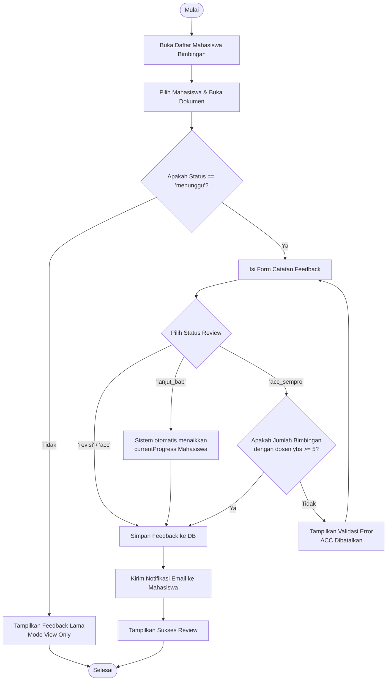
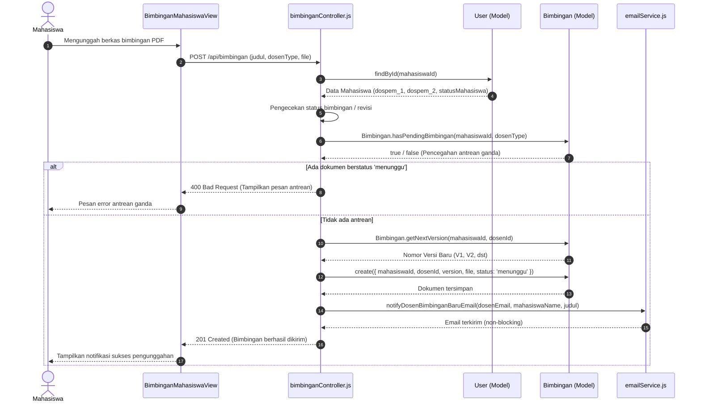
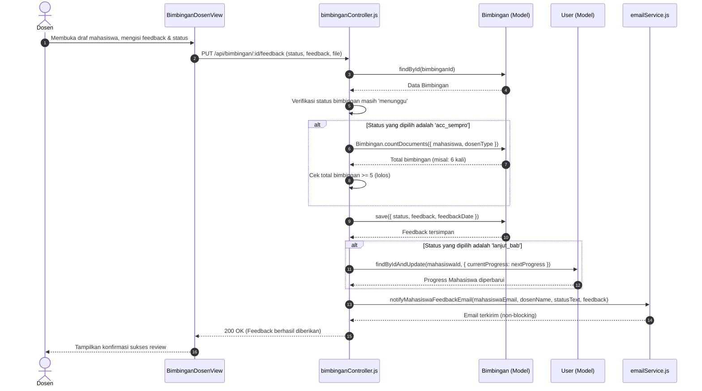

# Kumpulan Kode Mermaid Diagram Bab IV (Skripsi SIMTA)

Dokumen ini berisi seluruh kode Mermaid.js yang telah disesuaikan dan dikoreksi 100% sesuai dengan kode program riil (frontend, backend, Mongoose schema, dan controllers) pada repositori SIMTA.

Anda dapat menyalin kode-kode di bawah ini dan langsung menempelkannya ke **[mermaid.live](https://mermaid.live)** untuk merender diagram dalam format gambar (PNG/SVG) berkualitas tinggi.

---

## 1. Class Diagram (Gambar 4.19) - MongoDB/Mongoose Skema

---

## 2. Use Case Diagram (Gambar 4.2) - Penggabungan Aktor Dosen

---

## 3. Activity Diagram - Pengajuan Bimbingan Mahasiswa (Gambar 4.7)

---

## 4. Activity Diagram - Dosen Review Bimbingan (Gambar 4.8)

---

## 5. Sequence Diagram - Mahasiswa Upload Bimbingan (Gambar 4.15) - Lapis MVC

---

## 6. Sequence Diagram - Dosen Review Bimbingan (Gambar 4.16) - Lapis MVC

