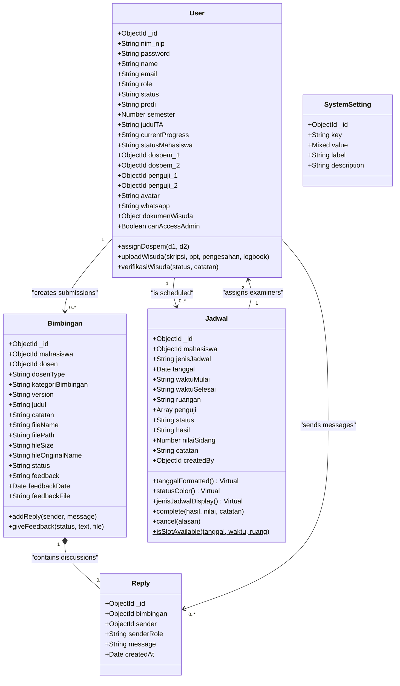
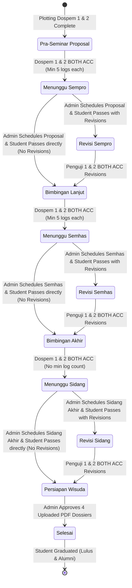
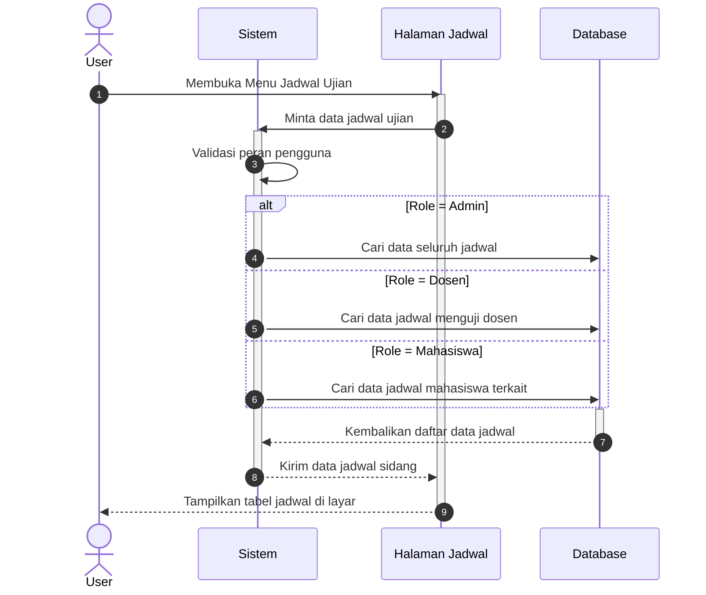
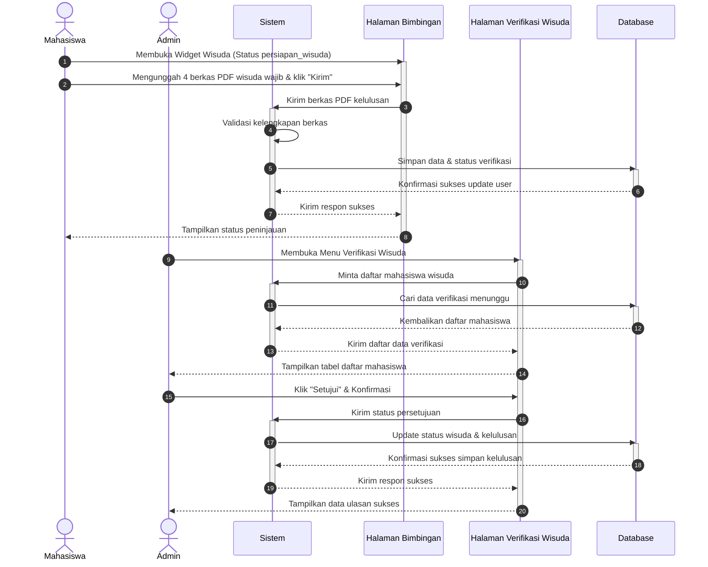
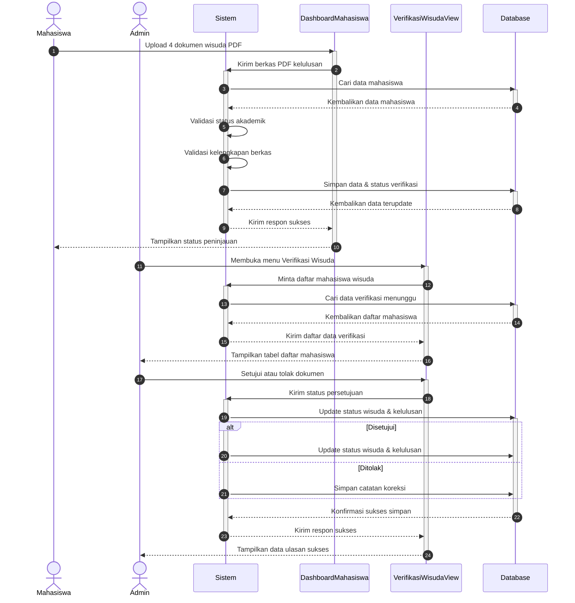

# SIMTA UML SYSTEM ARCHITECTURE & DIAGRAMS SPECIFICATIONS
## Central System UML Diagrams, Structural Design, and Core Workflow Sequences
### Study Case: Program Studi Sistem Informasi - Institut Teknologi Batam

---

## 1. ACTORS & USE CASE SPECIFICATIONS

### 1.1 Actor Definitions
SIMTA Batam operates under a Role-Based Access Control (RBAC) model with three main system roles:

1.  **Mahasiswa (Student):**
    *   Submits guidance reports (Bimbingan) to Supervisors.
    *   Submits exam revisions to Examiners.
    *   Views personalized exam schedules.
    *   Uploads graduation documents during the graduation preparation stage.
2.  **Dosen (Lecturer):**
    *   Acts as **Dosen Pembimbing (Supervisor 1 & 2)**: Reviews weekly guidance submissions, gives feedback, and awards stage ACCs.
    *   Acts as **Dosen Penguji (Examiner 1 & 2)**: Evaluates student exam sessions and reviews post-exam revisions.
3.  **Admin (Academic Administrator):**
    *   Manages user accounts (soft delete, activation).
    *   Maps student-supervisor allocations.
    *   Schedules exams (Seminar Proposal, Seminar Hasil, Sidang Akhir) and plots examiners.
    *   Verifies graduation dossiers.

---

### 1.2 Use Case Diagram

```mermaid
graph LR
  ActorAdmin["Admin (Koordinator TA)"]
  ActorMhs["Mahasiswa"]
  ActorDsn["Dosen (Pembimbing / Penguji)"]

  subgraph Batasan Sistem SIMTA
    UC_Login(((Login & Proteksi Sesi)))
    UC_Dash(((Melihat Dashboard)))
    UC_Users(((Kelola Data Pengguna)))
    UC_Plot(((Assign Dosen Pembimbing)))
    UC_Jadwal(((Kelola Jadwal Sidang)))
    UC_Hasil(((Input Hasil & Nilai Sidang)))
    UC_UploadWisuda(((Verifikasi Berkas Wisuda)))
    
    UC_Upload(((Kirim PDF Bimbingan Dospem)))
    UC_History(((Lihat Riwayat & Feedback)))
    UC_Reply(((Diskusi / Reply Komentar)))
    UC_Surat(((Unduh Surat Kelayakan DOCX)))
    UC_Revisi(((Kirim PDF Revisi ke Penguji)))
    UC_ViewJadwal(((Lihat Jadwal Sidang Global)))
    UC_UploadWsd(((Unggah Berkas Wisuda PDF)))
    
    UC_ReviewDospem(((Review Bimbingan Dospem)))
    UC_ReviewPenguji(((Review Revisi Penguji)))
    UC_AccSempro(((ACC Kesiapan Sidang)))
    UC_AccRevisi(((ACC Kelulusan Revisi)))
  end

  ActorAdmin --- UC_Login
  ActorAdmin --- UC_Dash
  ActorAdmin --- UC_Users
  ActorAdmin --- UC_Plot
  ActorAdmin --- UC_Jadwal
  ActorAdmin --- UC_Hasil
  ActorAdmin --- UC_UploadWisuda
  ActorAdmin --- UC_ViewJadwal

  ActorMhs --- UC_Login
  ActorMhs --- UC_Dash
  ActorMhs --- UC_Upload
  ActorMhs --- UC_History
  ActorMhs --- UC_Reply
  ActorMhs --- UC_Surat
  ActorMhs --- UC_Revisi
  ActorMhs --- UC_ViewJadwal
  ActorMhs --- UC_UploadWsd

  ActorDsn --- UC_Login
  ActorDsn --- UC_Dash
  ActorDsn --- UC_History
  ActorDsn --- UC_Reply
  ActorDsn --- UC_ReviewDospem
  ActorDsn --- UC_ReviewPenguji
  ActorDsn --- UC_AccSempro
  ActorDsn --- UC_AccRevisi
  ActorDsn --- UC_ViewJadwal
```



---

## 2. CLASS DIAGRAM & MONGODB SCHEMA STRUCTURAL SPECIFICATIONS

This class diagram represents the Mongoose schemas and model methods operating in the backend.



---

## 3. STATE MACHINE DIAGRAM: STUDENT ACADEMIC TIMELINE

The student state transitions are controlled by backend status promotions in `bimbinganController.js` and `jadwalController.js`.



---

## 4. SEQUENCE DIAGRAMS (CORE WORKFLOWS)

Semua sequence diagram di bawah dirancang mengikuti visualisasi kating Chrystalio yang menonjolkan objek GUI (Halaman/View, Form, Dialog Konfirmasi) berpasangan dengan sistem validasi dan database.

### 4.1 Sequence Diagram Autentikasi Pengguna (Login)

```mermaid
sequenceDiagram
    autonumber
    actor U as User
    participant SV as Sistem
    participant LV as Halaman Login
    participant DV as DashboardView
    participant DB as Database

    U->>LV: Mengisi NIM/NIP & password
    activate LV
    LV->>SV: Kirim data login
    activate SV
    SV->>DB: Cari data pengguna
    activate DB
    DB-->>SV: Kembalikan data pengguna
    deactivate DB
    SV->>SV: Validasi keaktifan akun
    SV->>SV: Verifikasi password
    
    alt Akun Tidak Valid
        SV-->>LV: Kirim pesan kegagalan
        deactivate SV
        LV-->>U: Tampilkan notifikasi gagal
    else Akun Valid
        SV-->>LV: Kirim respon sukses
        deactivate SV
        LV->>DV: Akses dashboard sesuai peran
        activate DV
        DV-->>U: Tampilkan halaman dashboard
        deactivate DV
    end
    deactivate LV
```

---

### 4.2 Sequence Diagram Admin Kelola Data User

```mermaid
sequenceDiagram
    autonumber
    actor A as Admin
    participant SV as Sistem
    participant UV as Halaman User
    participant FA as FormTambahUser
    participant DB as Database

    A->>UV: Membuka Halaman Kelola User
    activate UV
    A->>FA: Mengisi form data user & klik "Simpan"
    activate FA
    FA->>SV: Kirim data pengguna baru
    activate SV
    SV->>DB: Cek duplikasi NIM/NIP
    activate DB
    DB-->>SV: Kembalikan hasil pencarian
    deactivate DB
    
    alt NIM/NIP Sudah Terdaftar
        SV-->>FA: Kirim pesan error
        deactivate SV
        FA-->>A: Tampilkan notifikasi duplikasi
    else NIM/NIP Baru
        SV->>SV: Enkripsi password default
        SV->>DB: Simpan data pengguna baru
        activate DB
        DB-->>SV: Konfirmasi sukses simpan
        deactivate DB
        SV-->>FA: Kirim respon sukses
        deactivate SV
        FA-->>UV: Tutup form tambah
        deactivate FA
        UV-->>A: Tampilkan data pengguna terbaru
    end
    deactivate UV
```

---

### 4.3 Sequence Diagram Admin Plotting Dosen Pembimbing

```mermaid
sequenceDiagram
    autonumber
    actor A as Admin
    participant SV as Sistem
    participant PV as Halaman Plotting
    participant FP as FormPlottingDospem
    participant DB as Database

    A->>PV: Membuka Halaman Plotting Dospem
    activate PV
    A->>FP: Memilih Mahasiswa & Dospem 1 & 2
    activate FP
    FP->>SV: Kirim data plotting dosen
    activate SV
    
    alt Dosen Sama
        SV-->>FP: Kirim pesan error
        deactivate SV
        FP-->>A: Tampilkan notifikasi kesalahan
    else Dosen Berbeda
        SV->>DB: Simpan relasi dosen pembimbing
        activate DB
        DB-->>SV: Konfirmasi sukses simpan
        deactivate DB
        SV-->>FP: Kirim respon sukses
        deactivate SV
        FP-->>PV: Tutup form plotting
        deactivate FP
        PV-->>A: Tampilkan data plotting terbaru
    end
    deactivate PV
```

---

### 4.4 Sequence Diagram Admin Kelola Jadwal Ujian

```mermaid
sequenceDiagram
    autonumber
    actor A as Admin
    participant SV as Sistem
    participant JV as Halaman Jadwal
    participant FJ as FormTambahJadwal
    participant DB as Database

    A->>JV: Membuka Halaman Kelola Jadwal
    activate JV
    A->>FJ: Mengisi form jadwal sidang & klik "Simpan"
    activate FJ
    FJ->>SV: Kirim data jadwal baru
    activate SV
    SV->>DB: Cek ketersediaan ruangan
    activate DB
    DB-->>SV: Kembalikan status ruangan
    deactivate DB
    
    alt Ruangan Bentrok
        SV-->>FJ: Kirim pesan error
        deactivate SV
        FJ-->>A: Tampilkan notifikasi bentrok
    else Ruangan Tersedia
        SV->>SV: Validasi peran dosen penguji
        SV->>DB: Simpan data jadwal sidang
        activate DB
        DB-->>SV: Konfirmasi sukses simpan jadwal
        deactivate DB
        SV->>DB: Update data penguji & status mahasiswa
        activate DB
        DB-->>SV: Konfirmasi sukses update user
        deactivate DB
        SV-->>FJ: Kirim respon sukses
        deactivate SV
        FJ-->>JV: Tutup form jadwal
        deactivate FJ
        JV-->>A: Tampilkan jadwal terbaru & kirim email pemberitahuan
    end
    deactivate JV
```

---

### 4.5 Sequence Diagram Mahasiswa Upload Bimbingan / Revisi

```mermaid
sequenceDiagram
    autonumber
    actor M as Mahasiswa
    participant SV as Sistem
    participant BV as Halaman Bimbingan
    participant FU as FormUploadBimbingan
    participant DB as Database

    M->>BV: Membuka Menu Bimbingan
    activate BV
    M->>FU: Klik "Pengajuan Baru", pilih Dosen & file PDF
    activate FU
    FU->>SV: Kirim berkas bimbingan PDF
    activate SV
    SV->>DB: Cek status bimbingan aktif
    activate DB
    DB-->>SV: Kembalikan data bimbingan
    deactivate DB
    
    alt Ada Bimbingan Menunggu
        SV-->>FU: Kirim pesan penolakan
        deactivate SV
        FU-->>M: Tampilkan notifikasi antrean penuh
    else Antrean Kosong
        SV->>DB: Simpan berkas & generate versi otomatis
        activate DB
        DB-->>SV: Konfirmasi sukses simpan
        deactivate DB
        SV-->>FU: Kirim respon sukses
        deactivate SV
        FU-->>BV: Tutup form upload
        deactivate FU
        BV-->>M: Tampilkan riwayat bimbingan & kirim email pemberitahuan
    end
    deactivate BV
```

---

### 4.6 Sequence Diagram Dosen Review Bimbingan / Revisi

```mermaid
sequenceDiagram
    autonumber
    actor D as Dosen
    participant SV as Sistem
    participant RV as Halaman Review
    participant FF as FormFeedbackUlasan
    participant DB as Database

    D->>RV: Memilih Dokumen Mahasiswa
    activate RV
    RV-->>D: Tampilkan berkas PDF & form review
    D->>FF: Mengisi feedback, pilih status & klik "Kirim"
    activate FF
    FF->>SV: Kirim feedback & keputusan review
    activate SV
    
    alt ACC Sidang & Sesi Kurang
        SV-->>FF: Kirim pesan penolakan
        deactivate SV
        FF-->>D: Tampilkan notifikasi syarat kurang
    else Syarat Terpenuhi
        SV->>DB: Simpan catatan ulasan & status
        activate DB
        DB-->>SV: Konfirmasi sukses update bimbingan
        deactivate DB
        
        alt Keputusan: Lanjut Bab
            SV->>DB: Update progres bab mahasiswa
            activate DB
            DB-->>SV: Konfirmasi sukses update user
            deactivate DB
        end
        
        SV-->>FF: Kirim respon sukses
        deactivate SV
        FF-->>RV: Tutup form ulasan
        deactivate FF
        RV-->>D: Tampilkan data ulasan & kirim notifikasi email
    end
    deactivate RV
```

---

### 4.7 Sequence Diagram Diskusi Reply Komentar

```mermaid
sequenceDiagram
    autonumber
    actor U as User
    participant SV as Sistem
    participant DV as Halaman Detail Bimbingan
    participant FC as FormKomentarBalasan
    participant DB as Database

    U->>DV: Membuka Detail Riwayat Bimbingan
    activate DV
    U->>FC: Menulis pesan & menekan tombol "Kirim"
    activate FC
    FC->>SV: Kirim pesan balasan
    activate SV
    SV->>SV: Validasi otorisasi pengirim
    
    alt Pengirim Tidak Sah
        SV-->>FC: Kirim pesan kesalahan
        deactivate SV
        FC-->>U: Tampilkan notifikasi akses ditolak
    else Pengirim Sah
        SV->>DB: Simpan pesan diskusi
        activate DB
        DB-->>SV: Konfirmasi sukses simpan
        deactivate DB
        SV-->>FC: Kirim respon sukses
        deactivate SV
        FC-->>DV: Tampilkan balasan baru di layar
        deactivate FC
    end
    deactivate DV
```

---

### 4.8 Sequence Diagram Lihat Jadwal Ujian



---

### 4.9 Sequence Diagram Upload dan Verifikasi Berkas Wisuda (Stage 7)



---

## 5. DATABASE ERD (ENTITY RELATIONSHIP DIAGRAM)

This diagram shows the MongoDB database references and Cardinality relationships between the collections.


---

## 6. BAB 4 WRITING MEMORY: VERIFIED SYSTEM FACTS

Bagian ini adalah catatan kerja untuk menulis Bab 4 SIMTA agar narasi, UML, database, dan screenshot tidak melenceng dari sistem yang berjalan saat ini.

### 6.1 Fokus Bab 4 yang Paling Aman

Judul penelitian berfokus pada pengembangan sistem manajemen tugas akhir terintegrasi berbasis web untuk optimalisasi proses bimbingan. Karena itu, Bab 4 sebaiknya menonjolkan alur utama berikut:

1. Mahasiswa login dan melihat dashboard progres tugas akhir.
2. Mahasiswa mengajukan bimbingan atau revisi dengan upload dokumen PDF.
3. Sistem mengarahkan pengajuan ke Dosen Pembimbing atau Dosen Penguji sesuai fase akademik mahasiswa.
4. Dosen melakukan review, memberi feedback, menentukan status dokumen, dan dapat mengunggah file feedback.
5. Mahasiswa melihat riwayat, status, feedback, dan membalas komentar diskusi.
6. Admin mengelola user, plotting dosen pembimbing, kelola jadwal sidang, monitoring bimbingan, dan verifikasi dokumen wisuda.

Fitur yang boleh menjadi pendukung Bab 4:

- Kelola jadwal sidang proposal, seminar hasil, dan sidang akhir.
- Generate surat persetujuan sempro dalam format DOCX.
- Notifikasi email/WhatsApp sebagai fitur pendukung berbasis konfigurasi backend.
- Verifikasi berkas wisuda setelah mahasiswa selesai sidang akhir.

Fitur yang sebaiknya tidak ditonjolkan sebagai flow utama:

- Refresh token.
- Reset password.
- Upload avatar.
- Health check API.
- Wireframe pages.
- Plain password/demo password.
- Hard delete sebagai fitur utama.

### 6.2 Aktor Sistem

| Aktor | Peran dalam Sistem | Modul Utama |
|---|---|---|
| Mahasiswa | Mengelola proses bimbingan, revisi penguji, melihat jadwal, dan upload berkas wisuda setelah tahap akhir terbuka | Dashboard Mahasiswa, Bimbingan Mahasiswa, Jadwal Sidang |
| Dosen | Berperan sebagai pembimbing dan/atau penguji; melakukan review dokumen, memberi feedback, ACC, dan melihat jadwal sebagai penguji | Dashboard Dosen, Mahasiswa Bimbingan, Review Bimbingan, Jadwal Penguji |
| Admin | Mengelola data master, plotting dospem, jadwal sidang, monitoring bimbingan, laporan, dan verifikasi dokumen wisuda | Dashboard Admin, Manajemen User, Plotting, Kelola Bimbingan, Kelola Jadwal, Laporan, Verifikasi Wisuda |

Catatan penting: di database hanya ada role `mahasiswa`, `dosen`, dan `admin`. Dosen pembimbing dan dosen penguji bukan role terpisah, tetapi relasi dinamis pada field `dospem_1`, `dospem_2`, `penguji_1`, dan `penguji_2`.

### 6.3 Mapping Route Frontend Bab 4

| Route Frontend | Role | Halaman/Komponen | Kegunaan Bab 4 |
|---|---|---|---|
| `/` | Publik | Login | Autentikasi awal dan redirect berdasarkan role |
| `/dashboard/mahasiswa` | Mahasiswa | DashboardMhs | Menampilkan progres, dospem, status akademik, jadwal, dan tahap wisuda |
| `/bimbingan/mahasiswa` | Mahasiswa | BimbinganMahasiswa | Upload bimbingan/revisi, lihat riwayat, feedback, dan reply |
| `/dashboard/dosen` | Dosen | DashboardDosen | Ringkasan mahasiswa bimbingan dan tugas review |
| `/dosen/mahasiswa` | Dosen | ListMahasiswaBimbingan | Daftar mahasiswa bimbingan/penguji |
| `/bimbingan/dosen/:mahasiswaId` | Dosen | BimbinganDosen | Review dokumen dan pemberian feedback |
| `/dosen/jadwal-penguji` | Dosen | JadwalPenguji | Jadwal dosen sebagai penguji |
| `/admin/dashboard` | Admin | DashboardAdmin | Ringkasan data sistem |
| `/admin/users` | Admin | ManajemenUser | Kelola data mahasiswa, dosen, admin |
| `/admin/plotting` | Admin | KelolaPlottingDosen | Assign dospem 1 dan dospem 2 |
| `/admin/bimbingan` | Admin | KelolaBimbingan | Monitoring daftar mahasiswa bimbingan dan status tahap |
| `/admin/jadwal` | Admin | KelolaJadwal | Buat, ubah, selesaikan, batalkan, dan hapus jadwal sidang |
| `/admin/laporan` | Admin | Laporan | Rekap progress bimbingan |
| `/admin/wisuda` | Admin | VerifikasiWisuda | Verifikasi dokumen wisuda mahasiswa |
| `/jadwal-sidang` | Mahasiswa/Dosen/Admin | JadwalSidang | Tampilan jadwal sidang global dengan filter jenis, status, ruangan, dan dosen |

### 6.4 Mapping Endpoint Backend Bab 4

| Modul | Endpoint Utama | Controller | Model |
|---|---|---|---|
| Login | `POST /api/auth/login`, `GET /api/auth/me` | authController | User |
| User/Admin | `GET /api/users`, `POST /api/users`, `PUT /api/users/:id`, `DELETE /api/users/:id` | userController | User |
| Plotting Dospem | `PUT /api/users/:id/assign-dospem` | userController | User |
| Upload Bimbingan | `POST /api/bimbingan` | bimbinganController | User, Bimbingan |
| Riwayat Bimbingan | `GET /api/bimbingan`, `GET /api/bimbingan/:id` | bimbinganController | Bimbingan, Reply |
| Feedback Dosen | `PUT /api/bimbingan/:id/feedback` | bimbinganController | Bimbingan, User |
| Draft Feedback | `PUT /api/bimbingan/:id/draft-feedback` | bimbinganController | Bimbingan |
| Reply Komentar | `POST /api/bimbingan/:id/reply` | bimbinganController | Bimbingan, Reply |
| Surat Sempro | `GET /api/bimbingan/sempro-status/:mahasiswaId`, `GET /api/bimbingan/generate-surat-sempro/:mahasiswaId` | bimbinganController | User, Bimbingan |
| Monitoring Admin | `GET /api/bimbingan/admin/progress-report`, `GET /api/bimbingan/admin/mahasiswa/:mahasiswaId` | bimbinganController | User, Bimbingan |
| Jadwal Sidang | `GET /api/jadwal`, `POST /api/jadwal`, `PUT /api/jadwal/:id`, `DELETE /api/jadwal/:id` | jadwalController | Jadwal, User |
| Wisuda | `POST /api/users/upload-wisuda`, `PUT /api/users/:id/verifikasi-wisuda` | userController | User |

---

## 7. BAB 4 DIAGRAM PACKAGE RECOMMENDATION

### 7.1 Diagram yang Direkomendasikan

Untuk Bab 4, paket diagram yang seimbang adalah:

1. Use Case Diagram SIMTA.
2. Activity Diagram Login.
3. Activity Diagram Kelola User.
4. Activity Diagram Plotting Dosen Pembimbing.
5. Activity Diagram Kelola Jadwal Sidang.
6. Activity Diagram Pengajuan Bimbingan/Revisi.
7. Activity Diagram Dosen Review Bimbingan.
8. Activity Diagram Diskusi Reply Komentar.
9. Activity Diagram Upload dan Verifikasi Berkas Wisuda.
10. Sequence Diagram Login.
11. Sequence Diagram Admin Kelola User.
12. Sequence Diagram Admin Plotting Dosen.
13. Sequence Diagram Admin Kelola Jadwal Sidang.
14. Sequence Diagram Mahasiswa Upload Bimbingan/Revisi.
15. Sequence Diagram Dosen Review Bimbingan.
16. Sequence Diagram Diskusi Reply Komentar.
17. Sequence Diagram Upload dan Verifikasi Wisuda.
18. Class Diagram SIMTA.
19. ERD/struktur collection MongoDB.
20. State Machine status akademik mahasiswa.

Jika Bab 4 harus dibuat lebih ringkas, gunakan 3 flowchart aktor:

1. Flowchart Mahasiswa.
2. Flowchart Dosen.
3. Flowchart Admin.

Lalu diagram detail bimbingan dan jadwal tetap dijelaskan melalui activity/sequence utama.

### 7.2 Use Case yang Wajib Masuk

| Aktor | Use Case |
|---|---|
| Mahasiswa | Login, melihat dashboard, upload bimbingan, upload revisi penguji, melihat riwayat bimbingan, melihat feedback, membalas komentar, melihat jadwal sidang, upload berkas wisuda |
| Dosen | Login, melihat dashboard, melihat daftar mahasiswa, download dokumen, memberi feedback/status, upload file feedback, membalas komentar, melihat jadwal sebagai penguji |
| Admin | Login, kelola user, assign dospem, kelola jadwal sidang, monitoring bimbingan, laporan progress, verifikasi dokumen wisuda |

Use case pendukung:

- Generate surat persetujuan sempro.
- Notifikasi email/WhatsApp.
- Filter jadwal berdasarkan jenis, status, ruangan, dan dosen.

### 7.3 Activity Diagram Upload dan Verifikasi Wisuda


### 7.4 Sequence Diagram Upload dan Verifikasi Wisuda



---

## 8. CURRENT DATABASE STRUCTURE FOR BAB 4

### 8.1 Collection `users`

Fungsi: menyimpan akun mahasiswa, dosen, dan admin, termasuk data akademik mahasiswa dan relasi dosen.

Field penting untuk Bab 4:

| Field | Keterangan |
|---|---|
| `nim_nip` | NIM/NIP unik untuk login |
| `password` | Password hashed, jangan ditulis sebagai password biasa |
| `plainPassword` | Field demo/internal, jangan ditonjolkan |
| `name` | Nama user |
| `email` | Email user |
| `role` | `mahasiswa`, `dosen`, `admin` |
| `prodi` | Program studi mahasiswa |
| `semester` | Semester mahasiswa |
| `judulTA` | Judul tugas akhir |
| `currentProgress` | `BAB I`, `BAB II`, `BAB III`, `BAB IV`, `BAB V`, `BAB VI`, `Selesai` |
| `statusMahasiswa` | Tahap akademik mahasiswa dari pra sempro sampai selesai |
| `dospem_1`, `dospem_2` | Relasi dosen pembimbing |
| `penguji_1`, `penguji_2` | Relasi dosen penguji yang disinkronkan dari jadwal |
| `status` | Status akun `aktif` atau `nonaktif` |
| `whatsapp` | Kontak WhatsApp untuk notifikasi |
| `dokumenWisuda` | Dokumen persiapan wisuda dan status verifikasi admin |
| `canAccessAdmin` | Akses admin tambahan untuk dosen tertentu |
| `createdAt`, `updatedAt` | Timestamp data |

Subfield `dokumenWisuda`:

| Subfield | Keterangan |
|---|---|
| `skripsiFull` | File skripsi lengkap |
| `pptSkripsi` | File presentasi skripsi |
| `halamanPengesahan` | File halaman pengesahan |
| `formBimbingan` | File form/log bimbingan |
| `statusVerifikasi` | `belum_upload`, `menunggu_verifikasi`, `disetujui`, `ditolak` |
| `catatanAdmin` | Catatan admin jika dokumen ditolak |
| `verifiedAt` | Waktu verifikasi |

### 8.2 Collection `bimbingans`

Fungsi: menyimpan dokumen bimbingan normal dan revisi pascasidang/ujian.

Field penting:

| Field | Keterangan |
|---|---|
| `mahasiswa` | Ref ke `User` mahasiswa |
| `dosen` | Ref ke `User` dosen tujuan |
| `dosenType` | `dospem_1`, `dospem_2`, `penguji_1`, `penguji_2` |
| `kategoriBimbingan` | `bimbingan_dospem`, `revisi_sempro`, `revisi_semhas`, `revisi_sidang` |
| `version` | Versi dokumen seperti `V1`, `V2` |
| `judul` | Judul bimbingan |
| `catatan` | Catatan mahasiswa |
| `fileName`, `filePath`, `fileSize`, `fileOriginalName` | Metadata file mahasiswa |
| `status` | `menunggu`, `revisi`, `acc`, `lanjut_bab`, `acc_sempro` |
| `feedback`, `feedbackDate` | Feedback dosen dan tanggal feedback |
| `feedbackFile`, `feedbackFileName` | Lampiran feedback dosen |
| `draftFeedback`, `draftStatus`, `draftFeedbackFile`, `draftFeedbackFileName`, `hasDraft` | Draft feedback dosen sebelum dipublikasikan |
| `createdAt`, `updatedAt` | Timestamp data |

Catatan Bab 4:

- `Reply` tidak disimpan sebagai array fisik di `Bimbingan`; relasinya virtual lewat collection `replies`.
- Saat mahasiswa berada di fase revisi, upload diarahkan ke `penguji_1` atau `penguji_2`, bukan dospem.
- Status `acc_sempro` masih menjadi nilai database, walaupun narasi UI dapat menampilkan ACC maju tahap sidang/sempro.

### 8.3 Collection `jadwals`

Fungsi: menyimpan jadwal sidang proposal, seminar hasil, dan sidang akhir.

Field penting:

| Field | Keterangan |
|---|---|
| `mahasiswa` | Ref ke `User` mahasiswa peserta sidang |
| `jenisJadwal` | `sidang_proposal`, `sidang_semhas`, `sidang_skripsi` |
| `tanggal` | Tanggal sidang |
| `waktuMulai`, `waktuSelesai` | Waktu pelaksanaan |
| `ruangan` | Ruangan sidang, pada UI admin tersedia pilihan A401-A414 |
| `penguji` | Array ref dosen penguji |
| `status` | `dijadwalkan`, `berlangsung`, `selesai`, `dibatalkan` |
| `hasil` | `lulus`, `lulus_revisi`, `tidak_lulus`, atau null |
| `nilaiSidang` | Nilai sidang 0-100 |
| `catatan` | Catatan hasil/pembatalan |
| `createdBy` | Admin pembuat jadwal |
| `createdAt`, `updatedAt` | Timestamp data |

Catatan Bab 4:

- `sidang_semhas` sudah ada di sistem terbaru, jadi jangan hanya menulis proposal dan skripsi.
- Jadwal selesai tidak otomatis terhapus; statusnya menjadi `selesai` dan dapat difilter di UI.
- Jika hasil `lulus_revisi`, mahasiswa masuk fase revisi penguji. Jika hasil `lulus`, mahasiswa dapat naik langsung ke tahap berikutnya.

### 8.4 Collection `replies`

Fungsi: menyimpan komentar diskusi pada dokumen bimbingan.

Field penting:

| Field | Keterangan |
|---|---|
| `bimbingan` | Ref ke `Bimbingan` |
| `sender` | Ref ke `User` pengirim |
| `senderRole` | `mahasiswa` atau `dosen` |
| `message` | Isi komentar |
| `createdAt`, `updatedAt` | Timestamp data |

---

## 9. STUDENT ACADEMIC STATUS REFERENCE

Status akademik mahasiswa berada pada field `User.statusMahasiswa`.

| Status Database | Label Narasi Bab 4 | Makna |
|---|---|---|
| `pra_sempro` | Belum Sempro / Pra Sempro | Mahasiswa masih bimbingan awal dengan dospem |
| `menunggu_sempro` | Menunggu Sempro | Syarat ACC dospem untuk sempro sudah terpenuhi atau mahasiswa siap dijadwalkan sempro |
| `revisi_sempro` | Revisi Sempro | Mahasiswa lulus sempro dengan revisi dan wajib upload revisi ke penguji |
| `bimbingan_lanjut` | Bimbingan Lanjut | Revisi sempro selesai, mahasiswa lanjut bimbingan BAB IV/V |
| `menunggu_semhas` | Menunggu Seminar Hasil | Mahasiswa siap dijadwalkan seminar hasil |
| `revisi_semhas` | Revisi Seminar Hasil | Mahasiswa lulus semhas dengan revisi dan wajib upload revisi ke penguji |
| `bimbingan_akhir` | Bimbingan Akhir | Revisi semhas selesai, mahasiswa lanjut bimbingan akhir |
| `menunggu_sidang` | Menunggu Sidang Akhir | Mahasiswa siap dijadwalkan sidang akhir |
| `revisi_sidang` | Revisi Sidang Akhir | Mahasiswa lulus sidang akhir dengan revisi |
| `persiapan_wisuda` | Persiapan Wisuda | Revisi sidang selesai atau lulus langsung; mahasiswa dapat upload berkas wisuda |
| `selesai` | Selesai/Lulus | Berkas wisuda disetujui admin |

### 9.1 Aturan Transisi Penting

1. Dospem 1 dan Dospem 2 sama-sama memberi `acc_sempro` pada fase `pra_sempro` -> mahasiswa naik ke `menunggu_sempro`.
2. Setelah jadwal proposal selesai dengan hasil `lulus_revisi` -> mahasiswa masuk `revisi_sempro`.
3. Setelah jadwal proposal selesai dengan hasil `lulus` -> mahasiswa masuk `bimbingan_lanjut`.
4. Revisi sempro disetujui penguji 1 dan 2 -> mahasiswa masuk `bimbingan_lanjut`.
5. Dospem 1 dan 2 memberi `acc_sempro` pada fase `bimbingan_lanjut` -> mahasiswa naik ke `menunggu_semhas`.
6. Setelah jadwal semhas selesai dengan hasil `lulus_revisi` -> mahasiswa masuk `revisi_semhas`.
7. Setelah jadwal semhas selesai dengan hasil `lulus` -> mahasiswa masuk `bimbingan_akhir`.
8. Revisi semhas disetujui penguji 1 dan 2 -> mahasiswa masuk `bimbingan_akhir`.
9. Dospem 1 dan 2 memberi `acc_sempro` pada fase `bimbingan_akhir` -> mahasiswa naik ke `menunggu_sidang`.
10. Setelah jadwal sidang akhir selesai dengan hasil `lulus_revisi` -> mahasiswa masuk `revisi_sidang`.
11. Setelah jadwal sidang akhir selesai dengan hasil `lulus` -> mahasiswa masuk `persiapan_wisuda`.
12. Revisi sidang disetujui penguji 1 dan 2 -> mahasiswa masuk `persiapan_wisuda`.
13. Admin menyetujui dokumen wisuda -> mahasiswa masuk `selesai`.

---

## 10. BAB 4 SCREENSHOT AND NARRATIVE CHECKLIST

Screenshot yang paling kuat untuk Bab 4:

1. Halaman Login.
2. Dashboard Mahasiswa.
3. Halaman Bimbingan Mahasiswa.
4. Detail riwayat bimbingan/feedback mahasiswa.
5. Dashboard Dosen.
6. Halaman daftar mahasiswa bimbingan dosen.
7. Halaman review bimbingan dosen.
8. Dashboard Admin.
9. Manajemen User Admin.
10. Plotting Dosen Pembimbing.
11. Kelola Bimbingan Admin.
12. Kelola Jadwal Sidang Admin.
13. Jadwal Sidang global.
14. Verifikasi Wisuda Admin.

Narasi aman untuk Bab 4:

> SIMTA mengintegrasikan proses bimbingan tugas akhir antara mahasiswa, dosen, dan admin. Mahasiswa dapat mengunggah dokumen bimbingan atau revisi sesuai tahap akademiknya. Dosen berperan sebagai pembimbing maupun penguji melalui relasi yang ditentukan sistem, kemudian memberikan feedback, status review, dan ACC. Admin mengelola data pengguna, plotting dosen pembimbing, jadwal sidang, monitoring bimbingan, serta verifikasi dokumen wisuda. Seluruh proses tersimpan pada database MongoDB melalui collection users, bimbingans, replies, dan jadwals.

Kalimat aman untuk notifikasi:

> Sistem mendukung pengiriman notifikasi email/WhatsApp berdasarkan konfigurasi backend, sehingga notifikasi diposisikan sebagai fitur pendukung dan bukan syarat utama keberhasilan proses bimbingan.

Kalimat aman untuk jadwal:

> Jadwal sidang tidak dihapus otomatis ketika selesai, tetapi disimpan dengan status `selesai` agar dapat menjadi riwayat akademik dan dapat difilter pada halaman kelola jadwal.

Kalimat aman untuk wisuda:

> Modul wisuda terbuka setelah mahasiswa berada pada status `persiapan_wisuda`. Mahasiswa mengunggah empat dokumen PDF, kemudian admin melakukan verifikasi. Jika disetujui, status mahasiswa berubah menjadi `selesai`.

---

## 11. CAVEATS FOR BAB 4 CONSISTENCY

1. Jangan menulis `penguji` sebagai role user terpisah. Penguji adalah dosen yang ditunjuk melalui jadwal dan disimpan pada `penguji_1`, `penguji_2`, atau array `Jadwal.penguji`.
2. Jangan menulis `periode`, `gelombang`, atau `tahunAkademik` sebagai field database `Jadwal` jika hanya muncul sebagai filter/tampilan frontend.
3. Jangan menulis `replies` sebagai kolom fisik di collection `bimbingans`; itu virtual relation.
4. Jangan menonjolkan `plainPassword` di Bab 4 karena bersifat demo/internal.
5. Jangan menyatakan notifikasi selalu terkirim; tulis sebagai dukungan sistem berbasis konfigurasi.
6. Gunakan istilah `Seminar Proposal`, `Seminar Hasil`, dan `Sidang Akhir` untuk label akademik, dengan nilai database `sidang_proposal`, `sidang_semhas`, dan `sidang_skripsi`.
7. Jika menggunakan istilah "ACC Sidang" pada narasi, ingat bahwa nilai status bimbingan di database tetap `acc_sempro`.
8. Untuk Bab 4 saat ini, fitur inti tetap bimbingan dan review. Jadwal, laporan, dan wisuda adalah penguat integrasi alur tugas akhir.

---

## 12. WAJIB IKUTI STRUKTUR TA BAB 4 USER

Bagian ini adalah keputusan penting dari pembacaan `RANDOM-KEBUTUHANSKRIPSI/extracted_docx_text.txt`. Jangan menyarankan struktur baru yang tidak dipakai naskah user.

### 12.1 Struktur Bab 4 yang Dipakai

Bab 4 user saat ini memakai struktur berikut:

1. `4.1 Analisis Sistem`
   - `4.1.1 Sistem yang Sedang Berjalan`
   - `4.1.2 Sistem yang Diusulkan`
   - Use Case Diagram
   - Activity Diagram
   - Sequence Diagram
   - Class Diagram
2. `4.2 Analisis Kebutuhan Sistem`
   - `4.2.1 Analisis Kebutuhan Fungsional`
   - `4.2.2 Analisis Kebutuhan Non-Fungsional`
3. `4.3 Perancangan Sistem`
   - `4.3.1 Desain Sistem`
   - `4.3.2 Database`
   - `4.3.3 Flowchart`

Keputusan penting:

- Bab 4 user tidak memakai ERD sebagai bagian utama.
- Bagian database ditulis dalam bentuk tabel spesifikasi collection, bukan ERD.
- Jangan menyarankan tambah ERD kecuali user secara eksplisit minta.
- Fokus revisi adalah memperbaiki diagram/tabel yang sudah ada agar sesuai sistem terbaru.

### 12.2 UML yang Sudah Masuk di Bab 4

| Gambar | Isi |
|---|---|
| Gambar 4.2 | Use Case Diagram SI Manajemen Tugas Akhir (SIMTA) |
| Gambar 4.3 | Activity Diagram Login user Admin/Mahasiswa/Dosen |
| Gambar 4.4 | Activity Diagram Pengelolaan Data Pengguna |
| Gambar 4.5 | Activity Diagram Penentuan Dosen Pembimbing |
| Gambar 4.6 | Activity Diagram Pengelolaan Jadwal Sidang |
| Gambar 4.7 | Activity Diagram Pengajuan Bimbingan Mahasiswa |
| Gambar 4.8 | Activity Diagram Dosen Review Bimbingan |
| Gambar 4.9 | Activity Diagram Diskusi/Reply Bimbingan |
| Gambar 4.10 | Activity Diagram Lihat Jadwal Sidang |
| Gambar 4.11 | Sequence Diagram Autentikasi Pengguna |
| Gambar 4.12 | Sequence Diagram Admin Kelola Data User |
| Gambar 4.13 | Sequence Diagram Admin Plotting Dosen Pembimbing |
| Gambar 4.14 | Sequence Diagram Admin Kelola Jadwal Sidang |
| Gambar 4.15 | Sequence Diagram Mahasiswa Upload Bimbingan |
| Gambar 4.16 | Sequence Diagram Dosen Review Bimbingan |
| Gambar 4.17 | Sequence Diagram Diskusi Reply Komentar |
| Gambar 4.18 | Sequence Diagram Lihat Jadwal Sidang |
| Gambar 4.19 | Class Diagram Website SIMTA |

Selain UML, Bab 4 user juga sudah memuat:

- Gambar 4.1 Aliran Sistem yang Sedang Berjalan.
- Gambar 4.20 sampai Gambar 4.28 desain wireframe.
- Tabel 4.5 sampai Tabel 4.8 spesifikasi collection database.
- Gambar 4.29 sampai Gambar 4.31 flowchart aktor Mahasiswa, Dosen Pembimbing, dan Admin.

### 12.3 Gambar UML dari Extracted DOCX

Mapping gambar hasil ekstraksi yang ditemukan dari `caption_image_map.txt`:

| Caption | File Gambar Extract |
|---|---|
| Gambar 4.1 | `RANDOM-KEBUTUHANSKRIPSI/extracted_images/image39.png` |
| Gambar 4.2 | `RANDOM-KEBUTUHANSKRIPSI/extracted_images/image40.png` |
| Gambar 4.3 | `RANDOM-KEBUTUHANSKRIPSI/extracted_images/image41.png` |
| Gambar 4.4 | `RANDOM-KEBUTUHANSKRIPSI/extracted_images/image42.png` |
| Gambar 4.5 | `RANDOM-KEBUTUHANSKRIPSI/extracted_images/image43.png` |
| Gambar 4.6 | `RANDOM-KEBUTUHANSKRIPSI/extracted_images/image44.png` |
| Gambar 4.7 | `RANDOM-KEBUTUHANSKRIPSI/extracted_images/image45.png` |
| Gambar 4.8 | `RANDOM-KEBUTUHANSKRIPSI/extracted_images/image46.png` |
| Gambar 4.9 | `RANDOM-KEBUTUHANSKRIPSI/extracted_images/image47.png` |
| Gambar 4.10 | `RANDOM-KEBUTUHANSKRIPSI/extracted_images/image48.png` |
| Gambar 4.11 | `RANDOM-KEBUTUHANSKRIPSI/extracted_images/image49.png` |
| Gambar 4.12 | `RANDOM-KEBUTUHANSKRIPSI/extracted_images/image50.png` |
| Gambar 4.13 | `RANDOM-KEBUTUHANSKRIPSI/extracted_images/image51.png` |
| Gambar 4.14 | `RANDOM-KEBUTUHANSKRIPSI/extracted_images/image52.png` |
| Gambar 4.15 | `RANDOM-KEBUTUHANSKRIPSI/extracted_images/image53.png` |
| Gambar 4.16 | `RANDOM-KEBUTUHANSKRIPSI/extracted_images/image54.png` |
| Gambar 4.17 | `RANDOM-KEBUTUHANSKRIPSI/extracted_images/image55.png` |
| Gambar 4.18 | `RANDOM-KEBUTUHANSKRIPSI/extracted_images/image56.png` |
| Gambar 4.19 | `RANDOM-KEBUTUHANSKRIPSI/extracted_images/image57.png` |
| Gambar 4.29 | `RANDOM-KEBUTUHANSKRIPSI/extracted_images/image67.png` |
| Gambar 4.30 | `RANDOM-KEBUTUHANSKRIPSI/extracted_images/image68.png` |
| Gambar 4.31 | `RANDOM-KEBUTUHANSKRIPSI/extracted_images/image69.png` |

### 12.4 Revisi Sistem Terbaru yang Harus Masuk Narasi Bab 4

Hasil development terbaru SIMTA yang perlu tercermin di Bab 4:

1. Dosen tidak hanya sebagai pembimbing, tetapi juga dapat menjadi penguji. Di database tetap role `dosen`, sedangkan fungsi pembimbing/penguji ditentukan oleh relasi `dospem_1`, `dospem_2`, `penguji_1`, dan `penguji_2`.
2. Alur sidang sekarang memiliki tiga tahap: Seminar Proposal, Seminar Hasil, dan Sidang Akhir.
3. Jenis jadwal database adalah `sidang_proposal`, `sidang_semhas`, dan `sidang_skripsi`.
4. Status akademik mahasiswa dikontrol oleh `statusMahasiswa`.
5. Mahasiswa fase normal mengajukan bimbingan ke dospem.
6. Mahasiswa fase revisi `revisi_sempro`, `revisi_semhas`, atau `revisi_sidang` mengajukan revisi ke dosen penguji.
7. Kelola Bimbingan Admin sekarang berbentuk daftar mahasiswa seperti manajemen user, dengan status tahap mahasiswa seperti Belum Sempro, Sudah Sempro, Sudah Semhas, dan Sudah Sidang Akhir.
8. Detail Kelola Bimbingan perlu menampilkan dosen pembimbing dan dosen penguji.
9. Kelola Jadwal Admin memiliki filter status jadwal, jenis sidang, ruangan, dan dosen.
10. Ruangan jadwal yang tersedia di UI admin mencakup A401 sampai A414.
11. Jadwal yang selesai tidak otomatis dihapus; statusnya menjadi `selesai` dan dapat difilter agar tidak menumpuk.
12. Setelah mahasiswa masuk `persiapan_wisuda`, dashboard mahasiswa membuka modul upload dokumen wisuda.
13. Admin memiliki menu Verifikasi Wisuda untuk menyetujui atau menolak dokumen mahasiswa.
14. Jika dokumen wisuda disetujui, status mahasiswa berubah menjadi `selesai`.

### 12.5 Revisi yang Perlu Dilakukan pada Bab 4 yang Ada

Tidak perlu menambah banyak UML baru. Prioritasnya revisi diagram dan tabel yang sudah ada:

1. Use Case Diagram:
   - Ubah aktor `Dosen Pembimbing` menjadi `Dosen` atau jelaskan bahwa dosen dapat bertindak sebagai pembimbing dan penguji.
   - Tambahkan use case dosen sebagai penguji jika revisi penguji dibahas.
   - Tambahkan use case upload berkas wisuda dan verifikasi wisuda hanya jika fitur wisuda ikut dibahas.

2. Activity Diagram Pengajuan Bimbingan:
   - Tambahkan decision: apakah mahasiswa berada dalam fase revisi ujian.
   - Jika tidak, pengajuan diarahkan ke dospem.
   - Jika ya, revisi diarahkan ke penguji.

3. Activity Diagram Dosen Review Bimbingan:
   - Ubah narasi dari hanya dosen pembimbing menjadi dosen pembimbing/penguji.
   - Status pembimbing dapat mencakup revisi, ACC, lanjut bab, dan ACC sempro.
   - Status penguji cukup revisi dan ACC untuk menyelesaikan revisi pascaujian.

4. Activity Diagram Kelola Jadwal Sidang:
   - Revisi jenis jadwal agar mencakup Seminar Proposal, Seminar Hasil, dan Sidang Akhir.
   - Tambahkan validasi ruangan, penguji, dan konflik jadwal.
   - Tambahkan status selesai/dibatalkan sebagai bagian pengelolaan jadwal.

5. Sequence Diagram Upload Bimbingan:
   - Tambahkan pengecekan `User.statusMahasiswa`.
   - Tambahkan `kategoriBimbingan` untuk membedakan bimbingan dospem dan revisi penguji.

6. Sequence Diagram Admin Kelola Jadwal:
   - Tambahkan sinkronisasi `penguji_1` dan `penguji_2` ke data mahasiswa.
   - Tambahkan perubahan status akademik saat jadwal selesai dengan hasil `lulus` atau `lulus_revisi`.

7. Class Diagram:
   - Tambah field `User.statusMahasiswa`, `User.penguji_1`, `User.penguji_2`, `User.dokumenWisuda`, dan `User.canAccessAdmin`.
   - Tambah field `Bimbingan.kategoriBimbingan`, `Bimbingan.draftFeedback`, `Bimbingan.draftStatus`, dan `Bimbingan.hasDraft`.
   - Revisi enum `Jadwal.jenisJadwal` agar memuat `sidang_semhas`.
   - Revisi enum `Jadwal.status` agar memuat `berlangsung` dan `dibatalkan`.

8. Tabel Database:
   - Tabel `Users` perlu tambah `statusMahasiswa`, `penguji_1`, `penguji_2`, `dokumenWisuda`, dan `canAccessAdmin`.
   - Tabel `Bimbingan` perlu tambah `kategoriBimbingan`, `feedbackDate`, `feedbackFileName`, `draftFeedback`, `draftStatus`, dan `hasDraft`.
   - Tabel `Jadwal` perlu revisi deskripsi `jenisJadwal` menjadi Proposal/Semhas/Skripsi atau Seminar Proposal/Seminar Hasil/Sidang Akhir.
   - Tabel `Jadwal` perlu tambah status `berlangsung` dan `dibatalkan`.
   - Tabel `Replies` sudah cukup, tidak perlu banyak revisi.

### 12.6 Tambahan UML yang Boleh Dipertimbangkan

Tambahan UML bukan prioritas. Jika user minta tambah diagram, yang paling masuk akal sesuai struktur Bab 4 adalah:

1. Activity Diagram Verifikasi Wisuda.
2. Sequence Diagram Upload dan Verifikasi Wisuda.
3. State Machine Diagram Status Akademik Mahasiswa.

Jangan menyarankan ERD sebagai tambahan utama karena struktur Bab 4 user memakai tabel database, bukan ERD.

---

## 13. ALIRAN SISTEM INFORMASI (ASI) & NARASI SISTEM YANG DIUSULKAN

### 13.1 Narasi Akademik Subbab 4.1.2 Sistem yang Diusulkan

Sistem yang diusulkan adalah Sistem Informasi Manajemen Tugas Akhir (SIMTA) berbasis web yang dirancang untuk mengintegrasikan seluruh proses administrasi dan bimbingan tugas akhir secara digital. Sistem ini hadir sebagai solusi atas keterbatasan sistem berjalan yang masih konvensional, seperti risiko kehilangan data fisik, komunikasi bimbingan yang terfragmentasi pada aplikasi pesan WhatsApp, serta tidak terdokumentasinya progres bimbingan secara sistematis. Melalui SIMTA, interaksi antara Mahasiswa, Dosen Pembimbing, dan Koordinator Tugas Akhir (yang bertindak sebagai Admin) dapat dilakukan dalam satu platform terintegrasi. Hal ini memungkinkan pencatatan riwayat bimbingan secara real-time, penyimpanan dokumen digital yang aman di dalam server, monitoring progres tugas akhir secara transparan, serta otomasi verifikasi persyaratan sidang dan pembuatan surat persetujuan tugas akhir.

Dari sudut pandang Mahasiswa, alur penggunaan sistem yang diusulkan diawali dengan proses login menggunakan kredensial berupa NIM dan password yang telah didaftarkan oleh admin. Setelah berhasil masuk ke Dashboard Mahasiswa, sistem menyajikan informasi profil akademik, nama dosen pembimbing yang ditugaskan, visualisasi progres penulisan tugas akhir (dari BAB I hingga Selesai), serta status kesiapan sidang. Mahasiswa dapat mengajukan bimbingan dengan mengunggah dokumen draf dalam format PDF, memilih dosen tujuan (Dosen Pembimbing 1 atau Dosen Pembimbing 2), menulis judul bimbingan, dan menyertakan catatan penjelasan. Setelah diunggah, mahasiswa dapat memantau riwayat bimbingan yang terorganisasi berdasarkan penomoran versi dokumen (V1, V2, dst.), membaca umpan balik (feedback) dari dosen pembimbing, serta berdiskusi langsung dengan dosen melalui fitur balas komentar (reply). Apabila persyaratan minimal kuota bimbingan terpenuhi dan kedua dosen pembimbing telah memberikan persetujuan akhir (ACC), mahasiswa dapat mengunduh surat persetujuan pelaksanaan seminar proposal atau sidang tugas akhir yang digenerate otomatis oleh sistem dalam format Word (.docx). Selain itu, mahasiswa juga dapat mengakses menu jadwal sidang untuk melihat waktu, tempat, serta susunan tim penguji yang ditugaskan.

Bagi Dosen Pembimbing, alur sistem dimulai dengan melakukan login menggunakan NIP/NIDN dan password. Pada Dashboard Dosen, sistem menampilkan statistik berkas bimbingan mahasiswa yang menunggu ulasan (pending reviews), daftar mahasiswa bimbingan aktif, serta status progres pengerjaan tugas akhir mereka. Dosen dapat membuka halaman ulasan bimbingan mahasiswa untuk mengunduh dokumen draf PDF yang diajukan, menelaah konten tulisan, dan memberikan penilaian. Formulir feedback bimbingan memungkinkan dosen memberikan umpan balik tertulis, melampirkan file dokumen koreksi (opsional), serta menetapkan status bimbingan berupa "revisi", "acc", "lanjut_bab", atau "acc_sempro" untuk merekomendasikan kelayakan maju sidang. Dosen juga dapat berinteraksi secara interaktif dengan mahasiswa di kolom komentar guna memperjelas catatan perbaikan. Selain memproses bimbingan, dosen dapat melihat jadwal sidang yang menetapkan mereka sebagai anggota tim penguji (Dosen Penguji 1 atau Dosen Penguji 2) secara langsung melalui sistem.

Alur sistem bagi Admin atau Koordinator Tugas Akhir berpusat pada manajemen data master, plotting dosen, konfigurasi aturan akademik, dan administrasi ujian. Setelah melakukan login, Admin diarahkan ke Dashboard Admin yang memuat ringkasan aktivitas sistem. Melalui menu manajemen user, admin bertugas mengelola akun pengguna (menambah, mengedit, menonaktifkan, atau menghapus data mahasiswa, dosen, dan admin) serta memetakan pasangan Dosen Pembimbing 1 dan Dosen Pembimbing 2 untuk mahasiswa. Admin juga memiliki wewenang untuk menyesuaikan batas minimal bimbingan per mahasiswa sebagai prasyarat sidang secara dinamis. Ketika mahasiswa telah dinyatakan layak maju sidang, admin mengelola modul penjadwalan sidang dengan menentukan jenis sidang (Sidang Proposal, Seminar Hasil, atau Sidang Skripsi), menetapkan tanggal, waktu, ruangan, serta menugaskan tim dosen penguji. Setelah sidang selesai digelar, admin menginput hasil kelulusan (lulus, lulus revisi, tidak lulus) dan nilai sidang (0-100) ke dalam sistem, yang secara otomatis akan memperbarui status akademik mahasiswa. Admin juga dapat mengakses laporan rekapitulasi progres tugas akhir seluruh mahasiswa untuk kebutuhan monitoring institusi.

### 13.2 Tabel ASI (Aliran Sistem Informasi) Sistem yang Diusulkan

Berikut adalah representasi Diagram ASI sistem SIMTA yang diusulkan dalam format tabel swimlane:

| Mahasiswa | Sistem SIMTA | Dosen Pembimbing | Admin / Koordinator TA |
| :--- | :--- | :--- | :--- |
| 1. Memasukkan NIM dan password pada halaman Login. | | | |
| | 2. Memvalidasi akun dan role pengguna.<br>- *Jika tidak valid*: Menampilkan pesan error.<br>- *Jika valid*: Mengarahkan ke Dashboard Mahasiswa. | | |
| | 3. Menyimpan data master pengguna dan data bimbingan awal. | | 4. Melakukan plotting/assign Dospem 1 & Dospem 2 untuk Mahasiswa, serta mengonfigurasi batas minimal bimbingan (System Setting). |
| 5. Membuka halaman Bimbingan Mahasiswa. | | | |
| 6. Mengunggah draf bimbingan PDF, memilih target dosen (`dospem_1` / `dospem_2`), mengisi judul & catatan bimbingan. | | | |
| | 7. Melakukan validasi pengunggahan dokumen (tipe berkas PDF, ukuran < 10MB, slot bimbingan kosong).<br>- *Jika tidak valid*: Menolak unggahan dan tampilkan error.<br>- *Jika valid*: Menyimpan data bimbingan, auto-increment nomor versi dokumen (`V1`, `V2`, dst.), mengubah status bimbingan menjadi **"menunggu"**, dan mengirimkan notifikasi. | | |
| | 8. Mengirimkan notifikasi (email/WhatsApp) bimbingan baru ke Dosen Pembimbing terkait. | | |
| | | 9. Menerima notifikasi, login ke sistem, dan membuka daftar mahasiswa bimbingan pada Dashboard Dosen. | |
| | | 10. Membuka detail bimbingan mahasiswa, mengunduh file draf PDF, memeriksa dokumen, dan mengisi formulir review. | |
| | 11. Memproses review dosen:<br>- Menyimpan catatan feedback tertulis & file lampiran feedback (opsional).<br>- Memperbarui status bimbingan (**"revisi"**, **"acc"**, **"lanjut_bab"**, atau **"acc_sempro"**). | 12. Menentukan status ulasan bimbingan mahasiswa. | |
| | 13. Mengirimkan notifikasi umpan balik (email/WhatsApp) ke mahasiswa. | | |
| 14. Menerima notifikasi feedback, membuka riwayat bimbingan, dan membaca tanggapan dosen. | | | |
| 15. (*Kondisional - Diskusi*) Mengirimkan pesan balasan (reply) di kolom diskusi draf bimbingan jika ada pertanyaan revisi. | | 16. (*Kondisional - Diskusi*) Membuka diskusi dan mengirimkan balasan jawaban ke mahasiswa. | |
| | 17. Menyimpan dan menampilkan alur pesan reply secara real-time di halaman detail bimbingan. | | |
| 18. Mengakses halaman Dashboard Mahasiswa untuk mengecek kesiapan sidang. | | | |
| | 19. Memeriksa kelayakan sidang mahasiswa secara otomatis:<br>- Jumlah bimbingan Dospem 1 & 2 $\ge$ batas minimal.<br>- Status bimbingan terakhir ke Dospem 1 & 2 adalah **"acc_sempro"**.<br>- *Jika belum terpenuhi*: Tombol generate dinonaktifkan.<br>- *Jika terpenuhi*: Mengaktifkan tombol generate surat persetujuan. | | |
| 20. Klik tombol "Generate Surat Persetujuan" untuk mendaftar sidang. | | | |
| | 21. Memproses pembuatan berkas surat persetujuan (.docx) dengan menggabungkan data mahasiswa, judul TA, dosen pembimbing, dan menempelkan aset tanda tangan sampel (sample-ttd.png) dosen. | | |
| 22. Mengunduh berkas surat persetujuan (.docx) dari browser. | | | |
| | | | 23. Membuka menu kelola jadwal sidang, memeriksa data mahasiswa yang eligible untuk dijadwalkan sidang. |
| | | | 24. Membuat jadwal sidang dengan menginput data: Mahasiswa, Jenis Sidang (Sempro/Semhas/Skripsi), Tanggal, Waktu Mulai/Selesai, Ruangan, dan Tim Dosen Penguji (Penguji 1 & 2). |
| | 25. Memvalidasi ketersediaan slot (slot check bentrokan ruangan, tanggal, dan waktu).<br>- *Jika bentrok*: Tampilkan pesan ruangan/waktu telah terpakai.<br>- *Jika aman*: Simpan jadwal sidang (status **"dijadwalkan"**), ubah status akademik mahasiswa (misal: menjadi **"menunggu_sempro"** / **"menunggu_sidang"**), dan rilis jadwal. | | |
| | 26. Mengirimkan notifikasi jadwal sidang kepada mahasiswa dan dosen penguji terkait. | | |
| 27. Melihat rincian pelaksanaan sidang di menu Jadwal Sidang mahasiswa. | | 28. Melihat daftar jadwal menguji di menu Jadwal Sidang dosen. | |
| 29. Menjalani proses ujian sidang di hadapan tim penguji (aktivitas offline/di luar sistem). | | 30. Melaksanakan penilaian ujian sidang mahasiswa (aktivitas offline/di luar sistem). | |
| | | | 31. Mengakses menu kelola jadwal sidang, memilih jadwal yang selesai, lalu menginput nilai sidang (0-100) dan hasil kelulusan sidang (**"lulus"**, **"lulus_revisi"**, atau **"tidak_lulus"**). |
| | 32. Memproses hasil sidang:<br>- Menyimpan nilai & catatan sidang.<br>- Mengubah status jadwal menjadi **"selesai"**.<br>- Memperbarui status akademik mahasiswa secara otomatis (misal: **"revisi_sempro"** jika lulus revisi sempro, atau **"selesai"** jika lulus sidang akhir). | | |
| 33. Membuka dashboard untuk melihat hasil kelulusan dan nilai sidang yang diumumkan. | | | |

### 13.3 Alur Panah Diagram ASI untuk Draw.io

Gunakan urutan alur panah berikut untuk menggambar diagram alir sistem informasi (flowchart/swimlane) di draw.io. Alur disusun secara sekuensial dan logis:

1. **`Mahasiswa`** $\rightarrow$ **`Sistem SIMTA`** : Input NIM & Password (Mengirim data login)
2. **`Sistem SIMTA`** $\rightarrow$ **`Sistem SIMTA`** : Validasi akun & role database (Pengecekan kecocokan data)
3. **`Sistem SIMTA`** $\rightarrow$ **`Mahasiswa`** : Mengarahkan ke Dashboard Mahasiswa (Jika login valid)
4. **`Admin / Koordinator TA`** $\rightarrow$ **`Sistem SIMTA`** : Input data pengguna baru & Plotting pasangan Dospem 1 & 2
5. **`Sistem SIMTA`** $\rightarrow$ **`Sistem SIMTA`** : Menyimpan relasi plotting dosen & batas target bimbingan mahasiswa
6. **`Mahasiswa`** $\rightarrow$ **`Sistem SIMTA`** : Upload berkas PDF bimbingan, pilih target dospem, isi judul & catatan
7. **`Sistem SIMTA`** $\rightarrow$ **`Sistem SIMTA`** : Memvalidasi validitas berkas (PDF, <10MB) & membuat auto-increment versi dokumen (V1, V2, dst)
8. **`Sistem SIMTA`** $\rightarrow$ **`Dosen Pembimbing`** : Mengirim notifikasi bimbingan masuk (email/WhatsApp) & memperbarui daftar ulasan dosen
10. **`Dosen Pembimbing`** $\rightarrow$ **`Sistem SIMTA`** : Unduh draf PDF, periksa draf, input catatan feedback, dan tentukan status dokumen (revisi/acc/lanjut_bab/acc_sempro)
11. **`Sistem SIMTA`** $\rightarrow$ **`Sistem SIMTA`** : Memperbarui status bimbingan, menyimpan catatan umpan balik, dan melampirkan berkas review
12. **`Sistem SIMTA`** $\rightarrow$ **`Mahasiswa`** : Mengirim notifikasi feedback (email/WhatsApp) & menampilkan riwayat feedback di dashboard mahasiswa
13. **`Mahasiswa`** $\leftrightarrow$ **`Dosen Pembimbing`** (melalui **`Sistem SIMTA`**) : Melakukan tanya jawab/diskusi revisi di kolom balasan (reply)
14. **`Mahasiswa`** $\rightarrow$ **`Sistem SIMTA`** : Mengakses kelayakan sidang & klik tombol "Generate Surat Persetujuan"
15. **`Sistem SIMTA`** $\rightarrow$ **`Sistem SIMTA`** : Memvalidasi syarat sidang (jumlah bimbingan $\ge$ target dan status ACC disetujui kedua dospem)
16. **`Sistem SIMTA`** $\rightarrow$ **`Mahasiswa`** : Mengunduh otomatis file surat persetujuan (.docx) dengan data terisi dan tanda tangan sampel
17. **`Admin / Koordinator TA`** $\rightarrow$ **`Sistem SIMTA`** : Input data penjadwalan sidang (mahasiswa eligible, jenis sidang, tanggal/waktu, ruang, penguji)
18. **`Sistem SIMTA`** $\rightarrow$ **`Sistem SIMTA`** : Memeriksa bentrokan slot ruangan dan waktu pelaksanaan sidang
19. **`Sistem SIMTA`** $\rightarrow$ **`Mahasiswa`** : Menampilkan rincian tanggal, ruang, dan penguji di halaman Jadwal Sidang mahasiswa
20. **`Sistem SIMTA`** $\rightarrow$ **`Dosen Pembimbing`** : Menampilkan jadwal penugasan menguji di halaman Jadwal Sidang dosen
21. **`Admin / Koordinator TA`** $\rightarrow$ **`Sistem SIMTA`** : Memasukkan keputusan kelulusan sidang (lulus/revisi/tidak) dan nilai angka sidang (0-100)
22. **`Sistem SIMTA`** $\rightarrow$ **`Sistem SIMTA`** : Menyimpan nilai, menutup status jadwal sidang, dan memperbarui status akademik mahasiswa (`statusMahasiswa`)
23. **`Sistem SIMTA`** $\rightarrow$ **`Mahasiswa`** : Menampilkan pengumuman kelulusan sidang dan nilai akhir di dashboard mahasiswa

---

## 14. REKOMENDASI PENGUJIAN BLACK BOX (KASUS UJI BARU UNTUK BAB 5)

Berikut adalah daftar rekomendasi skenario pengujian Black Box yang dapat ditambahkan pada laporan Bab 5 skripsi Anda, khusus untuk memvalidasi fitur-fitur baru dan perubahan alur akademik yang telah dikembangkan di sistem SIMTA:

| ID Uji | Modul / Skenario Uji | Langkah Pengujian | Hasil Aktual / Yang Diharapkan |
|---|---|---|---|
| **BB-WIS-001** | Upload Dokumen Wisuda (Fase Valid) | 1. Login sebagai Mahasiswa dengan `statusMahasiswa === 'persiapan_wisuda'`. <br>2. Unggah 4 berkas PDF wisuda wajib (Skripsi Full, PPT, Halaman Pengesahan, Logbook). <br>3. Klik "Kirim". | Dokumen tersimpan di folder `/uploads/wisuda/` server, status verifikasi di sistem berubah menjadi `menunggu_verifikasi`, dan progress bar mahasiswa terkunci. |
| **BB-WIS-002** | Proteksi Upload Wisuda (Akses Tidak Sah) | 1. Login sebagai Mahasiswa dengan status selain `persiapan_wisuda` (misal: `pra_sempro`). <br>2. Coba akses menu upload wisuda secara paksa di frontend atau kirim payload upload wisuda ke backend. | Sistem di frontend menyembunyikan widget upload, dan backend menolak pengiriman file dengan respon error `400 Bad Request`. |
| **BB-WIS-003** | Verifikasi Berkas Wisuda (Disetujui Admin) | 1. Login sebagai Admin. <br>2. Buka menu "Verifikasi Wisuda". <br>3. Klik berkas mahasiswa yang berstatus `menunggu_verifikasi`. <br>4. Klik "Setujui" dan masukkan catatan konfirmasi. | Status mahasiswa di database otomatis berubah menjadi `selesai`, progres bab diset ke `Selesai`, dan mahasiswa melihat pesan ucapan selamat lulus di dashboard. |
| **BB-WIS-004** | Verifikasi Berkas Wisuda (Ditolak Admin) | 1. Login sebagai Admin. <br>2. Pilih berkas wisuda mahasiswa di daftar verifikasi. <br>3. Klik "Tolak" dan masukkan catatan catatan koreksi dokumen. | Status verifikasi berkas menjadi `ditolak`, catatan admin tampil di dashboard mahasiswa, dan mahasiswa dapat mengunggah ulang dokumen revisi. |
| **BB-JDW-001** | Penguncian Dosen Penguji Ujian Lintas Tahap | 1. Admin membuat jadwal Semhas atau Sidang Skripsi untuk mahasiswa yang sudah menyelesaikan ujian Proposal. | Form modal input penguji di halaman Admin berada dalam keadaan nonaktif (disabled) dan otomatis menampilkan nama tim penguji Proposal. Backend otomatis melakukan override penguji demi konsistensi lintas ujian. |
| **BB-JDW-002** | Filter Dinamis Jadwal Sidang Global | 1. Mahasiswa atau Dosen mengakses halaman `/jadwal-sidang`. <br>2. Mengatur filter Jenis Sidang ke "Seminar Hasil" dan Status ke "Selesai". | Judul tabel berubah secara dinamis menjadi "Jadwal Seminar Hasil Tugas Akhir", dan hanya menampilkan data jadwal yang selesai pada kategori tersebut. |
| **BB-BIM-001** | Antarmuka Kelola Bimbingan Admin | 1. Admin masuk ke menu "Kelola Bimbingan". <br>2. Melakukan pencarian berdasarkan nama mahasiswa dan memfilter status akademik "Sudah Semhas". | Tabel admin menyajikan list mahasiswa secara real-time berdasarkan query filter dengan paginasi responsif (maksimal 500 baris). |
| **BB-BIM-002** | Detil Riwayat Dosen Lengkap | 1. Admin mengklik tombol "Detail" pada salah satu mahasiswa di tabel Kelola Bimbingan. | Halaman otomatis melakukan scroll ke bagian bawah tabel dan menampilkan visualisasi panel detail mahasiswa lengkap dengan nama Dospem 1, Dospem 2, Penguji 1, dan Penguji 2. |

---

## 15. DAFTAR SCREENSHOTS KEBUTUHAN IMPLEMENTASI BAB 5
Untuk melengkapi pembahasan hasil pada Bab V, pastikan tangkapan layar antarmuka halaman baru berikut dimasukkan:

1. **Gambar 5.14 Halaman Jadwal Ujian Global Terfilter:** Memperlihatkan antarmuka tabel jadwal global dengan widget kueri filter (Jenis Sidang, Ruangan, Status, dan Dosen).
2. **Gambar 5.15 Halaman Unggah Dokumen Wisuda Mahasiswa:** Menampilkan form widget upload 4 berkas PDF wisuda wajib beserta indikator status peninjauan berkas.
3. **Gambar 5.16 Modul Verifikasi Berkas Wisuda Admin:** Menampilkan dashboard peninjauan berkas admin, modal preview PDF, tombol setujui/tolak, serta input catatan revisi.

---

## 16. PERHITUNGAN RUMUS KELAYAKAN UAT & USI (BAB 5)
Metodologi evaluasi ITEBA menuntut pencantuman rumus matematika berikut pada subbab pengujian Bab V:

### A. UAT (User Acceptance Testing)
Skor akhir tingkat penerimaan dihitung berdasarkan persentase rata-rata skor aspek UAT:

$$\text{Tingkat Penerimaan} = \frac{\bar{v}_{UAT}}{5.0} \times 100\%$$

Di mana $\bar{v}_{UAT}$ adalah rata-rata skor yang diperoleh dari seluruh aspek pengujian UAT.

### B. USI (User Satisfaction Index)
1. **Skor Rata-Rata per Aspek (\(\bar{v}\)):**
   $$\bar{v} = \frac{1}{m \cdot n} \sum_{j=1}^{m} \sum_{i=1}^{n} x_{ij}$$
   * $m$ = Jumlah pernyataan dalam aspek.
   * $n$ = Jumlah responden penguji.
   * $x_{ij}$ = Bobot skor jawaban responden ke-$i$ untuk pernyataan ke-$j$.

2. **Skor USI Akhir:**
   $$USI = \bar{v}_{total} = \frac{1}{k} \sum_{i=1}^{k} \bar{v}_i$$
   * $k$ = Jumlah total aspek (Fungsi Utama, Usability, Performa, Security).
   * $\bar{v}_i$ = Rata-rata skor aspek ke-$i$.

### C. Tabel Interpretasi Kategori USI
Skor akhir USI dicocokkan dengan kriteria kepuasan berikut:

| Rentang Skor | Kategori Kepuasan |
| :--- | :--- |
| $\ge 4,5$ | Sangat Memuaskan |
| $3,5 - 4,4$ | Memuaskan |
| $2,5 - 3,4$ | Cukup |
| $1,5 - 2,4$ | Kurang |
| $< 1,5$ | Sangat Buruk |

---

## 17. TABEL BUKTI PENGUJIAN BLACKBOX BARU (BAB 5)

Sebagai pelengkap bukti pengujian, gunakan format tabel kating berikut untuk mendokumentasikan bukti kasus uji wisuda, jadwal, dan kelola bimbingan:

### Tabel 5.22 Bukti Hasil Pengujian Validasi Alur Ujian dan Kelulusan Wisuda (Tambahan)

| ID Uji | Fitur / Skenario Uji | Hasil yang Diharapkan | Bukti (Gambar Pendukung) | Keterangan |
|---|---|---|---|---|
| **BB-WIS-001** | Upload Dokumen Wisuda (Fase Valid) | Dokumen tersimpan dengan status `menunggu_verifikasi`. | Tampilan dashboard mahasiswa dengan indikator berkas terkirim. | **Valid** |
| **BB-WIS-002** | Proteksi Upload Wisuda (Akses Tidak Sah) | Sistem menolak pengiriman payload upload wisuda. | Respon server HTTP 400 Bad Request di Network Tab. | **Valid** |
| **BB-WIS-003** | Verifikasi Berkas Wisuda (Disetujui Admin) | Mahasiswa berubah status menjadi `selesai` (Lulus). | Pesan selamat lulus pada halaman dashboard mahasiswa. | **Valid** |
| **BB-WIS-004** | Verifikasi Berkas Wisuda (Ditolak Admin) | Mahasiswa menerima catatan koreksi di dashboard. | Kotak notifikasi warna merah berisi catatan admin di dashboard. | **Valid** |
| **BB-JDW-001** | Penguncian Penguji Lintas Tahap | Pilihan penguji di-disabled dan otomatis memakai penguji proposal. | Screenshot modal buat jadwal admin dengan dospem penguji terkunci. | **Valid** |
| **BB-JDW-002** | Filter Dinamis Jadwal Sidang Global | Hanya memuat jenis sidang dan status jadwal yang dipilih. | Tampilan tabel jadwal sidang global terfilter. | **Valid** |
| **BB-BIM-001** | Antarmuka Kelola Bimbingan Admin | Data terfilter real-time sesuai status pencarian. | Tampilan tabel kelola bimbingan dengan paginasi. | **Valid** |
| **BB-BIM-002** | Detail Riwayat Dosen Lengkap | Menampilkan nama Dospem 1, 2 dan Penguji 1, 2. | Screenshot panel detail bimbingan mahasiswa di sisi admin. | **Valid** |

---

## 18. CHECKLIST PERBAIKAN MANDIRI (TODO LIST)

Gunakan daftar TODO di bawah ini sebagai panduan langkah-demi-langkah saat melakukan perbaikan pada file Draw.io (`ASI_Sistem_Diusulkan_SIMTA_Rapi.drawio`) dan naskah skripsi Word Anda.

### A. TODO DIAGRAM DRAW.IO (`ASI_Sistem_Diusulkan_SIMTA_Rapi.drawio`)
- [x] **Konsolidasi Lajur Dosen:**
  - Satukan lajur horizontal `Dosen Pembimbing` dan `Dosen Penguji` menjadi satu lajur bernama **`Dosen (Pembimbing / Penguji)`**.
  - Untuk setiap kotak proses di dalamnya, tambahkan keterangan label peran. Contoh:
    - `[Peran: Pembimbing] Review dokumen bimbingan`
    - `[Peran: Penguji] Review draf revisi Seminar Proposal`
- [x] **Otomatisasi Alur Penjadwalan (Hapus Langkah Manual Offline):**
  - Hapus kotak proses `Menyerahkan berkas sempro ke Koordinator TA` (tahap manual offline).
  - Hubungkan langsung dari proses `Download Surat Persetujuan (DOCX)` ke lajur **Sistem** untuk mendeteksi kelayakan secara otomatis $\rightarrow$ Ubah status akademik mahasiswa menjadi `menunggu_sempro`/`menunggu_semhas`/`menunggu_sidang`.
  - Pada lajur **Admin**, hubungkan langsung ke proses `Input jadwal sidang (Tanggal, Ruangan, Penguji)`.
- [x] **Tambahkan Alur Seminar Hasil (Semhas):**
  - Setelah alur revisi Sempro selesai (mahasiswa masuk status `bimbingan_lanjut`), tambahkan blok pengulangan:
    - Bimbingan Bab IV-V dengan Dospem $\rightarrow$ ACC Semhas (min 5 bimbingan) $\rightarrow$ Admin jadwalkan Semhas (Penguji tetap/locked dari Sempro) $\rightarrow$ Ujian Semhas $\rightarrow$ Revisi penguji $\rightarrow$ Double ACC penguji $\rightarrow$ Lanjut Bab Akhir (`bimbingan_akhir`).
- [x] **Tambahkan Tahap Persiapan Wisuda (Stage 7):**
  - Di akhir alur (setelah kelulusan revisi Sidang Akhir):
    - **Sistem:** Ubah status mahasiswa menjadi `persiapan_wisuda`.
    - **Mahasiswa:** Mengunggah 4 berkas PDF wisuda wajib (Skripsi Full, PPT, Halaman Pengesahan, Logbook).
    - **Admin:** Membuka modul verifikasi wisuda $\rightarrow$ Menolak (minta mahasiswa upload ulang) atau Menyetujui berkas.
    - **Sistem:** Mengubah status mahasiswa menjadi `selesai` (Lulus & Alumni).

### B. TODO NASKAH SKRIPSI (CHAPTER 4)
- [ ] **Subbab 4.1.2 (Narasi Aktor Dosen):**
  - Ubah definisi aktor Dosen Pembimbing dan Dosen Penguji menjadi satu aktor bernama **Dosen** dengan peran dinamis (lihat draf teks di bagian 20.2 / laporan audit).
- [ ] **Subbab 4.1.2 (Narasi Siklus 7 Tahap Akademik):**
  - Masukkan penjelasan mengenai 7 status akademik mahasiswa (dari *pra_sempro* hingga *selesai*) di bawah Use Case diagram agar dosen penguji memahami otomatisasi status (lihat draf teks di laporan audit).
- [ ] **Penjelasan UML (Gaya Bahasa Kating):**
  - Selaraskan paragraf penjelasan pembuka Use Case, Activity, dan Sequence diagram dengan pola kalimat kating Chrystalio (lihat draf kalimat di bagian 12).
- [ ] **Subbab 4.3.2 (Spesifikasi Tabel Database):**
  - Tambahkan baris field-field baru (seperti `statusMahasiswa`, `penguji_1/2`, `dokumenWisuda`, `kategoriBimbingan`, `hasil`, `nilaiSidang`) ke **Tabel 4.5, Tabel 4.6, dan Tabel 4.8** naskah Word Anda agar datanya sinkron dengan schema backend SIMTA (lihat tabel spesifikasi lengkap di bagian 8).

### C. TODO NASKAH SKRIPSI (CHAPTER 5)
- [ ] **Tangkapan Layar Halaman Baru (Subbab 5.1.5 s.d. 5.1.7):**
  - Sisipkan tangkapan layar antarmuka baru berikut sebagai bukti implementasi:
    - *Gambar 5.14 Halaman Jadwal Sidang Global terfilter.*
    - *Gambar 5.15 Widget Upload Berkas Wisuda Mahasiswa.*
    - *Gambar 5.16 Modul Verifikasi Berkas Wisuda Admin.*
- [ ] **Tambahkan Tabel Kasus Uji Black Box (Subbab 5.2):**
  - Tambahkan **Tabel 5.21 Kasus Uji Validasi Alur Ujian dan Kelulusan Wisuda (Tambahan)** ke dalam daftar tabel pengujian fungsionalitas (lihat rancangan kasus uji di bagian 14).
- [ ] **Tambahkan Tabel Bukti Pengujian Black Box (Subbab 5.2):**
  - Tambahkan **Tabel 5.22 Bukti Hasil Pengujian Validasi Alur Ujian dan Kelulusan Wisuda (Tambahan)** sebagai bukti tangkapan layar (lihat rancangan bukti di bagian 17).
- [ ] **Tulis Bagian Perhitungan UAT & USI (Subbab 5.3 & 5.4):**
  - Tuliskan penjabaran rumus matematika UAT dan USI serta tabel kriteria USI di naskah Word Anda dengan merujuk pada standar perhitungan kating Chrystalio (lihat rumusnya di bagian 16).

---

## 19. DETAIL PERANCANGAN AKTIVITAS (ACTIVITY DIAGRAM AUDIT & REVISIONS)

Berikut adalah daftar revisi spesifik yang perlu Anda terapkan pada gambar diagram aktivitas Anda:

### Gambar 4.3: Activity Diagram Login User
*   **Revisi:** Tambahkan *decision node* keaktifan akun. Setelah sistem memeriksa kecocokan NIM/NIP dan password, tambahkan kondisi: `"Apakah status akun == aktif?"`. Jika `Tidak`, arahkan kembali ke Halaman Login dengan notifikasi "Akun dinonaktifkan". Jika `Ya`, barulah diarahkan ke dashboard.

### Gambar 4.4: Activity Diagram Pengelolaan Data Pengguna (Admin)
*   **Revisi:** Sesuaikan alur aksi admin. Admin tidak hanya melakukan "Tambah Data", tetapi memiliki percabangan aksi: `"Tambah User"`, `"Edit User"`, atau `"Nonaktifkan User (Soft Delete)"`.
*   **Logika Sistem:** Jika memilih "Nonaktifkan", sistem mengubah status menjadi `'nonaktif'` tanpa menghapus data secara fisik dari basis data.

### Gambar 4.5: Activity Diagram Penentuan Dosen Pembimbing (Admin)
*   **Revisi:** Tambahkan *decision node* duplikasi. Sebelum data plotting disimpan ke basis data, sistem harus memvalidasi: `"Apakah Dosen Pembimbing 1 == Dosen Pembimbing 2?"`. Jika `Ya`, sistem membatalkan proses dan menampilkan pesan error duplikasi.

### Gambar 4.6: Activity Diagram Pengelolaan Jadwal Sidang (Admin)
*   **Revisi:** Tambahkan pengecekan konflik bertingkat sebelum jadwal disimpan:
    1.  `"Apakah slot ruangan & waktu bentrok?"` (menggunakan query `isSlotAvailable`).
    2.  `"Apakah dosen penguji merangkap sebagai dospem mahasiswa?"` (dospem dilarang menguji mahasiswa bimbingannya sendiri).
    *   Jika salah satu konflik terjadi, sistem akan menolak dan kembali ke form pengisian.

### Gambar 4.7: Activity Diagram Pengajuan Bimbingan Mahasiswa
*   **Revisi:** Tambahkan percabangan fase akademik mahasiswa di awal:
    *   Jika `statusMahasiswa` berada dalam fase revisi ujian (`revisi_sempro`, `revisi_semhas`, atau `revisi_sidang`), mahasiswa **wajib** mengunggah draf revisi PDF yang ditujukan ke **Dosen Penguji**.
    *   Jika berada dalam fase bimbingan normal (`pra_sempro`, `bimbingan_lanjut`, `bimbingan_akhir`), pengajuan ditujukan ke **Dosen Pembimbing**.
    *   Tambahkan pengecekan antrean: Jika masih ada berkas berstatus "Menunggu" pada dosen tujuan, tombol unggah dinonaktifkan.

### Gambar 4.8: Activity Diagram Dosen Review Bimbingan
*   **Revisi:** Tambahkan validasi kelayakan maju sidang saat dosen memilih status `'acc_sempro'`. Sistem menghitung total sesi bimbingan: `"Apakah jumlah bimbingan >= 5?"`. Jika kurang, review ditolak. Tambahkan juga proses otomatisasi: jika dosen memilih `'lanjut_bab'`, sistem secara otomatis menaikkan progress bab mahasiswa (`currentProgress` berubah dari BAB I -> BAB II, dst).

### Gambar 4.9: Activity Diagram Diskusi Bimbingan (Reply Komentar)
*   **Revisi:** Tambahkan validasi otorisasi pengirim. Sebelum komentar disimpan, sistem memverifikasi: `"Apakah pengirim merupakan pemilik dokumen atau dosen terkait?"`. Jika bukan, akses ditolak.

### Gambar 4.10: Activity Diagram Lihat Jadwal Sidang
*   **Revisi:** Tunjukkan penyaringan data berdasarkan hak akses (*role-based filter*). Mahasiswa hanya bisa melihat jadwal miliknya; Dosen melihat jadwal menguji; Admin melihat seluruh jadwal.

### Gambar 4.10b (NEW): Activity Diagram Upload dan Verifikasi Berkas Wisuda (Mahasiswa & Admin)
*   **Alur:** Mahasiswa berada di fase `persiapan_wisuda` $\rightarrow$ Mahasiswa unggah 4 berkas PDF wisuda $\rightarrow$ Sistem menyimpan dengan status `menunggu_verifikasi` $\rightarrow$ Admin memeriksa dokumen $\rightarrow$ Percabangan: jika ditolak, admin memberi catatan dan mahasiswa upload ulang; jika disetujui, sistem mengubah status mahasiswa menjadi `selesai` (Lulus).

---

## 20. REFERENSI METODOLOGI & PERHITUNGAN KATING CHRYSTALIO (2121004)

### 20.1 Metodologi Pengembangan Sistem (Agile Scrum)
Chrystalio menggunakan metodologi **Agile Scrum** untuk pengembangan sistemnya. Jika Anda ingin menyamakan struktur pengerjaan, gunakan pembagian sprint berikut:
*   **Sprint 1 (Fondasi & Autentikasi):** Perancangan database MongoDB, setup backend server (Express.js), model User, modul registrasi/login user, serta Dashboard utama.
*   **Sprint 2 (Modul Inti Bimbingan & Sidang):** Modul bimbingan mahasiswa (upload PDF), review dosen (feedback & status ACC), monitoring admin, plotting dospem, serta penjadwalan sidang (Sempro, Semhas, Sidang Skripsi).
*   **Sprint 3 (Modul Verifikasi & Kelulusan):** Modul persiapan wisuda (upload 4 berkas PDF), verifikasi berkas wisuda oleh admin, kelulusan akhir, serta monitoring laporan progres global.

### 20.2 Pilihan Arsitektur Basis Data: MySQL vs MongoDB
Meskipun Chrystalio menggunakan MySQL (RDBMS relational), SIMTA dikembangkan menggunakan MongoDB (NoSQL document-oriented). Narasi berikut dapat disalin ke Subbab 4.3.2 naskah skripsi Anda untuk menjelaskan perbedaan arsitektur ini secara akademis:
> "Berbeda dengan basis data relasional seperti MySQL yang menggunakan tabel kaku dan constraint foreign key fisik, SIMTA menggunakan basis data NoSQL MongoDB berorientasi dokumen. Data disimpan dalam bentuk format JSON-like (BSON) dengan skema yang dinamis dan fleksibel. Relasi antar-koleksi dimodelkan menggunakan tipe referensi ObjectId yang dihubungkan di tingkat aplikasi melalui pustaka Object Data Modeling (ODM) Mongoose. Hal ini mempercepat query data bimbingan terstruktur tanpa perlu melakukan operasi JOIN yang berat."

### 20.3 Standar Hasil Evaluasi Kating Chrystalio (Sebagai Referensi Target)
Sebagai pembanding hasil pengujian di Bab 5 skripsi Anda, berikut adalah capaian hasil pengujian akhir dari tesis Chrystalio:
*   **Tingkat Penerimaan UAT:** Rata-rata skor UAT mencapai **4.67** dari skala 5.00, atau setara dengan tingkat penerimaan sebesar **93.4%** (Sangat Layak/Diterima).
*   **User Satisfaction Index (USI):** Skor akhir USI bernilai **4.19** dari skala 5.00, yang dikategorikan dalam tingkat kepuasan **"Memuaskan"**.

---

## 21. KUNCI REALITAS CODEBASE (BUSINESS RULES & SUB-VIEWS)

### 21.1 Aturan Penguncian Bab: Blocker BAB III ke BAB IV
Sistem memiliki aturan bisnis tersembunyi pada `bimbinganController.js` (baris 392–394):
*   **Aturan:** Dosen Pembimbing tidak dapat memberikan status `lanjut_bab` kepada mahasiswa jika posisi `currentProgress` mahasiswa berada di `'BAB III'` dan mahasiswa belum lulus Seminar Proposal (status akademik masih `pra_sempro` atau `menunggu_sempro`).
*   **Tujuan:** Mencegah mahasiswa menulis Bab IV (Hasil dan Pembahasan) sebelum rancangan penelitiannya disetujui dalam forum Seminar Proposal resmi.
*   **Narasi Bab 4:** Masukkan aturan ini sebagai bagian penjelasan Gambar 4.8 (Activity Diagram Review Dosen) dan Gambar 4.16 (Sequence Diagram Review Dosen).

### 21.2 Pemisahan Halaman Manajemen Pengguna di Admin
Modul manajemen pengguna di sisi admin tidak diimplementasikan dalam satu tampilan tunggal, melainkan dipecah menjadi tiga view React terpisah untuk menjaga kebersihan antarmuka:
1.  **`ManajemenUser.tsx`:** Dashboard utama manajemen user yang memuat ringkasan statistik akun dan kontrol navigasi.
2.  **`ManajemenUserDosen.tsx`:** Tampilan khusus untuk mengelola akun Dosen, mencakup data NIP, email, nama lengkap, status keaktifan, dan toggle admin access (`canAccessAdmin`).
3.  **`ManajemenUserMahasiswa.tsx`:** Tampilan khusus untuk mengelola akun Mahasiswa, mencakup NIM, nama, prodi, semester aktif, judul tugas akhir, progres bab (`currentProgress`), serta status akademik (`statusMahasiswa`).
*   **Narasi Bab 4/5:** Pastikan dokumentasi desain wireframe (Bab 4) dan hasil implementasi (Bab 5) mendokumentasikan ketiga view ini secara spesifik, bukan satu modul user generik.


---

## 22. REVISED ACTIVITY DIAGRAMS (VISUAL SWIMLANES, TABLES & NARRATIVES)

Bagian ini menyajikan rancangan diagram aktivitas (*Activity Diagram*) sistem SIMTA yang telah disederhanakan dan diselaraskan dengan naskah asli Anda serta format acuan Chrystalio. 

Setiap diagram disajikan dalam tiga format lengkap:
1.  **Visual Diagram (Gambar PNG):** Menampilkan visualisasi swimlane 3-kolom vertikal murni (Aktor di kiri, Sistem di tengah, Basis Data di kanan) dengan tata letak yang bersih dan panah orthogonal tanpa tabrakan.
2.  **Panduan Tabel Draw.io:** Panduan langkah-demi-langkah bagi Anda jika ingin menggambarnya ulang di Draw.io.
3.  **Narasi Naskah Skripsi:** Paragraf deskripsi formal Bahasa Indonesia untuk disalin langsung ke naskah skripsi Bab 4 Anda.

---

### 22.1 Gambar 4.3 Activity Diagram Login User

**Struktur Kolom:**
*   **Kolom Kiri (Aktor):** ADMIN / DOSEN / MAHASISWA
*   **Kolom Tengah (Sistem):** SISTEM
*   **Kolom Kanan (Basis Data):** BASIS DATA

**Panduan Alur Langkah Draw.io:**

| Langkah | Lajur Kiri (ADMIN / DOSEN / MAHASISWA) | Lajur Tengah (SISTEM) | Lajur Kanan (BASIS DATA) | Arah Panah | Bentuk Shape |
| :---: | :--- | :--- | :--- | :---: | :--- |
| **1** | **Mulai** | | | $\rightarrow$ | Lingkaran Hitam Solid (Initial) |
| **2** | **Membuka Website SIMTA** | | | $\rightarrow$ | Kotak Tepi Bulat (Aksi) |
| **3** | | **Menampilkan Halaman Login** | | $\leftarrow$ | Kotak Tepi Bulat (Aksi) |
| **4** | **Mengisi NIM/NIP dan Password** | | | $\rightarrow$ | Kotak Tepi Bulat (Aksi) |
| **5** | | **Validasi NIM/NIP dan Password** | | $\rightarrow$ | Kotak Tepi Bulat (Aksi) |
| **6** | | | **Mencari Data Pengguna** | $\rightarrow$ | Kotak Tepi Bulat (Aksi) |
| **7** | | **Apakah Akun Aktif & Password Valid?** | | $\rightarrow$ | Belah Ketupat (Decision) |
| **8** | *(Panah kembali ke Langkah 4 jika **Tidak**)* | | | $\leftarrow$ | Panah alur kembali |
| **9** | | **Menampilkan Dashboard** *(jika **Ya**)* | | $\rightarrow$ | Kotak Tepi Bulat (Aksi) |
| **10** | | **Selesai** | | | Lingkaran Hitam di dalam Lingkaran (Final) |

**Narasi Naskah Skripsi:**
Proses autentikasi pengguna (Login) berlaku secara seragam bagi ketiga aktor dalam sistem SIMTA, yaitu Mahasiswa, Dosen, dan Administrator. Alur aktivitas dimulai saat pengguna mengakses *website* SIMTA, di mana sistem kemudian akan merespon dengan menyajikan halaman login. Pengguna wajib memasukkan kredensial login berupa NIM/NIP dan kata sandi. Setelah menekan tombol kirim, sistem melakukan verifikasi keaktifan akun (memastikan status bernilai aktif) serta memeriksa kecocokan kata sandi. Jika kredensial tidak valid atau akun berstatus nonaktif, sistem akan menampilkan notifikasi kegagalan dan mengembalikan pengguna ke halaman pengisian kredensial. Sebaliknya, jika data valid dan akun aktif, sistem akan mengarahkan pengguna untuk menampilkan halaman *dashboard* utama yang disesuaikan secara dinamis berdasarkan peran masing-masing aktor. Alur aktivitas Login User dapat dilihat pada Gambar 4.3.

---

### 22.2 Gambar 4.4 Activity Diagram Pengelolaan Data Pengguna (Admin)

**Struktur Kolom:**
*   **Kolom Kiri (Aktor):** ADMIN
*   **Kolom Tengah (Sistem):** SISTEM
*   **Kolom Kanan (Basis Data):** BASIS DATA

**Panduan Alur Langkah Draw.io:**

| Langkah | Lajur Kiri (ADMIN) | Lajur Tengah (SISTEM) | Lajur Kanan (BASIS DATA) | Arah Panah | Bentuk Shape |
| :---: | :--- | :--- | :--- | :---: | :--- |
| **1** | **Mulai** | | | $\rightarrow$ | Lingkaran Hitam Solid (Initial) |
| **2** | | **Menampilkan Menu Kelola User** | | $\leftarrow$ | Kotak Tepi Bulat (Aksi) |
| **3** | **Mengisi Form Data Pengguna** | | | $\rightarrow$ | Kotak Tepi Bulat (Aksi) |
| **4** | | **Validasi NIM/NIP Baru** | | $\rightarrow$ | Kotak Tepi Bulat (Aksi) |
| **5** | | | **Cek Duplikasi Data** | $\rightarrow$ | Kotak Tepi Bulat (Aksi) |
| **6** | | **Apakah Data Valid?** | | $\rightarrow$ | Belah Ketupat (Decision) |
| **7** | *(Panah kembali ke Langkah 3 jika **Tidak**)* | | | $\leftarrow$ | Panah alur kembali |
| **8** | | | **Menyimpan Data Pengguna** *(jika **Ya**)* | $\rightarrow$ | Kotak Tepi Bulat (Aksi) |
| **9** | | **Menampilkan Notifikasi Sukses** | | $\rightarrow$ | Kotak Tepi Bulat (Aksi) |
| **10** | | **Selesai** | | | Lingkaran Hitam di dalam Lingkaran (Final) |

**Narasi Naskah Skripsi:**
Administrator memiliki wewenang penuh dalam mengelola data master pengguna di sistem SIMTA. Pengelolaan data mencakup pendaftaran akun baru, pembaruan data pengguna lama (*edit*), dan penonaktifan akun secara logis (*soft delete*). Alur aktivitas dimulai ketika Administrator membuka halaman kelola pengguna. Sistem kemudian memuat dan menampilkan seluruh daftar pengguna yang terdaftar. Administrator kemudian memilih salah satu aksi pengelolaan. Untuk aksi penambahan pengguna baru, Administrator mengisi formulir data diri. Sistem secara otomatis melakukan validasi duplikasi untuk memastikan NIM/NIP belum pernah terdaftar. Jika terjadi duplikasi, sistem akan menolak penyimpanan dan menampilkan pesan kesalahan. Jika valid, sistem mengenkripsi kata sandi default dan menyimpan data ke dalam basis data. Untuk aksi pembaruan, Administrator mengubah data yang diperlukan pada formulir *edit*, lalu sistem memperbarui data tersebut. Untuk aksi penonaktifan, Administrator mengonfirmasi aksi *soft delete* yang akan mengubah status pengguna menjadi nonaktif. Di akhir proses, sistem menyegarkan tampilan tabel pengguna di layar dan menampilkan pesan sukses. Alur aktivitas pengelolaan data pengguna dapat dilihat pada Gambar 4.4.

---

### 22.3 Gambar 4.5 Activity Diagram Penentuan Dosen Pembimbing (Admin)

**Struktur Kolom:**
*   **Kolom Kiri (Aktor):** ADMIN
*   **Kolom Tengah (Sistem):** SISTEM
*   **Kolom Kanan (Basis Data):** BASIS DATA

**Panduan Alur Langkah Draw.io:**

| Langkah | Lajur Kiri (ADMIN) | Lajur Tengah (SISTEM) | Lajur Kanan (BASIS DATA) | Arah Panah | Bentuk Shape |
| :---: | :--- | :--- | :--- | :---: | :--- |
| **1** | **Mulai** | | | $\rightarrow$ | Lingkaran Hitam Solid (Initial) |
| **2** | | **Menampilkan Halaman Plotting** | | $\leftarrow$ | Kotak Tepi Bulat (Aksi) |
| **3** | **Memilih Mahasiswa & Dosen Pembimbing** | | | $\rightarrow$ | Kotak Tepi Bulat (Aksi) |
| **4** | | **Validasi Pemilihan Dosen** | | $\rightarrow$ | Kotak Tepi Bulat (Aksi) |
| **5** | | **Apakah Dosen Berbeda?** | | $\rightarrow$ | Belah Ketupat (Decision) |
| **6** | *(Panah kembali ke Langkah 3 jika **Tidak**)* | | | $\leftarrow$ | Panah alur kembali |
| **7** | | | **Menyimpan Relasi Pembimbing** *(jika **Ya**)* | $\rightarrow$ | Kotak Tepi Bulat (Aksi) |
| **8** | | **Menampilkan Notifikasi Sukses** | | $\rightarrow$ | Kotak Tepi Bulat (Aksi) |
| **9** | | **Selesai** | | | Lingkaran Hitam di dalam Lingkaran (Final) |

**Narasi Naskah Skripsi:**
Penentuan pasangan Dosen Pembimbing 1 dan Dosen Pembimbing 2 untuk mahasiswa tugas akhir dikelola sepenuhnya oleh Administrator. Alur dimulai dengan Administrator mengakses menu plotting dosen pembimbing. Sistem akan memuat form plotting yang berisi daftar pilihan mahasiswa aktif beserta seluruh dosen. Administrator kemudian memilih mahasiswa dan menetapkan Dosen Pembimbing 1 serta Dosen Pembimbing 2 yang diinginkan. Setelah Administrator menekan tombol simpan, sistem melakukan pengecekan logika untuk memastikan dosen yang ditugaskan sebagai pembimbing 1 dan pembimbing 2 tidak sama. Jika dosen yang dipilih sama, sistem membatalkan proses penyimpanan dan menampilkan notifikasi kesalahan. Jika valid, sistem menyimpan relasi pembimbing ke dalam database dan menyajikan notifikasi sukses di layar. Alur aktivitas penentuan dosen pembimbing dapat dilihat pada Gambar 4.5.

---

### 22.4 Gambar 4.6 Activity Diagram Pengelolaan Jadwal Sidang (Admin)

**Struktur Kolom:**
*   **Kolom Kiri (Aktor):** ADMIN
*   **Kolom Tengah (Sistem):** SISTEM
*   **Kolom Kanan (Basis Data):** BASIS DATA

**Panduan Alur Langkah Draw.io:**

| Langkah | Lajur Kiri (ADMIN) | Lajur Tengah (SISTEM) | Lajur Kanan (BASIS DATA) | Arah Panah | Bentuk Shape |
| :---: | :--- | :--- | :--- | :---: | :--- |
| **1** | **Mulai** | | | $\rightarrow$ | Lingkaran Hitam Solid (Initial) |
| **2** | | **Menampilkan Halaman Kelola Jadwal** | | $\leftarrow$ | Kotak Tepi Bulat (Aksi) |
| **3** | **Mengisi Form Jadwal Sidang** | | | $\rightarrow$ | Kotak Tepi Bulat (Aksi) |
| **4** | | **Validasi Ruangan & Dosen Penguji** | | $\rightarrow$ | Kotak Tepi Bulat (Aksi) |
| **5** | | | **Cek Konflik Jadwal** | $\rightarrow$ | Kotak Tepi Bulat (Aksi) |
| **6** | | **Apakah Jadwal Valid?** | | $\rightarrow$ | Belah Ketupat (Decision) |
| **7** | *(Panah kembali ke Langkah 3 jika **Tidak**)* | | | $\leftarrow$ | Panah alur kembali |
| **8** | | | **Menyimpan Jadwal & Update Status** *(jika **Ya**)* | $\rightarrow$ | Kotak Tepi Bulat (Aksi) |
| **9** | | **Menampilkan Jadwal & Kirim Notifikasi** | | $\rightarrow$ | Kotak Tepi Bulat (Aksi) |
| **10** | | **Selesai** | | | Lingkaran Hitam di dalam Lingkaran (Final) |

**Narasi Naskah Skripsi:**
Administrator mengelola jadwal pelaksanaan Seminar Proposal, Seminar Hasil, dan Sidang Akhir secara otomatis melalui sistem. Alur aktivitas dimulai ketika Administrator membuka menu kelola jadwal. Sistem menyajikan daftar jadwal sidang yang sudah terencana sebelumnya. Administrator kemudian membuka formulir penjadwalan dan menginput data mahasiswa, tanggal, waktu, ruangan, serta menunjuk dosen penguji. Setelah menekan tombol simpan, sistem secara otomatis melakukan pengecekan konflik ganda. Pertama, sistem memeriksa ketersediaan ruangan dan waktu agar tidak terjadi jadwal bentrok (*room conflict*). Kedua, sistem memverifikasi bahwa dosen penguji yang ditunjuk tidak berstatus sebagai dosen pembimbing dari mahasiswa tersebut. Jika terjadi konflik ganda, sistem akan menampilkan pesan penolakan dan mengembalikan ke form pengisian. Jika valid, sistem menyimpan jadwal sidang, memperbarui status ujian mahasiswa, serta mengirimkan email pemberitahuan ke mahasiswa dan dosen terkait secara otomatis. Alur aktivitas kelola jadwal sidang dapat dilihat pada Gambar 4.6.

---

### 22.5 Gambar 4.7 Activity Diagram Pengajuan Bimbingan Mahasiswa

**Struktur Kolom:**
*   **Kolom Kiri (Aktor):** MAHASISWA
*   **Kolom Tengah (Sistem):** SISTEM
*   **Kolom Kanan (Basis Data):** BASIS DATA

**Panduan Alur Langkah Draw.io:**

| Langkah | Lajur Kiri (MAHASISWA) | Lajur Tengah (SISTEM) | Lajur Kanan (BASIS DATA) | Arah Panah | Bentuk Shape |
| :---: | :--- | :--- | :--- | :---: | :--- |
| **1** | **Mulai** | | | $\rightarrow$ | Lingkaran Hitam Solid (Initial) |
| **2** | | **Menampilkan Halaman Bimbingan** | | $\leftarrow$ | Kotak Tepi Bulat (Aksi) |
| **3** | **Mengunggah Berkas PDF Bimbingan** | | | $\rightarrow$ | Kotak Tepi Bulat (Aksi) |
| **4** | | **Validasi Berkas & Sesi Aktif** | | $\rightarrow$ | Kotak Tepi Bulat (Aksi) |
| **5** | | | **Cek Status Antrean Dokumen** | $\rightarrow$ | Kotak Tepi Bulat (Aksi) |
| **6** | | **Apakah Lolos Validasi?** | | $\rightarrow$ | Belah Ketupat (Decision) |
| **7** | *(Panah kembali ke Langkah 3 jika **Tidak**)* | | | $\leftarrow$ | Panah alur kembali |
| **8** | | | **Menyimpan Berkas & Auto-Version** *(jika **Ya**)* | $\rightarrow$ | Kotak Tepi Bulat (Aksi) |
| **9** | | **Menampilkan Riwayat Bimbingan Terkini** | | $\rightarrow$ | Kotak Tepi Bulat (Aksi) |
| **10** | | **Selesai** | | | Lingkaran Hitam di dalam Lingkaran (Final) |

**Narasi Naskah Skripsi:**
Aktivitas pengajuan bimbingan dilakukan oleh mahasiswa dengan mengunggah draf pengerjaan dalam format PDF. Alur aktivitas dimulai ketika mahasiswa mengakses menu bimbingan pada portal mereka. Sistem akan menyajikan riwayat bimbingan terdahulu beserta statusnya. Mahasiswa memilih untuk membuat pengajuan baru dengan memilih dosen tujuan, mengisi judul bimbingan, catatan deskripsi, serta melampirkan berkas tugas akhir. Sebelum dokumen diproses, sistem memeriksa antrean bimbingan aktif mahasiswa pada dosen tujuan. Jika masih ada dokumen berstatus "Menunggu" yang belum ditinjau oleh dosen tersebut, sistem akan menampilkan notifikasi antrean penuh dan menolak pengajuan. Jika antrean kosong, sistem mendeteksi status akademik mahasiswa. Apabila mahasiswa berada dalam fase revisi ujian (*revisi_sempro*, *revisi_semhas*, atau *revisi_sidang*), sistem secara otomatis mengarahkan dokumen tersebut ke Dosen Penguji. Namun, jika mahasiswa dalam fase bimbingan normal, dokumen diarahkan ke Dosen Pembimbing. Sistem kemudian menyimpan berkas, membuat nomor versi dokumen secara otomatis (V1, V2, dst.), dan mengirim notifikasi email ke dosen terkait. Alur pengajuan bimbingan dapat dilihat pada Gambar 4.7.

---

### 22.6 Gambar 4.8 Activity Diagram Dosen Review Bimbingan

**Struktur Kolom:**
*   **Kolom Kiri (Aktor):** DOSEN (PEMBIMBING / PENGUJI)
*   **Kolom Tengah (Sistem):** SISTEM
*   **Kolom Kanan (Basis Data):** BASIS DATA

**Panduan Alur Langkah Draw.io:**

| Langkah | Lajur Kiri (DOSEN) | Lajur Tengah (SISTEM) | Lajur Kanan (BASIS DATA) | Arah Panah | Bentuk Shape |
| :---: | :--- | :--- | :--- | :---: | :--- |
| **1** | **Mulai** | | | $\rightarrow$ | Lingkaran Hitam Solid (Initial) |
| **2** | | **Menampilkan Berkas PDF & Form Review** | | $\leftarrow$ | Kotak Tepi Bulat (Aksi) |
| **3** | **Mengisi Form Review & Keputusan** | | | $\rightarrow$ | Kotak Tepi Bulat (Aksi) |
| **4** | | **Validasi Keputusan & Sesi Bimbingan** | | $\rightarrow$ | Kotak Tepi Bulat (Aksi) |
| **5** | | | **Cek Syarat Kelayakan & Sesi** | $\rightarrow$ | Kotak Tepi Bulat (Aksi) |
| **6** | | **Apakah Syarat Terpenuhi?** | | $\rightarrow$ | Belah Ketupat (Decision) |
| **7** | *(Panah kembali ke Langkah 3 jika **Tidak**)* | | | $\leftarrow$ | Panah alur kembali |
| **8** | | | **Menyimpan Hasil Review & Progres Bab** *(jika **Ya**)* | $\rightarrow$ | Kotak Tepi Bulat (Aksi) |
| **9** | | **Menampilkan Hasil & Kirim Email** | | $\rightarrow$ | Kotak Tepi Bulat (Aksi) |
| **10** | | **Selesai** | | | Lingkaran Hitam di dalam Lingkaran (Final) |

**Narasi Naskah Skripsi:**
Dosen (Pembimbing maupun Penguji) bertugas meninjau dokumen tugas akhir yang diajukan oleh mahasiswa. Alur dimulai ketika dosen mengakses detail dokumen bimbingan mahasiswa. Sistem menyajikan berkas PDF tugas akhir beserta kolom masukan ulasan. Dosen mengunduh dokumen, melakukan pembacaan, kemudian mengisi formulir ulasan masukan (*feedback*), memilih keputusan status dokumen, dan dapat melampirkan berkas *feedback* tambahan. Jika status keputusan yang dipilih adalah "ACC Sempro", sistem melakukan validasi kuota minimal pengerjaan dengan memeriksa jumlah sesi bimbingan mahasiswa di basis data. Jika jumlah bimbingan kurang dari 5 sesi, sistem menolak persetujuan ACC dan menampilkan notifikasi kesalahan. Jika kuota terpenuhi (atau jika status yang dipilih bukan ACC Sempro), sistem menyimpan catatan review dan status dokumen. Setelah itu, jika keputusan yang diambil dosen adalah "Lanjut Bab", sistem secara otomatis memutakhirkan progres pengerjaan bab mahasiswa ke bab berikutnya (misalnya, dari BAB I ke BAB II). Terakhir, sistem menampilkan status review terbaru dan mengirimkan pemberitahuan email secara otomatis ke mahasiswa. Alur review bimbingan oleh dosen dapat dilihat pada Gambar 4.8.

---

### 22.7 Gambar 4.9 Activity Diagram Diskusi Bimbingan (Reply Komentar)

**Struktur Kolom:**
*   **Kolom Kiri (Aktor):** PENGGUNA (MHS / DSN)
*   **Kolom Tengah (Sistem):** SISTEM
*   **Kolom Kanan (Basis Data):** BASIS DATA

**Panduan Alur Langkah Draw.io:**

| Langkah | Lajur Kiri (PENGGUNA) | Lajur Tengah (SISTEM) | Lajur Kanan (BASIS DATA) | Arah Panah | Bentuk Shape |
| :---: | :--- | :--- | :--- | :---: | :--- |
| **1** | **Mulai** | | | $\rightarrow$ | Lingkaran Hitam Solid (Initial) |
| **2** | | **Menampilkan Detail Riwayat Bimbingan** | | $\leftarrow$ | Kotak Tepi Bulat (Aksi) |
| **3** | **Menulis Pesan Balasan Komentar** | | | $\rightarrow$ | Kotak Tepi Bulat (Aksi) |
| **4** | | **Validasi Hak Akses Sesi** | | $\rightarrow$ | Kotak Tepi Bulat (Aksi) |
| **5** | | | **Verifikasi Keterlibatan Akun** | $\rightarrow$ | Kotak Tepi Bulat (Aksi) |
| **6** | | **Apakah Akses Valid?** | | $\rightarrow$ | Belah Ketupat (Decision) |
| **7** | *(Panah kembali ke Langkah 3 jika **Tidak**)* | | | $\leftarrow$ | Panah alur kembali |
| **8** | | | **Menyimpan & Memuat Balasan Baru** *(jika **Ya**)* | $\rightarrow$ | Kotak Tepi Bulat (Aksi) |
| **9** | | **Menampilkan Komentar Real-time** | | $\rightarrow$ | Kotak Tepi Bulat (Aksi) |
| **10** | | **Selesai** | | | Lingkaran Hitam di dalam Lingkaran (Final) |

**Narasi Naskah Skripsi:**
Diskusi komentar memfasilitasi komunikasi asinkron tertulis antara mahasiswa dengan dosen secara terintegrasi di dalam portal riwayat bimbingan. Alur aktivitas dimulai ketika pengguna (mahasiswa atau dosen) mengakses detail riwayat pengajuan bimbingan. Sistem memuat rincian dokumen beserta kolom komentar. Pengguna menulis pesan tanggapan dan mengklik tombol kirim komentar. Sistem kemudian memverifikasi otorisasi sesi aktif untuk memastikan bahwa pengirim pesan adalah mahasiswa pemilik dokumen atau dosen pembimbing/penguji yang ditugaskan khusus. Jika terdeteksi akses dari pihak luar yang tidak sah, sistem menolak pengiriman pesan. Jika valid, sistem menyimpan pesan tanggapan ke dalam database dan langsung menyajikannya secara *real-time* di layar riwayat bimbingan. Alur aktivitas diskusi bimbingan dapat dilihat pada Gambar 4.9.

---

### 22.8 Gambar 4.10 Activity Diagram Lihat Jadwal Ujian

**Struktur Kolom:**
*   **Kolom Kiri (Aktor):** PENGGUNA (MHS / DSN / ADMIN)
*   **Kolom Tengah (Sistem):** SISTEM
*   **Kolom Kanan (Basis Data):** BASIS DATA

**Panduan Alur Langkah Draw.io:**

| Langkah | Lajur Kiri (PENGGUNA) | Lajur Tengah (SISTEM) | Lajur Kanan (BASIS DATA) | Arah Panah | Bentuk Shape |
| :---: | :--- | :--- | :--- | :---: | :--- |
| **1** | **Mulai** | | | $\rightarrow$ | Lingkaran Hitam Solid (Initial) |
| **2** | | **Menampilkan Halaman Jadwal Ujian** | | $\leftarrow$ | Kotak Tepi Bulat (Aksi) |
| **3** | | **Identifikasi Peran & Otorisasi** | | $\rightarrow$ | Kotak Tepi Bulat (Aksi) |
| **4** | | | **Mencari Data Jadwal Terfilter** | $\rightarrow$ | Kotak Tepi Bulat (Aksi) |
| **5** | | **Menyaring & Menyajikan Jadwal** | | $\rightarrow$ | Kotak Tepi Bulat (Aksi) |
| **6** | | **Selesai** | | | Lingkaran Hitam di dalam Lingkaran (Final) |

**Narasi Naskah Skripsi:**
Seluruh aktor dapat melihat jadwal pelaksanaan ujian sidang melalui menu jadwal ujian global. Alur aktivitas dimulai saat pengguna mengakses menu jadwal ujian. Sistem merespon dengan memuat modul halaman jadwal ujian, lalu mengidentifikasi peran (*role*) pengguna yang sedang aktif melalui token sesi. Jika peran teridentifikasi sebagai Administrator, sistem memanggil seluruh data jadwal sidang secara menyeluruh dari database. Jika peran teridentifikasi sebagai Dosen, sistem menyaring data dan hanya memanggil jadwal di mana dosen tersebut terdaftar sebagai tim penguji. Jika peran adalah Mahasiswa, sistem memanggil data jadwal sidang yang ditujukan khusus bagi mahasiswa bersangkutan. Sistem kemudian menyaring data tersebut berdasarkan otorisasi hak akses dan menampilkannya dalam bentuk tabel daftar jadwal sidang global. Alur aktivitas lihat jadwal sidang dapat dilihat pada Gambar 4.10.

---

### 22.9 Gambar 4.10b (NEW) Activity Diagram Upload dan Verifikasi Berkas Wisuda (Stage 7)

**Struktur Kolom:**
*   **Kolom Kiri (Aktor):** PENGGUNA (MAHASISWA / ADMIN)
*   **Kolom Tengah (Sistem):** SISTEM
*   **Kolom Kanan (Basis Data):** BASIS DATA

**Panduan Alur Langkah Draw.io:**

| Langkah | Lajur Kiri (MAHASISWA / ADMIN) | Lajur Tengah (SISTEM) | Lajur Kanan (BASIS DATA) | Arah Panah | Bentuk Shape |
| :---: | :--- | :--- | :--- | :---: | :--- |
| **1** | **Mulai** *(oleh Mahasiswa)* | | | $\rightarrow$ | Lingkaran Hitam Solid (Initial) |
| **2** | | **Menampilkan Form Wisuda** | | $\leftarrow$ | Kotak Tepi Bulat (Aksi) |
| **3** | **Mengunggah Berkas Wisuda** *(oleh Mahasiswa)* | | | $\rightarrow$ | Kotak Tepi Bulat (Aksi) |
| **4** | | **Validasi Kelengkapan Berkas** | | $\rightarrow$ | Kotak Tepi Bulat (Aksi) |
| **5** | | **Apakah Berkas Lengkap?** | | $\rightarrow$ | Belah Ketupat (Decision) |
| **6** | *(Panah kembali ke Langkah 3 jika **Tidak**)* | | | $\leftarrow$ | Panah alur kembali |
| **7** | | | **Menyimpan Berkas Wisuda** *(jika **Ya**)* | $\rightarrow$ | Kotak Tepi Bulat (Aksi) |
| **8** | | **Menampilkan Daftar Verifikasi** | | $\rightarrow$ | Kotak Tepi Bulat (Aksi) |
| **9** | **Meninjau & Memilih Keputusan** *(oleh Admin)* | | | $\rightarrow$ | Kotak Tepi Bulat (Aksi) |
| **10** | | **Apakah Data Disetujui?** | | $\rightarrow$ | Belah Ketupat (Decision) |
| **11** | *(Panah kembali ke Langkah 3 jika **Tolak**)* | | | $\leftarrow$ | Panah alur kembali |
| **12** | | | **Memperbarui Status Kelulusan** *(jika **Setujui**)* | $\rightarrow$ | Kotak Tepi Bulat (Aksi) |
| **13** | | **Menampilkan Hasil & Kelulusan** | | $\rightarrow$ | Kotak Tepi Bulat (Aksi) |
| **14** | | **Selesai** | | | Lingkaran Hitam di dalam Lingkaran (Final) |

**Narasi Naskah Skripsi:**
Aktivitas persiapan wisuda merupakan tahap akhir kelulusan setelah mahasiswa dinyatakan lulus dalam ujian sidang skripsi dan menyelesaikan seluruh revisi penguji. Alur dimulai ketika mahasiswa membuka halaman persiapan wisuda saat status mereka telah berada pada fase *persiapan_wisuda*. Mahasiswa mengunggah 4 berkas kelulusan PDF wajib, yaitu berkas Skripsi Lengkap, file PPT Presentasi, lembar Halaman Pengesahan bertanda tangan, serta Form Logbook Bimbingan. Sistem memverifikasi kelengkapan dokumen yang diunggah. Jika tidak lengkap, sistem menampilkan notifikasi kesalahan. Jika berkas lengkap, sistem menyimpan dokumen dan menetapkan status verifikasi menjadi "menunggu_verifikasi". Selanjutnya, Administrator membuka menu verifikasi wisuda pada portal admin. Sistem menampilkan daftar mahasiswa yang menunggu peninjauan berkas wisuda. Administrator memeriksa kelayakan fisik dari 4 dokumen PDF tersebut. Administrator kemudian menginputkan keputusan persetujuan. Jika Administrator memilih keputusan "Tolak", Administrator menginputkan catatan perbaikan, sistem menyimpan catatan tersebut, dan mahasiswa wajib mengunggah ulang dokumen perbaikan. Jika Administrator memilih keputusan "Setujui", sistem memperbarui status verifikasi disetujui, merubah status akademik mahasiswa menjadi "selesai" (Lulus & Alumni), serta menyajikan notifikasi ucapan selamat kelulusan pada dashboard mahasiswa. Alur aktivitas upload dan verifikasi berkas wisuda dapat dilihat pada Gambar 4.10b.

---


---


---


---


---

## 23. REVISED SEQUENCE DIAGRAMS (VISUAL LIFELINES, TABLES & NARRATIVES)

Bagian ini menyajikan rancangan diagram sekuens (*Sequence Diagram*) sistem SIMTA yang telah diselaraskan dengan diagram aktivitas 3-kolom sebelumnya, Mongoose schema, dan format acuan Chrystalio. 

Setiap diagram disajikan dalam tiga format lengkap:
1.  **Visual Diagram (Gambar PNG):** Menampilkan visualisasi lifelines (Actor, View, Controller, Entity/Database) lengkap dengan alur aktivasi, pesan sync, self-call, dan return message.
2.  **Panduan Tabel Alur Pesan:** Panduan langkah-demi-langkah sequence dalam tabel terstruktur.
3.  **Narasi Naskah Skripsi:** Paragraf deskripsi formal Bahasa Indonesia untuk disalin langsung ke naskah skripsi Bab 4 Anda.

---

### 23.1 Gambar 4.11 Sequence Diagram Login User

**Visual Diagram:**


**Lifeline Objek:**
*   `User` (Actor) - ADMIN / DOSEN / MAHASISWA
*   `Halaman Login` (View / Boundary) - Antarmuka masukan kredensial
*   `Sistem Validasi` (Controller) - Logika autentikasi API backend
*   `Database (User)` (Entity) - MongoDB collection `users`
*   `DashboardView` (View / Boundary) - Tampilan utama setelah login

**Tabel Alur Pesan:**

| No | Pengirim | Penerima | Pesan / Aktivitas | Tipe Pesan |
| :---: | :--- | :--- | :--- | :---: |
| **1** | User | Halaman Login | Mengisi NIM/NIP & Password | Sync Call |
| **2** | Halaman Login | Sistem Validasi | POST /api/auth/login (nim_nip, password) | Sync Call |
| **3** | Sistem Validasi | Database (User) | User.findOne({ nim_nip }) | Sync Call |
| **4** | Database (User) | Sistem Validasi | Kembalikan data user & hashed password | Return (Dashed) |
| **5** | Sistem Validasi | Sistem Validasi | Pengecekan status akun (aktif/nonaktif) | Self Call |
| **6** | Sistem Validasi | Sistem Validasi | Bandingkan password (bcrypt.compare) | Self Call |
| **7** | Sistem Validasi | Halaman Login | Return HTTP 401: Autentikasi Gagal / HTTP 200: Sukses | Return (Dashed) |
| **8** | Halaman Login | DashboardView | Redirect ke Dashboard sesuai peran (jika sukses) | Sync Call |
| **9** | DashboardView | User | Render tampilan dashboard utama | Return (Dashed) |

**Narasi Naskah Skripsi:**
*Sequence Diagram* Autentikasi Pengguna (Login) pada Gambar 4.11 menjelaskan interaksi antar objek dalam proses masuk ke sistem. Alur dimulai ketika Pengguna memasukkan kredensial login berupa NIM/NIP dan kata sandi pada objek Halaman Login. Data tersebut dikirimkan ke objek Sistem Validasi melalui request POST. Sistem Validasi kemudian melakukan kueri ke objek Database untuk mencari data pengguna berdasarkan identitas yang dimasukkan. Database mengembalikan objek data pengguna beserta kata sandi yang telah terenkripsi. Sistem Validasi melakukan verifikasi internal untuk memeriksa keaktifan akun dan mencocokkan kata sandi menggunakan fungsi komparasi hash. Apabila autentikasi gagal, pesan kesalahan dikirimkan kembali ke layar pengguna. Namun, jika kredensial cocok dan akun berstatus aktif, sistem mengembalikan token sesi dan mengarahkan halaman pengguna menuju DashboardView yang sesuai dengan hak akses masing-masing peran.

---

### 23.2 Gambar 4.12 Sequence Diagram Admin Kelola Data User

**Visual Diagram:**


**Lifeline Objek:**
*   `Admin` (Actor) - Pengelola data master
*   `ManajemenUserView` (View / Boundary) - Tabel daftar data pengguna
*   `FormTambahUser` (View / Boundary) - Modal formulir input user baru
*   `Sistem Validasi` (Controller) - Logika pengelolaan user backend
*   `Database (User)` (Entity) - MongoDB collection `users`

**Tabel Alur Pesan:**

| No | Pengirim | Penerima | Pesan / Aktivitas | Tipe Pesan |
| :---: | :--- | :--- | :--- | :---: |
| **1** | Admin | Halaman Kelola | Membuka Halaman Kelola User | Sync Call |
| **2** | Admin | Form User | Mengisi form data user & klik "Simpan" | Sync Call |
| **3** | Form User | Sistem Validasi | POST /api/users (nim_nip, name, role, email) | Sync Call |
| **4** | Sistem Validasi | Database (User) | User.findOne({ nim_nip }) | Sync Call |
| **5** | Database (User) | Sistem Validasi | Kembalikan data pencarian | Return (Dashed) |
| **6** | Sistem Validasi | Sistem Validasi | Enkripsi password default (bcrypt.hash) | Self Call |
| **7** | Sistem Validasi | Database (User) | User.create() & simpan data | Sync Call |
| **8** | Database (User) | Sistem Validasi | Konfirmasi sukses simpan | Return (Dashed) |
| **9** | Sistem Validasi | Form User | Return HTTP 201: User Created | Return (Dashed) |
| **10** | Form User | Halaman Kelola | Tutup form modal | Return (Dashed) |
| **11** | Halaman Kelola | Admin | Tampilkan toast sukses & perbarui tabel | Return (Dashed) |

**Narasi Naskah Skripsi:**
*Sequence Diagram* Pengelolaan Data Pengguna oleh Administrator pada Gambar 4.12 menggambarkan alur penambahan data pengguna baru ke dalam database. Proses diawali saat Administrator mengakses halaman pengelolaan pengguna dan membuka form pembuatan user. Administrator melengkapi kolom data diri lalu menekan tombol simpan. Permintaan dikirim ke Sistem Validasi untuk diperiksa agar terhindar dari duplikasi NIM/NIP di database. Jika data terindikasi ganda, sistem mengembalikan pesan penolakan. Jika valid, sistem membangkitkan sandi default, mengenkripsinya dengan algoritma hash, dan menginstruksikan objek Database untuk membuat entitas dokumen pengguna baru. Setelah database mengonfirmasi keberhasilan penyimpanan data, Sistem Validasi mengirimkan respons sukses ke FormTambahUser, menutup dialog modal, dan menyegarkan tabel daftar pengguna pada halaman utama untuk menampilkan data baru tersebut.

---

### 23.3 Gambar 4.13 Sequence Diagram Admin Plotting Dosen Pembimbing

**Visual Diagram:**


**Lifeline Objek:**
*   `Admin` (Actor) - Administrator SIMTA
*   `PlottingDospemView` (View / Boundary) - Halaman utama plotting dosen
*   `FormPlottingDospem` (View / Boundary) - Formulir penugasan pembimbing
*   `Sistem Validasi` (Controller) - Logika pemetaan dosen backend
*   `Database (User)` (Entity) - MongoDB collection `users`

**Tabel Alur Pesan:**

| No | Pengirim | Penerima | Pesan / Aktivitas | Tipe Pesan |
| :---: | :--- | :--- | :--- | :---: |
| **1** | Admin | Plotting View | Membuka Halaman Plotting Dospem | Sync Call |
| **2** | Admin | Form Plotting | Memilih Mahasiswa & Dospem 1 & 2 | Sync Call |
| **3** | Form Plotting | Sistem Validasi | PUT /api/users/:id/assign-dospem (dospem_1, dospem_2) | Sync Call |
| **4** | Sistem Validasi | Database (User) | User.findByIdAndUpdate(studentId, { dospem_1, dospem_2 }) | Sync Call |
| **5** | Database (User) | Sistem Validasi | Konfirmasi update sukses | Return (Dashed) |
| **6** | Sistem Validasi | Form Plotting | Return HTTP 200: Plotting Berhasil | Return (Dashed) |
| **7** | Form Plotting | Plotting View | Tutup form plotting | Return (Dashed) |
| **8** | Plotting View | Admin | Tampilkan pesan sukses plotting | Return (Dashed) |

**Narasi Naskah Skripsi:**
Penetapan pasangan pembimbing tugas akhir diuraikan melalui *Sequence Diagram* Penentuan Dosen Pembimbing pada Gambar 4.13. Alur dimulai dari akses Administrator ke halaman utama pemetaan, lalu memilih nama mahasiswa beserta nama Dosen Pembimbing 1 dan Dosen Pembimbing 2 pada form isian. Data ini diteruskan ke Sistem Validasi. Di sini, sistem memvalidasi bahwa Dosen Pembimbing 1 dan Dosen Pembimbing 2 adalah dua orang yang berbeda. Apabila terjadi pemilihan dosen yang sama untuk kedua posisi tersebut, sistem langsung membatalkan proses dan mengembalikan notifikasi penolakan. Jika valid, Sistem Validasi mengirim instruksi pembaruan data ke Database untuk mengasosiasikan relasi ID pembimbing ke dokumen milik mahasiswa yang bersangkutan. Setelah sukses, respons status berhasil dikirimkan kembali ke UI Form untuk menutup modal dan memunculkan toast sukses pemetaan.

---

### 23.4 Gambar 4.14 Sequence Diagram Admin Kelola Jadwal Sidang

**Visual Diagram:**


**Lifeline Objek:**
*   `Admin` (Actor) - Administrator SIMTA
*   `KelolaJadwalView` (View / Boundary) - Halaman monitoring jadwal ujian
*   `FormTambahJadwal` (View / Boundary) - Formulir modal input penjadwalan
*   `Sistem Validasi` (Controller) - Logika pengecekan konflik ganda
*   `Database (Jadwal/User)` (Entity) - MongoDB collection `jadwals` dan `users`

**Tabel Alur Pesan:**

| No | Pengirim | Penerima | Pesan / Aktivitas | Tipe Pesan |
| :---: | :--- | :--- | :--- | :---: |
| **1** | Admin | Jadwal View | Membuka Halaman Kelola Jadwal | Sync Call |
| **2** | Admin | Form Jadwal | Mengisi form jadwal sidang & klik "Simpan" | Sync Call |
| **3** | Form Jadwal | Sistem Validasi | POST /api/jadwal (mahasiswa, jenisJadwal, tanggal, waktu, ruangan, penguji) | Sync Call |
| **4** | Sistem Validasi | Database (Jadwal/User) | Jadwal.isSlotAvailable(tanggal, waktu, ruangan) | Sync Call |
| **5** | Database (Jadwal/User) | Sistem Validasi | Kembalikan status ketersediaan ruang | Return (Dashed) |
| **6** | Sistem Validasi | Sistem Validasi | Validasi penguji bukan dospem mahasiswa | Self Call |
| **7** | Sistem Validasi | Database (Jadwal/User) | Jadwal.create() & simpan jadwal | Sync Call |
| **8** | Database (Jadwal/User) | Sistem Validasi | Konfirmasi sukses simpan jadwal | Return (Dashed) |
| **9** | Sistem Validasi | Database (Jadwal/User) | User.findByIdAndUpdate(mahasiswa, { penguji_1, penguji_2, statusMahasiswa }) | Sync Call |
| **10** | Database (Jadwal/User) | Sistem Validasi | Konfirmasi sinkronisasi data penguji | Return (Dashed) |
| **11** | Sistem Validasi | Form Jadwal | Return HTTP 201: Jadwal Berhasil Dibuat | Return (Dashed) |
| **12** | Form Jadwal | Jadwal View | Tutup form jadwal | Return (Dashed) |
| **13** | Jadwal View | Admin | Tampilkan pesan sukses & kirim notifikasi email | Return (Dashed) |

**Narasi Naskah Skripsi:**
*Sequence Diagram* Pengelolaan Jadwal Sidang pada Gambar 4.14 menggambarkan runtutan verifikasi konflik saat admin menjadwalkan sidang ujian. Admin memasukkan data tanggal, waktu, ruangan, dan menunjuk dosen penguji pada FormTambahJadwal. Sistem Validasi kemudian memanggil metode kueri ketersediaan pada Database untuk memastikan ruangan tidak bentrok dengan jadwal lain. Apabila ruangan bentrok, database melaporkannya dan sistem menolak pembuatan jadwal. Jika ruangan kosong, Sistem Validasi memeriksa status dosen penguji untuk memastikan mereka bukan merupakan pembimbing mahasiswa bersangkutan. Jika lolos seluruh validasi, Sistem Validasi menginstruksikan Database untuk membuat dokumen jadwal baru sekaligus memperbarui status akademik mahasiswa dan mencatat pasangan penguji ke profil user. Terakhir, sistem menutup form modal, memperbarui tabel jadwal, dan mengirimkan email notifikasi otomatis ke dosen dan mahasiswa terkait.

---

### 23.5 Gambar 4.15 Sequence Diagram Mahasiswa Upload Bimbingan / Revisi

**Visual Diagram:**


**Lifeline Objek:**
*   `Mahasiswa` (Actor) - Mahasiswa aktif Tugas Akhir
*   `BimbinganView` (View / Boundary) - Riwayat pengajuan dokumen
*   `FormUploadBimbingan` (View / Boundary) - Modal formulir upload berkas PDF
*   `Sistem Validasi` (Controller) - Logika penanganan bimbingan
*   `Database (Bimbingan)` (Entity) - MongoDB collection `bimbingans`

**Tabel Alur Pesan:**

| No | Pengirim | Penerima | Pesan / Aktivitas | Tipe Pesan |
| :---: | :--- | :--- | :--- | :---: |
| **1** | Mahasiswa | Bimbingan View | Membuka Menu Bimbingan | Sync Call |
| **2** | Mahasiswa | Form Upload | Klik "Pengajuan Baru", pilih Dosen & file PDF | Sync Call |
| **3** | Form Upload | Sistem Validasi | POST /api/bimbingan (dosenId, dosenType, kategoriBimbingan, file) | Sync Call |
| **4** | Sistem Validasi | Database (Bimbingan) | Bimbingan.findOne({ status: 'menunggu', dosen }) | Sync Call |
| **5** | Database (Bimbingan) | Sistem Validasi | Kembalikan dokumen menunggu jika ada | Return (Dashed) |
| **6** | Sistem Validasi | Database (Bimbingan) | Simpan data bimbingan & hitung versi otomatis (V1->V2) | Sync Call |
| **7** | Database (Bimbingan) | Sistem Validasi | Konfirmasi berkas tersimpan | Return (Dashed) |
| **8** | Sistem Validasi | Form Upload | Return HTTP 201: Upload Berhasil | Return (Dashed) |
| **9** | Form Upload | Bimbingan View | Tutup modal upload | Return (Dashed) |
| **10** | Bimbingan View | Mahasiswa | Tampilkan riwayat bimbingan & kirim email ke Dosen | Return (Dashed) |

**Narasi Naskah Skripsi:**
Alur pengiriman berkas laporan tugas akhir dijabarkan dalam *Sequence Diagram* Upload Bimbingan Mahasiswa pada Gambar 4.15. Mahasiswa mengakses menu bimbingan lalu mengunggah berkas PDF dan menetapkan dosen tujuan. Form mengidentifikasi apakah pengiriman ditujukan sebagai bimbingan normal (ke dosen pembimbing) atau revisi hasil sidang (ke dosen penguji) berdasarkan fase akademik saat ini. Request dikirimkan ke backend. Sistem Validasi melakukan pengecekan antrean pada Database. Jika terdeteksi masih terdapat berkas bimbingan lama yang berstatus "Menunggu" pada dosen tujuan, sistem membatalkan penyimpanan berkas baru untuk mencegah antrean menumpuk. Jika tidak ada antrean aktif, berkas disimpan, nomor versi dokumen dinaikkan otomatis (V1, V2, dst.), dan riwayat bimbingan diperbarui beserta pengiriman email notifikasi ke dosen bersangkutan.

---

### 23.6 Gambar 4.16 Sequence Diagram Dosen Review Bimbingan / Revisi

**Visual Diagram:**


**Lifeline Objek:**
*   `Dosen` (Actor) - Dosen Pembimbing atau Dosen Penguji
*   `HalamanReviewBimbingan` (View / Boundary) - Layar pembacaan berkas & ulasan
*   `FormFeedbackUlasan` (View / Boundary) - Bidang masukan komentar & status keputusan
*   `Sistem Validasi` (Controller) - Logika pemrosesan feedback & kelayakan
*   `Database (Bimbingan/User)` (Entity) - MongoDB collection `bimbingans` dan `users`

**Tabel Alur Pesan:**

| No | Pengirim | Penerima | Pesan / Aktivitas | Tipe Pesan |
| :---: | :--- | :--- | :--- | :---: |
| **1** | Dosen | Halaman Review | Memilih Dokumen Mahasiswa | Sync Call |
| **2** | Halaman Review | Dosen | Tampilkan berkas PDF & form review | Return (Dashed) |
| **3** | Dosen | Form Feedback | Mengisi feedback, pilih status & klik "Kirim" | Sync Call |
| **4** | Form Feedback | Sistem Validasi | PUT /api/bimbingan/:id/feedback (status, feedbackText, file) | Sync Call |
| **5** | Sistem Validasi | Database (Bimbingan/User) | Update data Bimbingan (status, feedback) | Sync Call |
| **6** | Database (Bimbingan/User) | Sistem Validasi | Konfirmasi data bimbingan terupdate | Return (Dashed) |
| **7** | Sistem Validasi | Database (Bimbingan/User) | User.findByIdAndUpdate (Update currentProgress bab jika 'Lanjut Bab') | Sync Call |
| **8** | Database (Bimbingan/User) | Sistem Validasi | Konfirmasi update progres bab mahasiswa | Return (Dashed) |
| **9** | Sistem Validasi | Form Feedback | Return HTTP 200: Feedback Disimpan | Return (Dashed) |
| **10** | Form Feedback | Halaman Review | Tutup ulasan | Return (Dashed) |
| **11** | Halaman Review | Dosen | Tampilkan ulasan tersimpan & kirim email ke mahasiswa | Return (Dashed) |

**Narasi Naskah Skripsi:**
*Sequence Diagram* Review Bimbingan oleh Dosen pada Gambar 4.16 memvisualisasikan bagaimana ulasan dosen memengaruhi riwayat bimbingan dan riwayat bab akademik mahasiswa. Dosen membuka ulasan berkas mahasiswa pada portal, mengisi lembar feedback, memilih status kelayakan, kemudian menekan tombol kirim. Sistem Validasi memproses permintaan tersebut. Jika status yang diberikan adalah "ACC Sempro", sistem melakukan verifikasi ke database untuk memastikan kuota bimbingan minimal 5 kali telah terlampaui. Jika tidak, proses ACC ditolak. Jika syarat terpenuhi, sistem mengupdate status bimbingan. Selanjutnya, jika dosen memberikan status "Lanjut Bab", Sistem Validasi mengupdate secara otomatis field `currentProgress` mahasiswa di database (misalnya naik ke Bab II atau Bab III). Begitu proses database selesai, respons sukses dikirimkan ke UI untuk merender halaman review terupdate serta memicu pengiriman email pemberitahuan ke mahasiswa.

---

### 23.7 Gambar 4.17 Sequence Diagram Diskusi Reply Komentar

**Visual Diagram:**


**Lifeline Objek:**
*   `User` (Actor) - Mahasiswa atau Dosen terkait
*   `DetailBimbinganView` (View / Boundary) - Detail riwayat thread diskusi bimbingan
*   `FormKomentarBalasan` (View / Boundary) - Kolom input balasan komentar
*   `Sistem Validasi` (Controller) - Logika validasi hak akses diskusi
*   `Database (Reply)` (Entity) - MongoDB collection `replies`

**Tabel Alur Pesan:**

| No | Pengirim | Penerima | Pesan / Aktivitas | Tipe Pesan |
| :---: | :--- | :--- | :--- | :---: |
| **1** | User | Detail View | Membuka Detail Riwayat Bimbingan | Sync Call |
| **2** | User | Form Balasan | Menulis pesan & menekan tombol "Kirim" | Sync Call |
| **3** | Form Balasan | Sistem Validasi | POST /api/bimbingan/:id/reply (message) | Sync Call |
| **4** | Sistem Validasi | Sistem Validasi | Validasi otorisasi pengirim (apakah pemilik/dosen dokumen) | Self Call |
| **5** | Sistem Validasi | Database (Reply) | Reply.create() & simpan pesan | Sync Call |
| **6** | Database (Reply) | Sistem Validasi | Konfirmasi komentar disimpan | Return (Dashed) |
| **7** | Sistem Validasi | Form Balasan | Return HTTP 201: Comment Posted | Return (Dashed) |
| **8** | Form Balasan | Detail View | Tampilkan komentar baru secara real-time di thread UI | Return (Dashed) |

**Narasi Naskah Skripsi:**
Komunikasi interaktif antar pengguna digambarkan pada *Sequence Diagram* Diskusi Reply Komentar pada Gambar 4.17. Alur diawali ketika Pengguna (baik Mahasiswa pemilik maupun Dosen pembimbing/penguji) membuka thread diskusi bimbingan, menuliskan pesan balasan, lalu mengirimkannya. Sistem Validasi memverifikasi token sesi pengirim untuk memastikan mereka memiliki otorisasi (hanya mahasiswa pemilik dokumen atau dosen yang ditunjuk sebagai pembimbing/penguji mahasiswa tersebut yang diperbolehkan memposting komentar). Jika akses valid, sistem meneruskan instruksi pembuatan pesan balasan ke Database untuk dimasukkan ke sub-collection komentar dokumen terkait. Setelah database mengonfirmasi penyimpanan, Sistem Validasi mengirimkan respons sukses ke UI untuk langsung merender komentar baru tersebut di layar secara real-time menggunakan websocket.

---

### 23.8 Gambar 4.18 Sequence Diagram Lihat Jadwal Ujian

**Visual Diagram:**


**Lifeline Objek:**
*   `User` (Actor) - Seluruh pengguna sistem
*   `JadwalSidangView` (View / Boundary) - Halaman antarmuka daftar jadwal
*   `Sistem Validasi` (Controller) - Logika pemfilteran jadwal
*   `Database (Jadwal)` (Entity) - MongoDB collection `jadwals`

**Tabel Alur Pesan:**

| No | Pengirim | Penerima | Pesan / Aktivitas | Tipe Pesan |
| :---: | :--- | :--- | :--- | :---: |
| **1** | User | Jadwal View | Membuka Menu Jadwal Sidang | Sync Call |
| **2** | Jadwal View | Sistem Validasi | GET /api/jadwal | Sync Call |
| **3** | Sistem Validasi | Sistem Validasi | Identifikasi Peran dari Token Pengguna | Self Call |
| **4** | Sistem Validasi | Database (Jadwal) | Jadwal.find() (Mengambil data jadwal terfilter sesuai peran) | Sync Call |
| **5** | Database (Jadwal) | Sistem Validasi | Mengembalikan array data jadwal terfilter | Return (Dashed) |
| **6** | Sistem Validasi | Jadwal View | Return HTTP 200: Array Jadwal | Return (Dashed) |
| **7** | Jadwal View | User | Tampilkan data jadwal dalam tabel di layar | Return (Dashed) |

**Narasi Naskah Skripsi:**
*Sequence Diagram* Lihat Jadwal Ujian pada Gambar 4.18 menjelaskan proses pencarian data jadwal sidang yang telah disaring berdasarkan peran aktor. Pengguna mengklik menu jadwal sidang pada portal, yang memicu request GET ke Sistem Validasi. Sistem Validasi mengidentifikasi peran aktor yang sedang aktif melalui token sesi. Apabila aktor yang mengakses adalah Administrator, Sistem Validasi melakukan query menyeluruh tanpa filter ke Database. Jika aktor adalah Dosen, query difilter agar hanya mengambil jadwal sidang di mana dosen bertindak sebagai penguji. Jika aktor adalah Mahasiswa, query menyaring jadwal ujian khusus miliknya saja. Database menyajikan kumpulan berkas data jadwal terfilter tersebut ke Sistem Validasi untuk diteruskan ke JadwalSidangView agar ditampilkan dalam format tabel dinamis di layar masing-masing aktor.

---

### 23.9 Gambar 4.19 Sequence Diagram Upload dan Verifikasi Berkas Wisuda (Stage 7)

**Visual Diagram:**


**Lifeline Objek:**
*   `Mahasiswa` (Actor) - Mahasiswa yang telah menyelesaikan revisi
*   `Admin` (Actor) - Administrator kelulusan
*   `DashboardMahasiswa` (View / Boundary) - Portal dashboard mahasiswa
*   `VerifikasiWisudaView` (View / Boundary) - Portal dashboard verifikasi admin
*   `Sistem Validasi` (Controller) - Logika validasi wisuda backend
*   `Database (User)` (Entity) - MongoDB collection `users`

**Tabel Alur Pesan:**

| No | Pengirim | Penerima | Pesan / Aktivitas | Tipe Pesan |
| :---: | :--- | :--- | :--- | :---: |
| **1** | Mahasiswa | Dashboard Mhs | Membuka Widget Wisuda (Status persiapan_wisuda) | Sync Call |
| **2** | Mahasiswa | Dashboard Mhs | Mengunggah 4 berkas PDF wisuda wajib & klik "Kirim" | Sync Call |
| **3** | Dashboard Mhs | Sistem Validasi | POST /api/users/upload-wisuda (Files: skripsi, ppt, pengesahan, logbook) | Sync Call |
| **4** | Sistem Validasi | Sistem Validasi | Validasi kelengkapan 4 file PDF | Self Call |
| **5** | Sistem Validasi | Database (User) | Update dokumenWisuda & statusVerifikasi = 'menunggu_verifikasi' | Sync Call |
| **6** | Database (User) | Sistem Validasi | Konfirmasi data wisuda terupdate | Return (Dashed) |
| **7** | Sistem Validasi | Dashboard Mhs | Return HTTP 200: Upload wisuda berhasil | Return (Dashed) |
| **8** | Dashboard Mhs | Mahasiswa | Tampilkan indikator menunggu verifikasi admin | Return (Dashed) |
| **9** | Admin | Verifikasi View | Membuka Menu Verifikasi Wisuda | Sync Call |
| **10** | Verifikasi View | Sistem Validasi | GET /api/users?role=mahasiswa&statusVerifikasi=menunggu_verifikasi | Sync Call |
| **11** | Sistem Validasi | Database (User) | User.find({ statusVerifikasi: 'menunggu_verifikasi' }) | Sync Call |
| **12** | Database (User) | Sistem Validasi | Mengembalikan daftar mahasiswa menunggu verifikasi | Return (Dashed) |
| **13** | Sistem Validasi | Verifikasi View | Return HTTP 200: Daftar Verifikasi | Return (Dashed) |
| **14** | Verifikasi View | Admin | Tampilkan daftar tabel mahasiswa wisuda | Return (Dashed) |
| **15** | Admin | Verifikasi View | Klik "Setujui" & Konfirmasi | Sync Call |
| **16** | Verifikasi View | Sistem Validasi | PUT /api/users/:id/verifikasi-wisuda (status: 'disetujui') | Sync Call |
| **17** | Sistem Validasi | Database (User) | Update statusVerifikasi = 'disetujui', statusMahasiswa = 'selesai' | Sync Call |
| **18** | Database (User) | Sistem Validasi | Konfirmasi kelulusan wisuda disimpan | Return (Dashed) |
| **19** | Sistem Validasi | Verifikasi View | Return HTTP 200: Wisuda Disetujui | Return (Dashed) |
| **20** | Verifikasi View | Admin | Tampilkan pesan sukses & hilangkan dari daftar | Return (Dashed) |

**Narasi Naskah Skripsi:**
*Sequence Diagram* Upload dan Verifikasi Berkas Wisuda pada Gambar 4.19 menggambarkan proses akhir kelulusan (Stage 7). Mahasiswa membuka widget wisuda pada DashboardMahasiswa saat berstatus `persiapan_wisuda` dan mengunggah 4 dokumen kelulusan wajib. Request POST dikirimkan ke Sistem Validasi. Setelah sistem memvalidasi keberadaan keempat dokumen tersebut, sistem menginstruksikan Database untuk menyimpan berkas wisuda dan mengubah status verifikasi menjadi `'menunggu_verifikasi'`. Di sisi admin, Administrator membuka VerifikasiWisudaView, yang memicu Sistem Validasi mengambil seluruh berkas bertipe `'menunggu_verifikasi'` dari Database untuk ditampilkan dalam tabel. Administrator memeriksa kelayakan fisik berkas tersebut dan mengklik tombol "Setujui". Sistem Validasi kemudian merubah status verifikasi mahasiswa menjadi `'disetujui'` serta memutakhirkan `statusMahasiswa` menjadi `'selesai'` (alumni) di Database. Akhirnya, sistem menyajikan pemberitahuan kelulusan sukses pada dashboard admin dan memberikan feedback visual kelulusan kepada mahasiswa.
