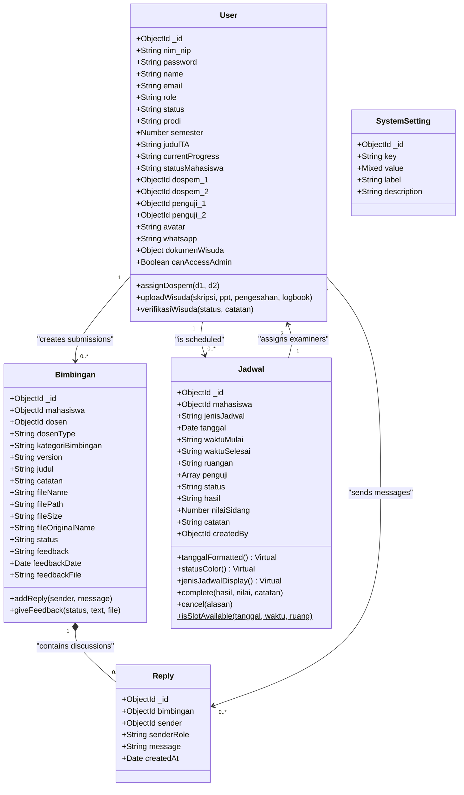
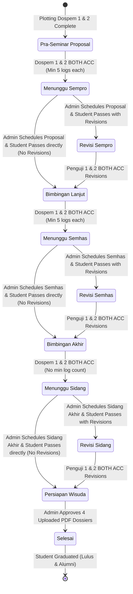
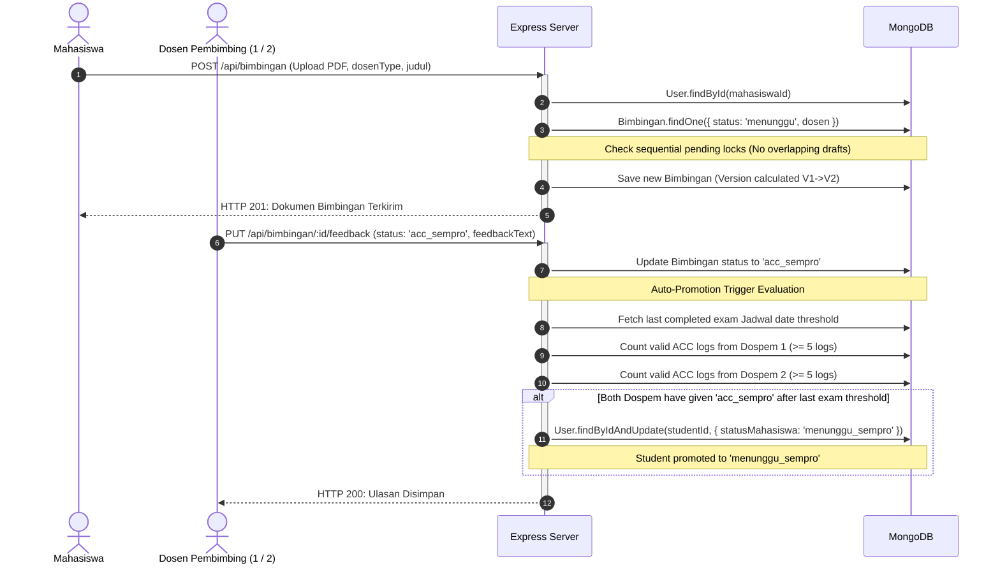
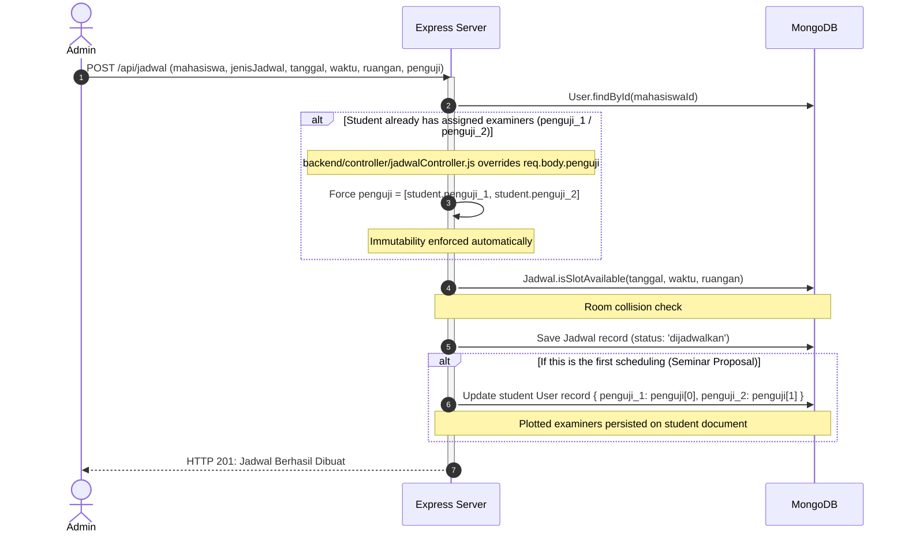
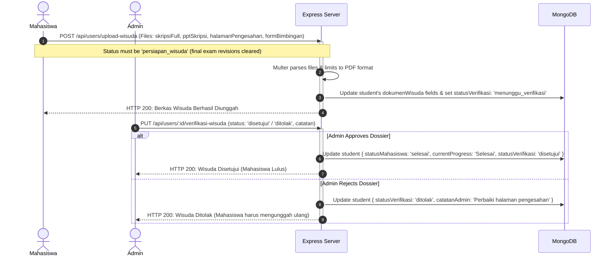
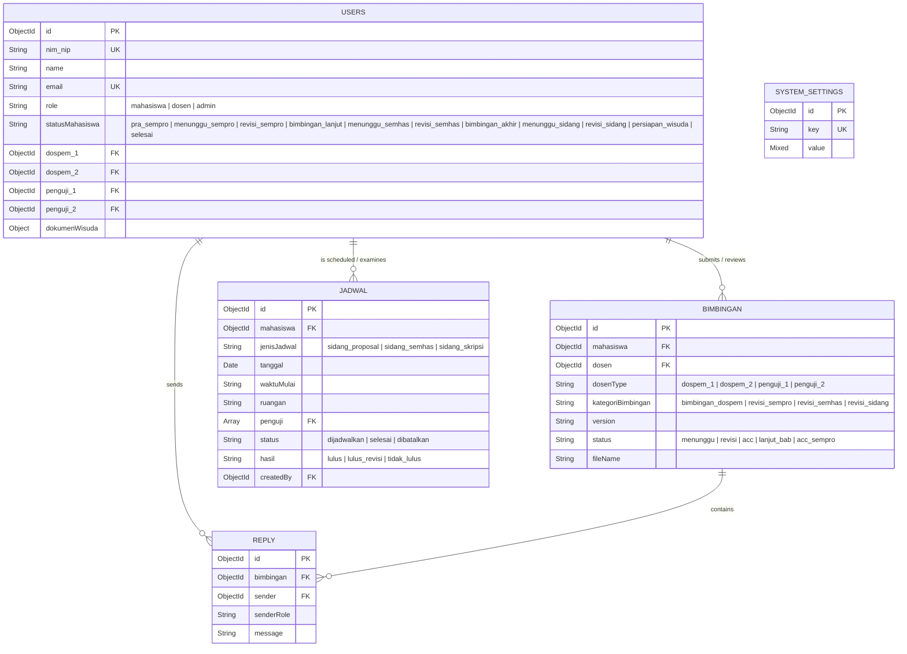
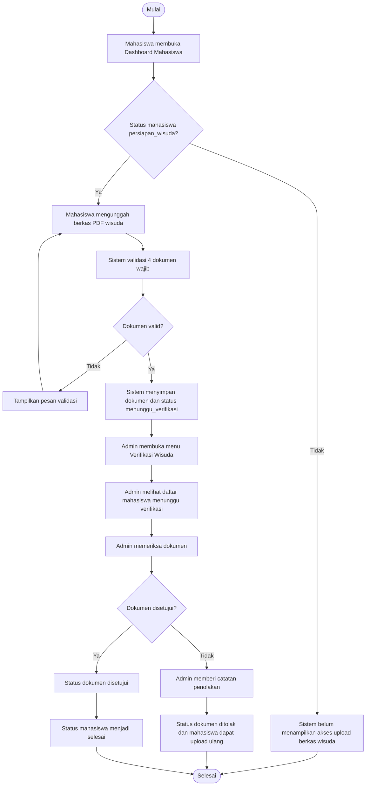
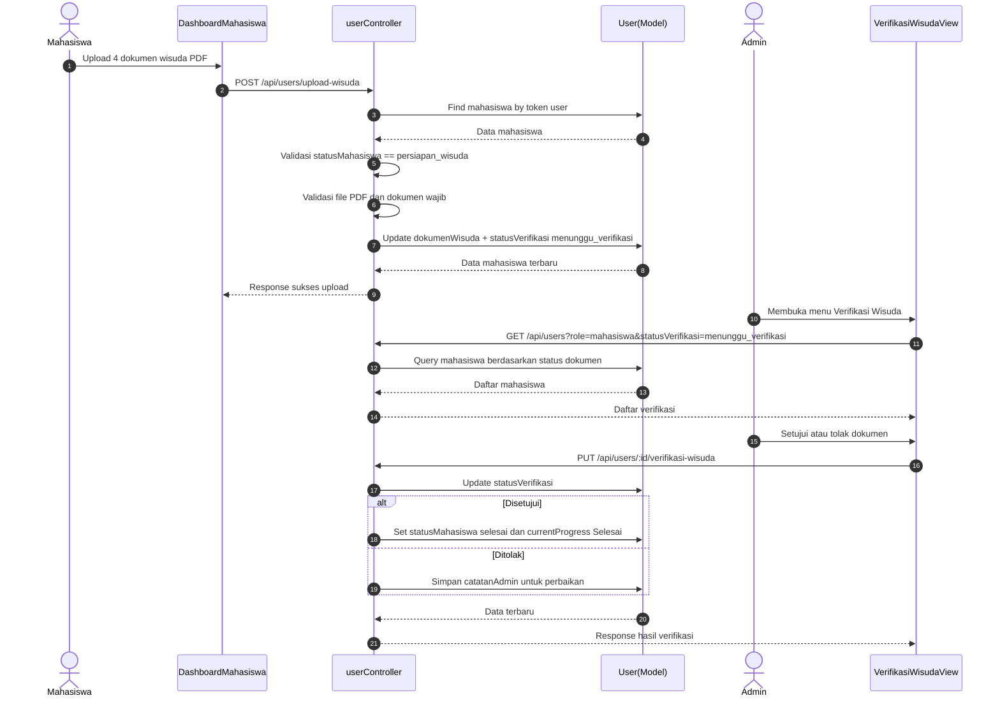

# SIMTA UML SYSTEM ARCHITECTURE & DIAGRAMS SPECIFICATIONS
## Central System UML Diagrams, Structural Design, and Core Workflow Sequences
### Study Case: Program Studi Sistem Informasi - Institut Teknologi Batam

---

## 1. ACTORS & USE CASE SPECIFICATIONS

### 1.1 Actor Definitions
SIMTA Batam operates under a Role-Based Access Control (RBAC) model with three main system roles:

1.  **Mahasiswa (Student):**
    *   Submits guidance reports (Bimbingan) to Supervisors.
    *   Submits exam revisions to Examiners.
    *   Views personalized exam schedules.
    *   Uploads graduation documents during the graduation preparation stage.
2.  **Dosen (Lecturer):**
    *   Acts as **Dosen Pembimbing (Supervisor 1 & 2)**: Reviews weekly guidance submissions, gives feedback, and awards stage ACCs.
    *   Acts as **Dosen Penguji (Examiner 1 & 2)**: Evaluates student exam sessions and reviews post-exam revisions.
3.  **Admin (Academic Administrator):**
    *   Manages user accounts (soft delete, activation).
    *   Maps student-supervisor allocations.
    *   Schedules exams (Seminar Proposal, Seminar Hasil, Sidang Akhir) and plots examiners.
    *   Verifies graduation dossiers.

---

### 1.2 Use Case Diagram

```mermaid
usecaseDiagram
    actor Mahasiswa as "Mahasiswa"
    actor Dosen as "Dosen (Pembimbing / Penguji)"
    actor Admin as "Admin"

    package "SIMTA Core System" {
        usecase UC_Login as "Login & Refresh Token"
        usecase UC_Bimbingan as "Mengajukan Bimbingan Dospem"
        usecase UC_Revisi as "Mengajukan Revisi Penguji"
        usecase UC_Feedback as "Memberikan Feedback / ACC"
        usecase UC_ViewJadwal as "Melihat Jadwal Sidang"
        usecase UC_ManageUser as "Kelola Akun Pengguna"
        usecase UC_PlotDospem as "Plotting Dosen Pembimbing"
        usecase UC_PlotJadwal as "Plotting Jadwal & Penguji"
        usecase UC_UploadWisuda as "Unggah Berkas Wisuda"
        usecase UC_VerifyWisuda as "Verifikasi Berkas Wisuda"
        usecase UC_GenSurat as "Cetak Surat Kelayakan Sempro"
    }

    Mahasiswa --> UC_Login
    Mahasiswa --> UC_Bimbingan
    Mahasiswa --> UC_Revisi
    Mahasiswa --> UC_ViewJadwal
    Mahasiswa --> UC_UploadWisuda

    Dosen --> UC_Login
    Dosen --> UC_Feedback
    Dosen --> UC_ViewJadwal

    Admin --> UC_Login
    Admin --> UC_ManageUser
    Admin --> UC_PlotDospem
    Admin --> UC_PlotJadwal
    Admin --> UC_VerifyWisuda
    Admin --> UC_GenSurat
```

---

## 2. CLASS DIAGRAM & MONGODB SCHEMA STRUCTURAL SPECIFICATIONS

This class diagram represents the Mongoose schemas and model methods operating in the backend.



---

## 3. STATE MACHINE DIAGRAM: STUDENT ACADEMIC TIMELINE

The student state transitions are controlled by backend status promotions in `bimbinganController.js` and `jadwalController.js`.



---

## 4. SEQUENCE DIAGRAMS (CORE WORKFLOWS)

### 4.1 Bimbingan Submission & Auto-Promotion to Exam Waiting-List
This workflow shows a student submitting a guidance log and transitioning to `menunggu_sempro` when both supervisors issue an ACC.



---

### 4.2 Exam Scheduling & Examiner Immutability
This sequence demonstrates the Admin creating an exam schedule and enforcing that once plotted, examiners are locked for subsequent stages.



---

### 4.3 Examiner Double ACC Revision & Guidance Unlocking
This workflow visualizes how a student in the `revisi_sempro` phase gets promoted to `bimbingan_lanjut` and unlocks their supervisors once both examiners approve the revisions.

```mermaid
sequenceDiagram
    autonumber
    actor M as Mahasiswa
    actor P1 as Dosen Penguji 1
    actor P2 as Dosen Penguji 2
    participant API as Express Server
    participant DB as MongoDB

    M->>API: POST /api/bimbingan (Upload revisi, dosenType: 'penguji_1')
    activate API
    Note over API: Supervisor tabs are locked; Examiner tab is open
    API->>DB: Save revision Bimbingan log
    API-->>M: HTTP 201: Revisi Terkirim
    deactivate API

    P1->>API: PUT /api/bimbingan/:id/feedback (status: 'acc')
    activate API
    API->>DB: Save feedback and mark status: 'acc'
    
    Note over API,DB: Check Double ACC Verification
    API->>DB: Search latest revision status of other examiner ('penguji_2')
    
    alt Other examiner has not given 'acc'
        Note over API: Stay in revision phase
        API-->>P1: HTTP 200: ACC Ulasan Disimpan
    else Other examiner has already given 'acc'
        API->>DB: User.findByIdAndUpdate(studentId, { statusMahasiswa: 'bimbingan_lanjut', currentProgress: 'BAB IV' })
        Note over API: Student promoted; Supervisor tabs unlocked; progress set to BAB IV
        API-->>P1: HTTP 200: ACC Ulasan Disimpan & Status Mahasiswa Naik
    end
    deactivate API
```

---

### 4.4 Wisuda Document Upload & Graduation Approval (Stage 7)
This workflow handles the upload of the 4 required dossiers, Admin verification, and graduation graduation.



---

## 5. DATABASE ERD (ENTITY RELATIONSHIP DIAGRAM)

This diagram shows the MongoDB database references and Cardinality relationships between the collections.



---

## 6. BAB 4 WRITING MEMORY: VERIFIED SYSTEM FACTS

Bagian ini adalah catatan kerja untuk menulis Bab 4 SIMTA agar narasi, UML, database, dan screenshot tidak melenceng dari sistem yang berjalan saat ini.

### 6.1 Fokus Bab 4 yang Paling Aman

Judul penelitian berfokus pada pengembangan sistem manajemen tugas akhir terintegrasi berbasis web untuk optimalisasi proses bimbingan. Karena itu, Bab 4 sebaiknya menonjolkan alur utama berikut:

1. Mahasiswa login dan melihat dashboard progres tugas akhir.
2. Mahasiswa mengajukan bimbingan atau revisi dengan upload dokumen PDF.
3. Sistem mengarahkan pengajuan ke Dosen Pembimbing atau Dosen Penguji sesuai fase akademik mahasiswa.
4. Dosen melakukan review, memberi feedback, menentukan status dokumen, dan dapat mengunggah file feedback.
5. Mahasiswa melihat riwayat, status, feedback, dan membalas komentar diskusi.
6. Admin mengelola user, plotting dosen pembimbing, kelola jadwal sidang, monitoring bimbingan, dan verifikasi dokumen wisuda.

Fitur yang boleh menjadi pendukung Bab 4:

- Kelola jadwal sidang proposal, seminar hasil, dan sidang akhir.
- Generate surat persetujuan sempro dalam format DOCX.
- Notifikasi email/WhatsApp sebagai fitur pendukung berbasis konfigurasi backend.
- Verifikasi berkas wisuda setelah mahasiswa selesai sidang akhir.

Fitur yang sebaiknya tidak ditonjolkan sebagai flow utama:

- Refresh token.
- Reset password.
- Upload avatar.
- Health check API.
- Wireframe pages.
- Plain password/demo password.
- Hard delete sebagai fitur utama.

### 6.2 Aktor Sistem

| Aktor | Peran dalam Sistem | Modul Utama |
|---|---|---|
| Mahasiswa | Mengelola proses bimbingan, revisi penguji, melihat jadwal, dan upload berkas wisuda setelah tahap akhir terbuka | Dashboard Mahasiswa, Bimbingan Mahasiswa, Jadwal Sidang |
| Dosen | Berperan sebagai pembimbing dan/atau penguji; melakukan review dokumen, memberi feedback, ACC, dan melihat jadwal sebagai penguji | Dashboard Dosen, Mahasiswa Bimbingan, Review Bimbingan, Jadwal Penguji |
| Admin | Mengelola data master, plotting dospem, jadwal sidang, monitoring bimbingan, laporan, dan verifikasi dokumen wisuda | Dashboard Admin, Manajemen User, Plotting, Kelola Bimbingan, Kelola Jadwal, Laporan, Verifikasi Wisuda |

Catatan penting: di database hanya ada role `mahasiswa`, `dosen`, dan `admin`. Dosen pembimbing dan dosen penguji bukan role terpisah, tetapi relasi dinamis pada field `dospem_1`, `dospem_2`, `penguji_1`, dan `penguji_2`.

### 6.3 Mapping Route Frontend Bab 4

| Route Frontend | Role | Halaman/Komponen | Kegunaan Bab 4 |
|---|---|---|---|
| `/` | Publik | Login | Autentikasi awal dan redirect berdasarkan role |
| `/dashboard/mahasiswa` | Mahasiswa | DashboardMhs | Menampilkan progres, dospem, status akademik, jadwal, dan tahap wisuda |
| `/bimbingan/mahasiswa` | Mahasiswa | BimbinganMahasiswa | Upload bimbingan/revisi, lihat riwayat, feedback, dan reply |
| `/dashboard/dosen` | Dosen | DashboardDosen | Ringkasan mahasiswa bimbingan dan tugas review |
| `/dosen/mahasiswa` | Dosen | ListMahasiswaBimbingan | Daftar mahasiswa bimbingan/penguji |
| `/bimbingan/dosen/:mahasiswaId` | Dosen | BimbinganDosen | Review dokumen dan pemberian feedback |
| `/dosen/jadwal-penguji` | Dosen | JadwalPenguji | Jadwal dosen sebagai penguji |
| `/admin/dashboard` | Admin | DashboardAdmin | Ringkasan data sistem |
| `/admin/users` | Admin | ManajemenUser | Kelola data mahasiswa, dosen, admin |
| `/admin/plotting` | Admin | KelolaPlottingDosen | Assign dospem 1 dan dospem 2 |
| `/admin/bimbingan` | Admin | KelolaBimbingan | Monitoring daftar mahasiswa bimbingan dan status tahap |
| `/admin/jadwal` | Admin | KelolaJadwal | Buat, ubah, selesaikan, batalkan, dan hapus jadwal sidang |
| `/admin/laporan` | Admin | Laporan | Rekap progress bimbingan |
| `/admin/wisuda` | Admin | VerifikasiWisuda | Verifikasi dokumen wisuda mahasiswa |
| `/jadwal-sidang` | Mahasiswa/Dosen/Admin | JadwalSidang | Tampilan jadwal sidang global dengan filter jenis, status, ruangan, dan dosen |

### 6.4 Mapping Endpoint Backend Bab 4

| Modul | Endpoint Utama | Controller | Model |
|---|---|---|---|
| Login | `POST /api/auth/login`, `GET /api/auth/me` | authController | User |
| User/Admin | `GET /api/users`, `POST /api/users`, `PUT /api/users/:id`, `DELETE /api/users/:id` | userController | User |
| Plotting Dospem | `PUT /api/users/:id/assign-dospem` | userController | User |
| Upload Bimbingan | `POST /api/bimbingan` | bimbinganController | User, Bimbingan |
| Riwayat Bimbingan | `GET /api/bimbingan`, `GET /api/bimbingan/:id` | bimbinganController | Bimbingan, Reply |
| Feedback Dosen | `PUT /api/bimbingan/:id/feedback` | bimbinganController | Bimbingan, User |
| Draft Feedback | `PUT /api/bimbingan/:id/draft-feedback` | bimbinganController | Bimbingan |
| Reply Komentar | `POST /api/bimbingan/:id/reply` | bimbinganController | Bimbingan, Reply |
| Surat Sempro | `GET /api/bimbingan/sempro-status/:mahasiswaId`, `GET /api/bimbingan/generate-surat-sempro/:mahasiswaId` | bimbinganController | User, Bimbingan |
| Monitoring Admin | `GET /api/bimbingan/admin/progress-report`, `GET /api/bimbingan/admin/mahasiswa/:mahasiswaId` | bimbinganController | User, Bimbingan |
| Jadwal Sidang | `GET /api/jadwal`, `POST /api/jadwal`, `PUT /api/jadwal/:id`, `DELETE /api/jadwal/:id` | jadwalController | Jadwal, User |
| Wisuda | `POST /api/users/upload-wisuda`, `PUT /api/users/:id/verifikasi-wisuda` | userController | User |

---

## 7. BAB 4 DIAGRAM PACKAGE RECOMMENDATION

### 7.1 Diagram yang Direkomendasikan

Untuk Bab 4, paket diagram yang seimbang adalah:

1. Use Case Diagram SIMTA.
2. Activity Diagram Login.
3. Activity Diagram Kelola User.
4. Activity Diagram Plotting Dosen Pembimbing.
5. Activity Diagram Kelola Jadwal Sidang.
6. Activity Diagram Pengajuan Bimbingan/Revisi.
7. Activity Diagram Dosen Review Bimbingan.
8. Activity Diagram Diskusi Reply Komentar.
9. Activity Diagram Upload dan Verifikasi Berkas Wisuda.
10. Sequence Diagram Login.
11. Sequence Diagram Admin Kelola User.
12. Sequence Diagram Admin Plotting Dosen.
13. Sequence Diagram Admin Kelola Jadwal Sidang.
14. Sequence Diagram Mahasiswa Upload Bimbingan/Revisi.
15. Sequence Diagram Dosen Review Bimbingan.
16. Sequence Diagram Diskusi Reply Komentar.
17. Sequence Diagram Upload dan Verifikasi Wisuda.
18. Class Diagram SIMTA.
19. ERD/struktur collection MongoDB.
20. State Machine status akademik mahasiswa.

Jika Bab 4 harus dibuat lebih ringkas, gunakan 3 flowchart aktor:

1. Flowchart Mahasiswa.
2. Flowchart Dosen.
3. Flowchart Admin.

Lalu diagram detail bimbingan dan jadwal tetap dijelaskan melalui activity/sequence utama.

### 7.2 Use Case yang Wajib Masuk

| Aktor | Use Case |
|---|---|
| Mahasiswa | Login, melihat dashboard, upload bimbingan, upload revisi penguji, melihat riwayat bimbingan, melihat feedback, membalas komentar, melihat jadwal sidang, upload berkas wisuda |
| Dosen | Login, melihat dashboard, melihat daftar mahasiswa, download dokumen, memberi feedback/status, upload file feedback, membalas komentar, melihat jadwal sebagai penguji |
| Admin | Login, kelola user, assign dospem, kelola jadwal sidang, monitoring bimbingan, laporan progress, verifikasi dokumen wisuda |

Use case pendukung:

- Generate surat persetujuan sempro.
- Notifikasi email/WhatsApp.
- Filter jadwal berdasarkan jenis, status, ruangan, dan dosen.

### 7.3 Activity Diagram Upload dan Verifikasi Wisuda



### 7.4 Sequence Diagram Upload dan Verifikasi Wisuda



---

## 8. CURRENT DATABASE STRUCTURE FOR BAB 4

### 8.1 Collection `users`

Fungsi: menyimpan akun mahasiswa, dosen, dan admin, termasuk data akademik mahasiswa dan relasi dosen.

Field penting untuk Bab 4:

| Field | Keterangan |
|---|---|
| `nim_nip` | NIM/NIP unik untuk login |
| `password` | Password hashed, jangan ditulis sebagai password biasa |
| `plainPassword` | Field demo/internal, jangan ditonjolkan |
| `name` | Nama user |
| `email` | Email user |
| `role` | `mahasiswa`, `dosen`, `admin` |
| `prodi` | Program studi mahasiswa |
| `semester` | Semester mahasiswa |
| `judulTA` | Judul tugas akhir |
| `currentProgress` | `BAB I`, `BAB II`, `BAB III`, `BAB IV`, `BAB V`, `BAB VI`, `Selesai` |
| `statusMahasiswa` | Tahap akademik mahasiswa dari pra sempro sampai selesai |
| `dospem_1`, `dospem_2` | Relasi dosen pembimbing |
| `penguji_1`, `penguji_2` | Relasi dosen penguji yang disinkronkan dari jadwal |
| `status` | Status akun `aktif` atau `nonaktif` |
| `whatsapp` | Kontak WhatsApp untuk notifikasi |
| `dokumenWisuda` | Dokumen persiapan wisuda dan status verifikasi admin |
| `canAccessAdmin` | Akses admin tambahan untuk dosen tertentu |
| `createdAt`, `updatedAt` | Timestamp data |

Subfield `dokumenWisuda`:

| Subfield | Keterangan |
|---|---|
| `skripsiFull` | File skripsi lengkap |
| `pptSkripsi` | File presentasi skripsi |
| `halamanPengesahan` | File halaman pengesahan |
| `formBimbingan` | File form/log bimbingan |
| `statusVerifikasi` | `belum_upload`, `menunggu_verifikasi`, `disetujui`, `ditolak` |
| `catatanAdmin` | Catatan admin jika dokumen ditolak |
| `verifiedAt` | Waktu verifikasi |

### 8.2 Collection `bimbingans`

Fungsi: menyimpan dokumen bimbingan normal dan revisi pascasidang/ujian.

Field penting:

| Field | Keterangan |
|---|---|
| `mahasiswa` | Ref ke `User` mahasiswa |
| `dosen` | Ref ke `User` dosen tujuan |
| `dosenType` | `dospem_1`, `dospem_2`, `penguji_1`, `penguji_2` |
| `kategoriBimbingan` | `bimbingan_dospem`, `revisi_sempro`, `revisi_semhas`, `revisi_sidang` |
| `version` | Versi dokumen seperti `V1`, `V2` |
| `judul` | Judul bimbingan |
| `catatan` | Catatan mahasiswa |
| `fileName`, `filePath`, `fileSize`, `fileOriginalName` | Metadata file mahasiswa |
| `status` | `menunggu`, `revisi`, `acc`, `lanjut_bab`, `acc_sempro` |
| `feedback`, `feedbackDate` | Feedback dosen dan tanggal feedback |
| `feedbackFile`, `feedbackFileName` | Lampiran feedback dosen |
| `draftFeedback`, `draftStatus`, `draftFeedbackFile`, `draftFeedbackFileName`, `hasDraft` | Draft feedback dosen sebelum dipublikasikan |
| `createdAt`, `updatedAt` | Timestamp data |

Catatan Bab 4:

- `Reply` tidak disimpan sebagai array fisik di `Bimbingan`; relasinya virtual lewat collection `replies`.
- Saat mahasiswa berada di fase revisi, upload diarahkan ke `penguji_1` atau `penguji_2`, bukan dospem.
- Status `acc_sempro` masih menjadi nilai database, walaupun narasi UI dapat menampilkan ACC maju tahap sidang/sempro.

### 8.3 Collection `jadwals`

Fungsi: menyimpan jadwal sidang proposal, seminar hasil, dan sidang akhir.

Field penting:

| Field | Keterangan |
|---|---|
| `mahasiswa` | Ref ke `User` mahasiswa peserta sidang |
| `jenisJadwal` | `sidang_proposal`, `sidang_semhas`, `sidang_skripsi` |
| `tanggal` | Tanggal sidang |
| `waktuMulai`, `waktuSelesai` | Waktu pelaksanaan |
| `ruangan` | Ruangan sidang, pada UI admin tersedia pilihan A401-A414 |
| `penguji` | Array ref dosen penguji |
| `status` | `dijadwalkan`, `berlangsung`, `selesai`, `dibatalkan` |
| `hasil` | `lulus`, `lulus_revisi`, `tidak_lulus`, atau null |
| `nilaiSidang` | Nilai sidang 0-100 |
| `catatan` | Catatan hasil/pembatalan |
| `createdBy` | Admin pembuat jadwal |
| `createdAt`, `updatedAt` | Timestamp data |

Catatan Bab 4:

- `sidang_semhas` sudah ada di sistem terbaru, jadi jangan hanya menulis proposal dan skripsi.
- Jadwal selesai tidak otomatis terhapus; statusnya menjadi `selesai` dan dapat difilter di UI.
- Jika hasil `lulus_revisi`, mahasiswa masuk fase revisi penguji. Jika hasil `lulus`, mahasiswa dapat naik langsung ke tahap berikutnya.

### 8.4 Collection `replies`

Fungsi: menyimpan komentar diskusi pada dokumen bimbingan.

Field penting:

| Field | Keterangan |
|---|---|
| `bimbingan` | Ref ke `Bimbingan` |
| `sender` | Ref ke `User` pengirim |
| `senderRole` | `mahasiswa` atau `dosen` |
| `message` | Isi komentar |
| `createdAt`, `updatedAt` | Timestamp data |

---

## 9. STUDENT ACADEMIC STATUS REFERENCE

Status akademik mahasiswa berada pada field `User.statusMahasiswa`.

| Status Database | Label Narasi Bab 4 | Makna |
|---|---|---|
| `pra_sempro` | Belum Sempro / Pra Sempro | Mahasiswa masih bimbingan awal dengan dospem |
| `menunggu_sempro` | Menunggu Sempro | Syarat ACC dospem untuk sempro sudah terpenuhi atau mahasiswa siap dijadwalkan sempro |
| `revisi_sempro` | Revisi Sempro | Mahasiswa lulus sempro dengan revisi dan wajib upload revisi ke penguji |
| `bimbingan_lanjut` | Bimbingan Lanjut | Revisi sempro selesai, mahasiswa lanjut bimbingan BAB IV/V |
| `menunggu_semhas` | Menunggu Seminar Hasil | Mahasiswa siap dijadwalkan seminar hasil |
| `revisi_semhas` | Revisi Seminar Hasil | Mahasiswa lulus semhas dengan revisi dan wajib upload revisi ke penguji |
| `bimbingan_akhir` | Bimbingan Akhir | Revisi semhas selesai, mahasiswa lanjut bimbingan akhir |
| `menunggu_sidang` | Menunggu Sidang Akhir | Mahasiswa siap dijadwalkan sidang akhir |
| `revisi_sidang` | Revisi Sidang Akhir | Mahasiswa lulus sidang akhir dengan revisi |
| `persiapan_wisuda` | Persiapan Wisuda | Revisi sidang selesai atau lulus langsung; mahasiswa dapat upload berkas wisuda |
| `selesai` | Selesai/Lulus | Berkas wisuda disetujui admin |

### 9.1 Aturan Transisi Penting

1. Dospem 1 dan Dospem 2 sama-sama memberi `acc_sempro` pada fase `pra_sempro` -> mahasiswa naik ke `menunggu_sempro`.
2. Setelah jadwal proposal selesai dengan hasil `lulus_revisi` -> mahasiswa masuk `revisi_sempro`.
3. Setelah jadwal proposal selesai dengan hasil `lulus` -> mahasiswa masuk `bimbingan_lanjut`.
4. Revisi sempro disetujui penguji 1 dan 2 -> mahasiswa masuk `bimbingan_lanjut`.
5. Dospem 1 dan 2 memberi `acc_sempro` pada fase `bimbingan_lanjut` -> mahasiswa naik ke `menunggu_semhas`.
6. Setelah jadwal semhas selesai dengan hasil `lulus_revisi` -> mahasiswa masuk `revisi_semhas`.
7. Setelah jadwal semhas selesai dengan hasil `lulus` -> mahasiswa masuk `bimbingan_akhir`.
8. Revisi semhas disetujui penguji 1 dan 2 -> mahasiswa masuk `bimbingan_akhir`.
9. Dospem 1 dan 2 memberi `acc_sempro` pada fase `bimbingan_akhir` -> mahasiswa naik ke `menunggu_sidang`.
10. Setelah jadwal sidang akhir selesai dengan hasil `lulus_revisi` -> mahasiswa masuk `revisi_sidang`.
11. Setelah jadwal sidang akhir selesai dengan hasil `lulus` -> mahasiswa masuk `persiapan_wisuda`.
12. Revisi sidang disetujui penguji 1 dan 2 -> mahasiswa masuk `persiapan_wisuda`.
13. Admin menyetujui dokumen wisuda -> mahasiswa masuk `selesai`.

---

## 10. BAB 4 SCREENSHOT AND NARRATIVE CHECKLIST

Screenshot yang paling kuat untuk Bab 4:

1. Halaman Login.
2. Dashboard Mahasiswa.
3. Halaman Bimbingan Mahasiswa.
4. Detail riwayat bimbingan/feedback mahasiswa.
5. Dashboard Dosen.
6. Halaman daftar mahasiswa bimbingan dosen.
7. Halaman review bimbingan dosen.
8. Dashboard Admin.
9. Manajemen User Admin.
10. Plotting Dosen Pembimbing.
11. Kelola Bimbingan Admin.
12. Kelola Jadwal Sidang Admin.
13. Jadwal Sidang global.
14. Verifikasi Wisuda Admin.

Narasi aman untuk Bab 4:

> SIMTA mengintegrasikan proses bimbingan tugas akhir antara mahasiswa, dosen, dan admin. Mahasiswa dapat mengunggah dokumen bimbingan atau revisi sesuai tahap akademiknya. Dosen berperan sebagai pembimbing maupun penguji melalui relasi yang ditentukan sistem, kemudian memberikan feedback, status review, dan ACC. Admin mengelola data pengguna, plotting dosen pembimbing, jadwal sidang, monitoring bimbingan, serta verifikasi dokumen wisuda. Seluruh proses tersimpan pada database MongoDB melalui collection users, bimbingans, replies, dan jadwals.

Kalimat aman untuk notifikasi:

> Sistem mendukung pengiriman notifikasi email/WhatsApp berdasarkan konfigurasi backend, sehingga notifikasi diposisikan sebagai fitur pendukung dan bukan syarat utama keberhasilan proses bimbingan.

Kalimat aman untuk jadwal:

> Jadwal sidang tidak dihapus otomatis ketika selesai, tetapi disimpan dengan status `selesai` agar dapat menjadi riwayat akademik dan dapat difilter pada halaman kelola jadwal.

Kalimat aman untuk wisuda:

> Modul wisuda terbuka setelah mahasiswa berada pada status `persiapan_wisuda`. Mahasiswa mengunggah empat dokumen PDF, kemudian admin melakukan verifikasi. Jika disetujui, status mahasiswa berubah menjadi `selesai`.

---

## 11. CAVEATS FOR BAB 4 CONSISTENCY

1. Jangan menulis `penguji` sebagai role user terpisah. Penguji adalah dosen yang ditunjuk melalui jadwal dan disimpan pada `penguji_1`, `penguji_2`, atau array `Jadwal.penguji`.
2. Jangan menulis `periode`, `gelombang`, atau `tahunAkademik` sebagai field database `Jadwal` jika hanya muncul sebagai filter/tampilan frontend.
3. Jangan menulis `replies` sebagai kolom fisik di collection `bimbingans`; itu virtual relation.
4. Jangan menonjolkan `plainPassword` di Bab 4 karena bersifat demo/internal.
5. Jangan menyatakan notifikasi selalu terkirim; tulis sebagai dukungan sistem berbasis konfigurasi.
6. Gunakan istilah `Seminar Proposal`, `Seminar Hasil`, dan `Sidang Akhir` untuk label akademik, dengan nilai database `sidang_proposal`, `sidang_semhas`, dan `sidang_skripsi`.
7. Jika menggunakan istilah "ACC Sidang" pada narasi, ingat bahwa nilai status bimbingan di database tetap `acc_sempro`.
8. Untuk Bab 4 saat ini, fitur inti tetap bimbingan dan review. Jadwal, laporan, dan wisuda adalah penguat integrasi alur tugas akhir.

---

## 12. WAJIB IKUTI STRUKTUR TA BAB 4 USER

Bagian ini adalah keputusan penting dari pembacaan `RANDOM-KEBUTUHANSKRIPSI/extracted_docx_text.txt`. Jangan menyarankan struktur baru yang tidak dipakai naskah user.

### 12.1 Struktur Bab 4 yang Dipakai

Bab 4 user saat ini memakai struktur berikut:

1. `4.1 Analisis Sistem`
   - `4.1.1 Sistem yang Sedang Berjalan`
   - `4.1.2 Sistem yang Diusulkan`
   - Use Case Diagram
   - Activity Diagram
   - Sequence Diagram
   - Class Diagram
2. `4.2 Analisis Kebutuhan Sistem`
   - `4.2.1 Analisis Kebutuhan Fungsional`
   - `4.2.2 Analisis Kebutuhan Non-Fungsional`
3. `4.3 Perancangan Sistem`
   - `4.3.1 Desain Sistem`
   - `4.3.2 Database`
   - `4.3.3 Flowchart`

Keputusan penting:

- Bab 4 user tidak memakai ERD sebagai bagian utama.
- Bagian database ditulis dalam bentuk tabel spesifikasi collection, bukan ERD.
- Jangan menyarankan tambah ERD kecuali user secara eksplisit minta.
- Fokus revisi adalah memperbaiki diagram/tabel yang sudah ada agar sesuai sistem terbaru.

### 12.2 UML yang Sudah Masuk di Bab 4

| Gambar | Isi |
|---|---|
| Gambar 4.2 | Use Case Diagram SI Manajemen Tugas Akhir (SIMTA) |
| Gambar 4.3 | Activity Diagram Login user Admin/Mahasiswa/Dosen |
| Gambar 4.4 | Activity Diagram Pengelolaan Data Pengguna |
| Gambar 4.5 | Activity Diagram Penentuan Dosen Pembimbing |
| Gambar 4.6 | Activity Diagram Pengelolaan Jadwal Sidang |
| Gambar 4.7 | Activity Diagram Pengajuan Bimbingan Mahasiswa |
| Gambar 4.8 | Activity Diagram Dosen Review Bimbingan |
| Gambar 4.9 | Activity Diagram Diskusi/Reply Bimbingan |
| Gambar 4.10 | Activity Diagram Lihat Jadwal Sidang |
| Gambar 4.11 | Sequence Diagram Autentikasi Pengguna |
| Gambar 4.12 | Sequence Diagram Admin Kelola Data User |
| Gambar 4.13 | Sequence Diagram Admin Plotting Dosen Pembimbing |
| Gambar 4.14 | Sequence Diagram Admin Kelola Jadwal Sidang |
| Gambar 4.15 | Sequence Diagram Mahasiswa Upload Bimbingan |
| Gambar 4.16 | Sequence Diagram Dosen Review Bimbingan |
| Gambar 4.17 | Sequence Diagram Diskusi Reply Komentar |
| Gambar 4.18 | Sequence Diagram Lihat Jadwal Sidang |
| Gambar 4.19 | Class Diagram Website SIMTA |

Selain UML, Bab 4 user juga sudah memuat:

- Gambar 4.1 Aliran Sistem yang Sedang Berjalan.
- Gambar 4.20 sampai Gambar 4.28 desain wireframe.
- Tabel 4.5 sampai Tabel 4.8 spesifikasi collection database.
- Gambar 4.29 sampai Gambar 4.31 flowchart aktor Mahasiswa, Dosen Pembimbing, dan Admin.

### 12.3 Gambar UML dari Extracted DOCX

Mapping gambar hasil ekstraksi yang ditemukan dari `caption_image_map.txt`:

| Caption | File Gambar Extract |
|---|---|
| Gambar 4.1 | `RANDOM-KEBUTUHANSKRIPSI/extracted_images/image39.png` |
| Gambar 4.2 | `RANDOM-KEBUTUHANSKRIPSI/extracted_images/image40.png` |
| Gambar 4.3 | `RANDOM-KEBUTUHANSKRIPSI/extracted_images/image41.png` |
| Gambar 4.4 | `RANDOM-KEBUTUHANSKRIPSI/extracted_images/image42.png` |
| Gambar 4.5 | `RANDOM-KEBUTUHANSKRIPSI/extracted_images/image43.png` |
| Gambar 4.6 | `RANDOM-KEBUTUHANSKRIPSI/extracted_images/image44.png` |
| Gambar 4.7 | `RANDOM-KEBUTUHANSKRIPSI/extracted_images/image45.png` |
| Gambar 4.8 | `RANDOM-KEBUTUHANSKRIPSI/extracted_images/image46.png` |
| Gambar 4.9 | `RANDOM-KEBUTUHANSKRIPSI/extracted_images/image47.png` |
| Gambar 4.10 | `RANDOM-KEBUTUHANSKRIPSI/extracted_images/image48.png` |
| Gambar 4.11 | `RANDOM-KEBUTUHANSKRIPSI/extracted_images/image49.png` |
| Gambar 4.12 | `RANDOM-KEBUTUHANSKRIPSI/extracted_images/image50.png` |
| Gambar 4.13 | `RANDOM-KEBUTUHANSKRIPSI/extracted_images/image51.png` |
| Gambar 4.14 | `RANDOM-KEBUTUHANSKRIPSI/extracted_images/image52.png` |
| Gambar 4.15 | `RANDOM-KEBUTUHANSKRIPSI/extracted_images/image53.png` |
| Gambar 4.16 | `RANDOM-KEBUTUHANSKRIPSI/extracted_images/image54.png` |
| Gambar 4.17 | `RANDOM-KEBUTUHANSKRIPSI/extracted_images/image55.png` |
| Gambar 4.18 | `RANDOM-KEBUTUHANSKRIPSI/extracted_images/image56.png` |
| Gambar 4.19 | `RANDOM-KEBUTUHANSKRIPSI/extracted_images/image57.png` |
| Gambar 4.29 | `RANDOM-KEBUTUHANSKRIPSI/extracted_images/image67.png` |
| Gambar 4.30 | `RANDOM-KEBUTUHANSKRIPSI/extracted_images/image68.png` |
| Gambar 4.31 | `RANDOM-KEBUTUHANSKRIPSI/extracted_images/image69.png` |

### 12.4 Revisi Sistem Terbaru yang Harus Masuk Narasi Bab 4

Hasil development terbaru SIMTA yang perlu tercermin di Bab 4:

1. Dosen tidak hanya sebagai pembimbing, tetapi juga dapat menjadi penguji. Di database tetap role `dosen`, sedangkan fungsi pembimbing/penguji ditentukan oleh relasi `dospem_1`, `dospem_2`, `penguji_1`, dan `penguji_2`.
2. Alur sidang sekarang memiliki tiga tahap: Seminar Proposal, Seminar Hasil, dan Sidang Akhir.
3. Jenis jadwal database adalah `sidang_proposal`, `sidang_semhas`, dan `sidang_skripsi`.
4. Status akademik mahasiswa dikontrol oleh `statusMahasiswa`.
5. Mahasiswa fase normal mengajukan bimbingan ke dospem.
6. Mahasiswa fase revisi `revisi_sempro`, `revisi_semhas`, atau `revisi_sidang` mengajukan revisi ke dosen penguji.
7. Kelola Bimbingan Admin sekarang berbentuk daftar mahasiswa seperti manajemen user, dengan status tahap mahasiswa seperti Belum Sempro, Sudah Sempro, Sudah Semhas, dan Sudah Sidang Akhir.
8. Detail Kelola Bimbingan perlu menampilkan dosen pembimbing dan dosen penguji.
9. Kelola Jadwal Admin memiliki filter status jadwal, jenis sidang, ruangan, dan dosen.
10. Ruangan jadwal yang tersedia di UI admin mencakup A401 sampai A414.
11. Jadwal yang selesai tidak otomatis dihapus; statusnya menjadi `selesai` dan dapat difilter agar tidak menumpuk.
12. Setelah mahasiswa masuk `persiapan_wisuda`, dashboard mahasiswa membuka modul upload dokumen wisuda.
13. Admin memiliki menu Verifikasi Wisuda untuk menyetujui atau menolak dokumen mahasiswa.
14. Jika dokumen wisuda disetujui, status mahasiswa berubah menjadi `selesai`.

### 12.5 Revisi yang Perlu Dilakukan pada Bab 4 yang Ada

Tidak perlu menambah banyak UML baru. Prioritasnya revisi diagram dan tabel yang sudah ada:

1. Use Case Diagram:
   - Ubah aktor `Dosen Pembimbing` menjadi `Dosen` atau jelaskan bahwa dosen dapat bertindak sebagai pembimbing dan penguji.
   - Tambahkan use case dosen sebagai penguji jika revisi penguji dibahas.
   - Tambahkan use case upload berkas wisuda dan verifikasi wisuda hanya jika fitur wisuda ikut dibahas.

2. Activity Diagram Pengajuan Bimbingan:
   - Tambahkan decision: apakah mahasiswa berada dalam fase revisi ujian.
   - Jika tidak, pengajuan diarahkan ke dospem.
   - Jika ya, revisi diarahkan ke penguji.

3. Activity Diagram Dosen Review Bimbingan:
   - Ubah narasi dari hanya dosen pembimbing menjadi dosen pembimbing/penguji.
   - Status pembimbing dapat mencakup revisi, ACC, lanjut bab, dan ACC sempro.
   - Status penguji cukup revisi dan ACC untuk menyelesaikan revisi pascaujian.

4. Activity Diagram Kelola Jadwal Sidang:
   - Revisi jenis jadwal agar mencakup Seminar Proposal, Seminar Hasil, dan Sidang Akhir.
   - Tambahkan validasi ruangan, penguji, dan konflik jadwal.
   - Tambahkan status selesai/dibatalkan sebagai bagian pengelolaan jadwal.

5. Sequence Diagram Upload Bimbingan:
   - Tambahkan pengecekan `User.statusMahasiswa`.
   - Tambahkan `kategoriBimbingan` untuk membedakan bimbingan dospem dan revisi penguji.

6. Sequence Diagram Admin Kelola Jadwal:
   - Tambahkan sinkronisasi `penguji_1` dan `penguji_2` ke data mahasiswa.
   - Tambahkan perubahan status akademik saat jadwal selesai dengan hasil `lulus` atau `lulus_revisi`.

7. Class Diagram:
   - Tambah field `User.statusMahasiswa`, `User.penguji_1`, `User.penguji_2`, `User.dokumenWisuda`, dan `User.canAccessAdmin`.
   - Tambah field `Bimbingan.kategoriBimbingan`, `Bimbingan.draftFeedback`, `Bimbingan.draftStatus`, dan `Bimbingan.hasDraft`.
   - Revisi enum `Jadwal.jenisJadwal` agar memuat `sidang_semhas`.
   - Revisi enum `Jadwal.status` agar memuat `berlangsung` dan `dibatalkan`.

8. Tabel Database:
   - Tabel `Users` perlu tambah `statusMahasiswa`, `penguji_1`, `penguji_2`, `dokumenWisuda`, dan `canAccessAdmin`.
   - Tabel `Bimbingan` perlu tambah `kategoriBimbingan`, `feedbackDate`, `feedbackFileName`, `draftFeedback`, `draftStatus`, dan `hasDraft`.
   - Tabel `Jadwal` perlu revisi deskripsi `jenisJadwal` menjadi Proposal/Semhas/Skripsi atau Seminar Proposal/Seminar Hasil/Sidang Akhir.
   - Tabel `Jadwal` perlu tambah status `berlangsung` dan `dibatalkan`.
   - Tabel `Replies` sudah cukup, tidak perlu banyak revisi.

### 12.6 Tambahan UML yang Boleh Dipertimbangkan

Tambahan UML bukan prioritas. Jika user minta tambah diagram, yang paling masuk akal sesuai struktur Bab 4 adalah:

1. Activity Diagram Verifikasi Wisuda.
2. Sequence Diagram Upload dan Verifikasi Wisuda.
3. State Machine Diagram Status Akademik Mahasiswa.

Jangan menyarankan ERD sebagai tambahan utama karena struktur Bab 4 user memakai tabel database, bukan ERD.

---

## 13. ALIRAN SISTEM INFORMASI (ASI) & NARASI SISTEM YANG DIUSULKAN

### 13.1 Narasi Akademik Subbab 4.1.2 Sistem yang Diusulkan

Sistem yang diusulkan adalah Sistem Informasi Manajemen Tugas Akhir (SIMTA) berbasis web yang dirancang untuk mengintegrasikan seluruh proses administrasi dan bimbingan tugas akhir secara digital. Sistem ini hadir sebagai solusi atas keterbatasan sistem berjalan yang masih konvensional, seperti risiko kehilangan data fisik, komunikasi bimbingan yang terfragmentasi pada aplikasi pesan WhatsApp, serta tidak terdokumentasinya progres bimbingan secara sistematis. Melalui SIMTA, interaksi antara Mahasiswa, Dosen Pembimbing, dan Koordinator Tugas Akhir (yang bertindak sebagai Admin) dapat dilakukan dalam satu platform terintegrasi. Hal ini memungkinkan pencatatan riwayat bimbingan secara real-time, penyimpanan dokumen digital yang aman di dalam server, monitoring progres tugas akhir secara transparan, serta otomasi verifikasi persyaratan sidang dan pembuatan surat persetujuan tugas akhir.

Dari sudut pandang Mahasiswa, alur penggunaan sistem yang diusulkan diawali dengan proses login menggunakan kredensial berupa NIM dan password yang telah didaftarkan oleh admin. Setelah berhasil masuk ke Dashboard Mahasiswa, sistem menyajikan informasi profil akademik, nama dosen pembimbing yang ditugaskan, visualisasi progres penulisan tugas akhir (dari BAB I hingga Selesai), serta status kesiapan sidang. Mahasiswa dapat mengajukan bimbingan dengan mengunggah dokumen draf dalam format PDF, memilih dosen tujuan (Dosen Pembimbing 1 atau Dosen Pembimbing 2), menulis judul bimbingan, dan menyertakan catatan penjelasan. Setelah diunggah, mahasiswa dapat memantau riwayat bimbingan yang terorganisasi berdasarkan penomoran versi dokumen (V1, V2, dst.), membaca umpan balik (feedback) dari dosen pembimbing, serta berdiskusi langsung dengan dosen melalui fitur balas komentar (reply). Apabila persyaratan minimal kuota bimbingan terpenuhi dan kedua dosen pembimbing telah memberikan persetujuan akhir (ACC), mahasiswa dapat mengunduh surat persetujuan pelaksanaan seminar proposal atau sidang tugas akhir yang digenerate otomatis oleh sistem dalam format Word (.docx). Selain itu, mahasiswa juga dapat mengakses menu jadwal sidang untuk melihat waktu, tempat, serta susunan tim penguji yang ditugaskan.

Bagi Dosen Pembimbing, alur sistem dimulai dengan melakukan login menggunakan NIP/NIDN dan password. Pada Dashboard Dosen, sistem menampilkan statistik berkas bimbingan mahasiswa yang menunggu ulasan (pending reviews), daftar mahasiswa bimbingan aktif, serta status progres pengerjaan tugas akhir mereka. Dosen dapat membuka halaman ulasan bimbingan mahasiswa untuk mengunduh dokumen draf PDF yang diajukan, menelaah konten tulisan, dan memberikan penilaian. Formulir feedback bimbingan memungkinkan dosen memberikan umpan balik tertulis, melampirkan file dokumen koreksi (opsional), serta menetapkan status bimbingan berupa "revisi", "acc", "lanjut_bab", atau "acc_sempro" untuk merekomendasikan kelayakan maju sidang. Dosen juga dapat berinteraksi secara interaktif dengan mahasiswa di kolom komentar guna memperjelas catatan perbaikan. Selain memproses bimbingan, dosen dapat melihat jadwal sidang yang menetapkan mereka sebagai anggota tim penguji (Dosen Penguji 1 atau Dosen Penguji 2) secara langsung melalui sistem.

Alur sistem bagi Admin atau Koordinator Tugas Akhir berpusat pada manajemen data master, plotting dosen, konfigurasi aturan akademik, dan administrasi ujian. Setelah melakukan login, Admin diarahkan ke Dashboard Admin yang memuat ringkasan aktivitas sistem. Melalui menu manajemen user, admin bertugas mengelola akun pengguna (menambah, mengedit, menonaktifkan, atau menghapus data mahasiswa, dosen, dan admin) serta memetakan pasangan Dosen Pembimbing 1 dan Dosen Pembimbing 2 untuk mahasiswa. Admin juga memiliki wewenang untuk menyesuaikan batas minimal bimbingan per mahasiswa sebagai prasyarat sidang secara dinamis. Ketika mahasiswa telah dinyatakan layak maju sidang, admin mengelola modul penjadwalan sidang dengan menentukan jenis sidang (Sidang Proposal, Seminar Hasil, atau Sidang Skripsi), menetapkan tanggal, waktu, ruangan, serta menugaskan tim dosen penguji. Setelah sidang selesai digelar, admin menginput hasil kelulusan (lulus, lulus revisi, tidak lulus) dan nilai sidang (0-100) ke dalam sistem, yang secara otomatis akan memperbarui status akademik mahasiswa. Admin juga dapat mengakses laporan rekapitulasi progres tugas akhir seluruh mahasiswa untuk kebutuhan monitoring institusi.

### 13.2 Tabel ASI (Aliran Sistem Informasi) Sistem yang Diusulkan

Berikut adalah representasi Diagram ASI sistem SIMTA yang diusulkan dalam format tabel swimlane:

| Mahasiswa | Sistem SIMTA | Dosen Pembimbing | Admin / Koordinator TA |
| :--- | :--- | :--- | :--- |
| 1. Memasukkan NIM dan password pada halaman Login. | | | |
| | 2. Memvalidasi akun dan role pengguna.<br>- *Jika tidak valid*: Menampilkan pesan error.<br>- *Jika valid*: Mengarahkan ke Dashboard Mahasiswa. | | |
| | 3. Menyimpan data master pengguna dan data bimbingan awal. | | 4. Melakukan plotting/assign Dospem 1 & Dospem 2 untuk Mahasiswa, serta mengonfigurasi batas minimal bimbingan (System Setting). |
| 5. Membuka halaman Bimbingan Mahasiswa. | | | |
| 6. Mengunggah draf bimbingan PDF, memilih target dosen (`dospem_1` / `dospem_2`), mengisi judul & catatan bimbingan. | | | |
| | 7. Melakukan validasi pengunggahan dokumen (tipe berkas PDF, ukuran < 10MB, slot bimbingan kosong).<br>- *Jika tidak valid*: Menolak unggahan dan tampilkan error.<br>- *Jika valid*: Menyimpan data bimbingan, auto-increment nomor versi dokumen (`V1`, `V2`, dst.), mengubah status bimbingan menjadi **"menunggu"**, dan mengirimkan notifikasi. | | |
| | 8. Mengirimkan notifikasi (email/WhatsApp) bimbingan baru ke Dosen Pembimbing terkait. | | |
| | | 9. Menerima notifikasi, login ke sistem, dan membuka daftar mahasiswa bimbingan pada Dashboard Dosen. | |
| | | 10. Membuka detail bimbingan mahasiswa, mengunduh file draf PDF, memeriksa dokumen, dan mengisi formulir review. | |
| | 11. Memproses review dosen:<br>- Menyimpan catatan feedback tertulis & file lampiran feedback (opsional).<br>- Memperbarui status bimbingan (**"revisi"**, **"acc"**, **"lanjut_bab"**, atau **"acc_sempro"**). | 12. Menentukan status ulasan bimbingan mahasiswa. | |
| | 13. Mengirimkan notifikasi umpan balik (email/WhatsApp) ke mahasiswa. | | |
| 14. Menerima notifikasi feedback, membuka riwayat bimbingan, dan membaca tanggapan dosen. | | | |
| 15. (*Kondisional - Diskusi*) Mengirimkan pesan balasan (reply) di kolom diskusi draf bimbingan jika ada pertanyaan revisi. | | 16. (*Kondisional - Diskusi*) Membuka diskusi dan mengirimkan balasan jawaban ke mahasiswa. | |
| | 17. Menyimpan dan menampilkan alur pesan reply secara real-time di halaman detail bimbingan. | | |
| 18. Mengakses halaman Dashboard Mahasiswa untuk mengecek kesiapan sidang. | | | |
| | 19. Memeriksa kelayakan sidang mahasiswa secara otomatis:<br>- Jumlah bimbingan Dospem 1 & 2 $\ge$ batas minimal.<br>- Status bimbingan terakhir ke Dospem 1 & 2 adalah **"acc_sempro"**.<br>- *Jika belum terpenuhi*: Tombol generate dinonaktifkan.<br>- *Jika terpenuhi*: Mengaktifkan tombol generate surat persetujuan. | | |
| 20. Klik tombol "Generate Surat Persetujuan" untuk mendaftar sidang. | | | |
| | 21. Memproses pembuatan berkas surat persetujuan (.docx) dengan menggabungkan data mahasiswa, judul TA, dosen pembimbing, dan menempelkan aset tanda tangan sampel (sample-ttd.png) dosen. | | |
| 22. Mengunduh berkas surat persetujuan (.docx) dari browser. | | | |
| | | | 23. Membuka menu kelola jadwal sidang, memeriksa data mahasiswa yang eligible untuk dijadwalkan sidang. |
| | | | 24. Membuat jadwal sidang dengan menginput data: Mahasiswa, Jenis Sidang (Sempro/Semhas/Skripsi), Tanggal, Waktu Mulai/Selesai, Ruangan, dan Tim Dosen Penguji (Penguji 1 & 2). |
| | 25. Memvalidasi ketersediaan slot (slot check bentrokan ruangan, tanggal, dan waktu).<br>- *Jika bentrok*: Tampilkan pesan ruangan/waktu telah terpakai.<br>- *Jika aman*: Simpan jadwal sidang (status **"dijadwalkan"**), ubah status akademik mahasiswa (misal: menjadi **"menunggu_sempro"** / **"menunggu_sidang"**), dan rilis jadwal. | | |
| | 26. Mengirimkan notifikasi jadwal sidang kepada mahasiswa dan dosen penguji terkait. | | |
| 27. Melihat rincian pelaksanaan sidang di menu Jadwal Sidang mahasiswa. | | 28. Melihat daftar jadwal menguji di menu Jadwal Sidang dosen. | |
| 29. Menjalani proses ujian sidang di hadapan tim penguji (aktivitas offline/di luar sistem). | | 30. Melaksanakan penilaian ujian sidang mahasiswa (aktivitas offline/di luar sistem). | |
| | | | 31. Mengakses menu kelola jadwal sidang, memilih jadwal yang selesai, lalu menginput nilai sidang (0-100) dan hasil kelulusan sidang (**"lulus"**, **"lulus_revisi"**, atau **"tidak_lulus"**). |
| | 32. Memproses hasil sidang:<br>- Menyimpan nilai & catatan sidang.<br>- Mengubah status jadwal menjadi **"selesai"**.<br>- Memperbarui status akademik mahasiswa secara otomatis (misal: **"revisi_sempro"** jika lulus revisi sempro, atau **"selesai"** jika lulus sidang akhir). | | |
| 33. Membuka dashboard untuk melihat hasil kelulusan dan nilai sidang yang diumumkan. | | | |

### 13.3 Alur Panah Diagram ASI untuk Draw.io

Gunakan urutan alur panah berikut untuk menggambar diagram alir sistem informasi (flowchart/swimlane) di draw.io. Alur disusun secara sekuensial dan logis:

1. **`Mahasiswa`** $\rightarrow$ **`Sistem SIMTA`** : Input NIM & Password (Mengirim data login)
2. **`Sistem SIMTA`** $\rightarrow$ **`Sistem SIMTA`** : Validasi akun & role database (Pengecekan kecocokan data)
3. **`Sistem SIMTA`** $\rightarrow$ **`Mahasiswa`** : Mengarahkan ke Dashboard Mahasiswa (Jika login valid)
4. **`Admin / Koordinator TA`** $\rightarrow$ **`Sistem SIMTA`** : Input data pengguna baru & Plotting pasangan Dospem 1 & 2
5. **`Sistem SIMTA`** $\rightarrow$ **`Sistem SIMTA`** : Menyimpan relasi plotting dosen & batas target bimbingan mahasiswa
6. **`Mahasiswa`** $\rightarrow$ **`Sistem SIMTA`** : Upload berkas PDF bimbingan, pilih target dospem, isi judul & catatan
7. **`Sistem SIMTA`** $\rightarrow$ **`Sistem SIMTA`** : Memvalidasi validitas berkas (PDF, <10MB) & membuat auto-increment versi dokumen (V1, V2, dst)
8. **`Sistem SIMTA`** $\rightarrow$ **`Dosen Pembimbing`** : Mengirim notifikasi bimbingan masuk (email/WhatsApp) & memperbarui daftar ulasan dosen
9. **`Dosen Pembimbing`** $\rightarrow$ **`Sistem SIMTA`** : Unduh draf PDF, periksa draf, input catatan feedback, dan tentukan status dokumen (revisi/acc/lanjut_bab/acc_sempro)
10. **`Sistem SIMTA`** $\rightarrow$ **`Sistem SIMTA`** : Memperbarui status bimbingan, menyimpan catatan umpan balik, dan melampirkan berkas review
11. **`Sistem SIMTA`** $\rightarrow$ **`Mahasiswa`** : Mengirim notifikasi feedback (email/WhatsApp) & menampilkan riwayat feedback di dashboard mahasiswa
12. **`Mahasiswa`** $\leftrightarrow$ **`Dosen Pembimbing`** (melalui **`Sistem SIMTA`**) : Melakukan tanya jawab/diskusi revisi di kolom balasan (reply)
13. **`Mahasiswa`** $\rightarrow$ **`Sistem SIMTA`** : Mengakses kelayakan sidang & klik tombol "Generate Surat Persetujuan"
14. **`Sistem SIMTA`** $\rightarrow$ **`Sistem SIMTA`** : Memvalidasi syarat sidang (jumlah bimbingan $\ge$ target dan status ACC disetujui kedua dospem)
15. **`Sistem SIMTA`** $\rightarrow$ **`Mahasiswa`** : Mengunduh otomatis file surat persetujuan (.docx) dengan data terisi dan tanda tangan sampel
16. **`Admin / Koordinator TA`** $\rightarrow$ **`Sistem SIMTA`** : Input data penjadwalan sidang (mahasiswa eligible, jenis sidang, tanggal/waktu, ruang, penguji)
17. **`Sistem SIMTA`** $\rightarrow$ **`Sistem SIMTA`** : Memeriksa bentrokan slot ruangan dan waktu pelaksanaan sidang
18. **`Sistem SIMTA`** $\rightarrow$ **`Mahasiswa`** : Menampilkan rincian tanggal, ruang, dan penguji di halaman Jadwal Sidang mahasiswa
19. **`Sistem SIMTA`** $\rightarrow$ **`Dosen Pembimbing`** : Menampilkan jadwal penugasan menguji di halaman Jadwal Sidang dosen
20. **`Admin / Koordinator TA`** $\rightarrow$ **`Sistem SIMTA`** : Memasukkan keputusan kelulusan sidang (lulus/revisi/tidak) dan nilai angka sidang (0-100)
21. **`Sistem SIMTA`** $\rightarrow$ **`Sistem SIMTA`** : Menyimpan nilai, menutup status jadwal sidang, dan memperbarui status akademik mahasiswa (`statusMahasiswa`)
22. **`Sistem SIMTA`** $\rightarrow$ **`Mahasiswa`** : Menampilkan pengumuman kelulusan sidang dan nilai akhir di dashboard mahasiswa

